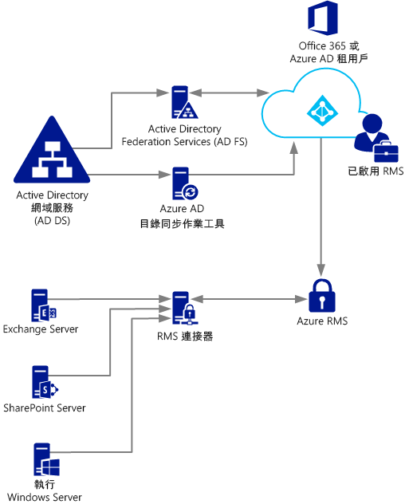
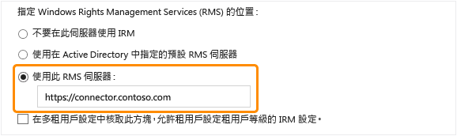

# 部署 Azure Rights Management 連接器
使用此資訊來深入瞭解 Microsoft Rights Management (RMS) 連接器，以及您如何搭配使用該連接器與使用 Microsoft Exchange Server、Microsoft SharePoint Server，或執行 Windows Server 之檔案伺服器的現有內部部署，及使用檔案伺服器資源管理員的檔案分類基礎結構 (FCI) 功能，藉此提供資訊保護。

> [!TIP]
> 如需附有螢幕擷取畫面的高階範例案例，請參閱[什麼是 Azure Rights Management？](../Topic/What_is_Azure_Rights_Management_.md) 主題中的[在執行 Windows Server 和檔案分類基礎結構的檔案伺服器上自動保護檔案](../Topic/What_is_Azure_Rights_Management_.md#BKMK_Example_FCI)一節。

## <a name="OverviewConnector"></a>Microsoft Rights Management 連接器概觀
Microsoft Rights Management (RMS) 連接器可讓您快速啟用現有的內部部署伺服器，以搭配使用其資訊版權管理 (IRM) 功能與雲端架構 Microsoft Rights Management 服務 (Azure RMS)。 利用此功能，IT 和使用者可輕鬆保護您組織內部和外部的文件和圖片，無需安裝其他基礎結構或與其他組織建立信任關係。 在混合式案例中，即使某些使用者已連接到線上服務，您仍可使用此連接器。 例如，某些使用者的信箱使用 Exchange Online，而某些使用者的信箱使用 Exchange Server。 安裝 RMS 連接器之後，所有使用者皆可藉由使用 Azure RMS 保護並取用電子郵件和附件，而資訊保護會在兩個部署組態之間順暢地運作。

RMS 連接器是個占用資源很少的服務，您可安裝於執行 Windows Server 2012 R2、Windows Server 2012 或 Windows Server 2008 R2 之伺服器的內部部署中。 除了在實體電腦上執行連接器，您也可以在包括 Azure IaaS VM 的虛擬機器上執行它。 安裝和設定連接器後，其會成為內部部署伺服器與雲端服務之間的通訊介面 (轉送)。

如果您針對 Azure RMS 管理自己的租用戶金鑰 (攜帶您自己的金鑰，即 BYOK 案例)，RMS 連接器和使用該連接器的內部部署伺服器不會存取含您租用戶金鑰的硬體安全性模組 (HSM)。 這是因為所有使用租用戶金鑰的密碼編譯作業都是在 Azure RMS 執行，而不是在內部。



RMS 連接器可支援下列內部部署伺服器：執行 Windows Server、並使用檔案分類基礎結構將原則分類並套用至資料夾中之 Office 文件的 Exchange Server、SharePoint Server 與檔案伺服器。 如果您想要使用檔案分類保護所有檔案類型，請勿使用 RMS 連接器，但請改用 [RMS 保護 cmdlet](https://msdn.microsoft.com/library/azure/mt433195.aspx)。

> [!NOTE]
> 如需這些內部部署伺服器的支援版本，請參閱＜[Azure Rights Management 的需求](../Topic/Requirements_for_Azure_Rights_Management.md)＞主題的＜[支援 Azure RMS 的應用程式](../Topic/Requirements_for_Azure_Rights_Management.md#BKMK_SupportedApplications)＞一節中的＜支援 Azure RMS 的內部部署伺服器＞。

使用下列各節，以協助您規劃、安裝和設定 RMS 連接器。 接著，您必須執行某些安裝後的設定，讓您的伺服器得以使用連接器。

-   [RMS 連接器的必要條件](../Topic/Deploying_the_Azure_Rights_Management_Connector.md#BKMK_Prereqs)

-   **步驟 1：**  [安裝 RMS 連接器](../Topic/Deploying_the_Azure_Rights_Management_Connector.md#BKMK_InstallingConnector)

-   **步驟 2：**  [輸入認證](../Topic/Deploying_the_Azure_Rights_Management_Connector.md#EnteringCredentials)

-   **步驟 3：**  [授權伺服器使用 RMS 連接器](../Topic/Deploying_the_Azure_Rights_Management_Connector.md#AuthorizingServers)

-   **步驟 4：**  [設定負載平衡和高可用性](../Topic/Deploying_the_Azure_Rights_Management_Connector.md#ConfiguringConnector)

-   選用：[設定 RMS 連接器使用 HTTPS](../Topic/Deploying_the_Azure_Rights_Management_Connector.md#BKMK_ConfiguringHTTPS)

-   選用：[設定 Web Proxy 伺服器的 RMS 連接器](../Topic/Deploying_the_Azure_Rights_Management_Connector.md#BKMK_ConfiguringWebProxy)

-   選用：[在系統管理電腦上安裝 RMS 連接器系統管理工具](../Topic/Deploying_the_Azure_Rights_Management_Connector.md#BKMK_InstallingStandaloneTool)

-   **步驟 5：**  [設定伺服器使用 RMS 連接器](../Topic/Deploying_the_Azure_Rights_Management_Connector.md#ConfiguringServers)

    -   [設定 Exchange 伺服器使用連接器](../Topic/Deploying_the_Azure_Rights_Management_Connector.md#BKMK_ExchangeServer)

    -   [設定 SharePoint 伺服器使用連接器](../Topic/Deploying_the_Azure_Rights_Management_Connector.md#BKMK_ConfiguringSharePoint)

    -   [設定檔案分類基礎結構的檔案伺服器以使用連接器](../Topic/Deploying_the_Azure_Rights_Management_Connector.md#BKMK_FileServer)

-   [後續步驟](../Topic/Deploying_the_Azure_Rights_Management_Connector.md#BKMK_NextSteps)

## <a name="BKMK_Prereqs"></a>RMS 連接器的必要條件
安裝 RMS 連接器之前，請確定下列需求已備妥

|需求|詳細資訊|
|------|--------|
|啟動 Rights Management (RMS) 服務|[啟用 Azure Rights Management](../Topic/Activating_Azure_Rights_Management.md)|
|Active Directory 樹系與 Azure Active Directory 之間的目錄同步|啟動 RMS 之後，必須先設定 Azure Active Directory 以使用 Active Directory 資料庫中的使用者和群組。 **Important:** 您必須執行此目錄同步處理步驟，RMS 連接器才能運作，即使是在測試網路中也一樣。 雖然您可使用 Azure Active Directory 中手動建立的帳戶來使用 Office 365 和 Azure Active Directory，但此連接器要求 Azure Active Directory 中的帳戶與 Active Directory 網域服務同步。密碼手動同步處理並不夠。<br />如需詳細資訊，請參閱下列資源：<br /><br />-   [設定您的 Azure AD 租用戶指示 (英文)](http://technet.microsoft.com/library/hh967611.aspx)<br />-   [使用 DirSync 啟用與 ADD 目錄同步的指示 (英文)](http://technet.microsoft.com/library/hh967642.aspx)|
|選用項但建議使用：<br /><br />-   啟用您內部部署 Active Directory 與 Azure Active Directory 之間的同盟|您可啟用您內部部署目錄與 Azure Active Directory 之間的識別同盟。 此設定可對 RMS 服務使用單一登入，藉此啟用更完美的使用者體驗。 若無單一登入，系統會先提示使用者出示其認證，再允許使用者使用受版權保護的內容。<br /><br />如需在 Active Directory 網域服務與 Azure Active Directory 之間使用 Active Directory Federation Services (AD FS) 以設定同盟的指示，請參閱 Windows Server 程式庫中的[檢查清單](http://technet.microsoft.com/library/jj205462.aspx)。|
|最少有兩部安裝 RMS 連接器的成員電腦：<br /><br /><ul><li>執行下列其中一個作業系統的 64 位元實體或虛擬電腦：<br /><br /><ul><li>Windows Server 2012 R2</li><li>Windows Server 2012</li><li>Windows Server 2008 R2</li></ul></li><li>至少需要 1 GB RAM</li><li>至少需要 64 GB 磁碟空間</li><li>至少需要一個網路介面</li><li>透過無需驗證的防火牆 (或 Web Proxy) 存取網際網路</li><li>必須位於信任組織中其他樹系的樹系或網域，該組織安裝了您要與 RMS 連接器一起使用的 Exchange 或 SharePoint 伺服器</li></ul>|對於容錯和高可用性，您至少必須在兩部電腦上安裝 RMS 連接器。 **Tip:** 如果您使用 Outlook Web Access 或使用 Exchange ActiveSync IRM 的行動裝置，而且必須維護對 Azure RMS 所保護之電子郵件與附件的存取，我們建議您部署負載平衡型連接器伺服器群組，以確保高度可用性。<br />您不需要有專門的伺服器來執行連接器，但必須將連接器安裝在使用連接器之伺服器以外的其他電腦上。 **Important:** 若要搭配使用這些服務的功能與 Azure RMS，請勿在執行 Exchange Server、SharePoint Server 的電腦，或對檔案分類基礎結構設定的檔案伺服器上安裝連接器。 此外，請勿將此連接器安裝在網域控制站上。|

## <a name="BKMK_InstallingConnector"></a>安裝 RMS 連接器
確認上一節的必要條件後，請使用下列指示來安裝 RMS 連接器：

1.  識別要執行 RMS 連接器的電腦 (至少兩台)。 他們必須符合列於上節中的最小規格。

    > [!NOTE]
    > 您將為每個租用戶 (Office 365 租用戶或 Azure AD 租用戶) 安裝單一 RMS 連接器 (可能由多部伺服器組成以提供高可用性)。 不像 Active Directory RMS，您無需在每個樹系中安裝 RMS 連接器。

2.  從 [Microsoft 下載中心](http://go.microsoft.com/fwlink/?LinkId=314106) 下載 RMS 連接器的來源檔案。

    若要安裝 RMS 連接器，請下載 RMSConnectorSetup.exe。

    此外：

    -   若您稍後想從 32 位元電腦設定連接器，亦請下載 RMSConnectorAdminToolSetup_x86.exe。

    -   若要使用 RMS 連接器的伺服器設定工具，若要在內部部署伺服器上自動化登錄設定的設定，請另外下載 GenConnectorConfig.ps1。

3.  在要安裝 RMS 連接器的電腦上，使用系統管理員權限執行 **RMSConnectorSetup.exe**。

4.  在 [Microsoft Rights Management 連接器設定] 頁面的 [歡迎] 頁面上，選取 [在電腦上安裝 Microsoft Rights Management 連接器] ，再按 [下一步]。

5.  閱讀並同意 RMS 連接器授權條款，然後按 [下一步]。

若要繼續，請輸入帳戶和密碼來設定 RMS 連接器。

## <a name="EnteringCredentials"></a>輸入認證
設定 RMS 連接器之前，必須對具足夠權限以設定 RMS 連接器的帳戶輸入認證。

此外，如果您已實作[登入控制項](https://technet.microsoft.com/library/jj658941.aspx)，請確定您指定的帳戶能夠保護內容。比方說，如果您將保護內容的功能限制為「IT 部門」群組，則您在此處指定的帳戶必須是該群組的成員。如果不是，您會看到錯誤訊息：**嘗試探索管理服務和組織的位置失敗。請確定已為您的組織啟用 Microsoft Rights Management 服務。**

您可使用具下列其中一種權限的帳戶：

-   **Office 365 租用戶系統管理員**：做為 Office 365 租用戶之全域管理員的帳戶。

-   **Azure Rights Management 全域管理員**：在 Azure RMS 租用戶上具系統管理員權限的帳戶。

-   **Microsoft RMS 連接器系統管理員**：Azure Active Directory 中的帳戶，該帳戶已獲得安裝並管理您組織之 RMS 連接器的授權。

    > [!NOTE]
    > 若要使用 Microsoft RMS 連接器系統管理員帳戶，您必須先執行下列工作來指派 RMS 連接器系統管理員角色：
    > 
    > 1.  在相同電腦上，下載並安裝 Rights Management 的 Windows PowerShell。 如需詳細資訊，請參閱[針對 Azure Rights Management 安裝 Windows PowerShell](../Topic/Installing_Windows_PowerShell_for_Azure_Rights_Management.md)。
    > 
    >     使用 [以系統管理員身分執行] 命令啟動 Windows PowerShell，並使用 [Connect-AadrmService](https://msdn.microsoft.com/library/azure/dn629415.aspx) 命令連接至 Azure RMS 服務：
    > 
    >     ```
    >     Connect-AadrmService                   //provide Office 365 tenant administrator or Azure RMS global administrator credentials
    >     ```
    > 2.  接著使用下列其中一個參數來執行 [Add-AadrmRoleBasedAdministrator](https://msdn.microsoft.com/library/azure/dn629417.aspx) 命令：
    > 
    >     ```
    >     Add-AadrmRoleBasedAdministrator -EmailAddress <email address> -Role "ConnectorAdministrator"
    >     ```
    > 
    >     ```
    >     Add-AadrmRoleBasedAdministrator -ObjectId <object id> -Role "ConnectorAdministrator"
    >     ```
    > 
    >     ```
    >     Add-AadrmRoleBasedAdministrator -SecurityGroupDisplayName <group Name> -Role "ConnectorAdministrator"
    >     ```
    >     例如，輸入：**Add-AadrmRoleBasedAdministrator -EmailAddress melisa@contoso.com -Role " ConnectorAdministrator "**
    > 
    >     雖然這些命令使用 ConnectorAdministrator 角色，您還是可以在此使用 GlobalAdministrator 角色。

在 RMS 連接器安裝程序期間，將會驗證並安裝所有必要軟體、安裝 Internet Information Services (IIS) (若尚未出現)，及安裝並設定連接器軟體。 此外，Azure RMS 會建立下列項目來準備設定：

-   授權伺服器的空白資料表以使用連接器與 Azure RMS 進行通訊。 您稍後可將伺服器新增至此資料表。

-   連接器的一組安全性權杖，可利用 Azure RMS 驗證作業。 這些權杖是從 Azure RMS 下載，並安裝於登錄中的本機電腦。 它們藉由使用資料保護應用程式設計介面 (DPAPI) 和本機系統帳戶認證而受到保護。

在精靈的最終頁面上，執行下列工作，然後按一下 [完成]：

-   如果這是您已安裝的第一個連接器，請勿在此時選取 [啟動連接器系統管理員主控台以授權伺服器]。 您將於安裝第二個 (或最終) RMS 連接器後選取此選項。 請改為在至少另一部電腦上重新執行精靈。 您必須安裝最少兩個連接器。

-   如已安裝了第二個 (或最後一個) 連接器，請選取 [啟動連接器系統管理員主控台以授權伺服器]。

> [!TIP]
> 此時，您可以執行驗證測試來測試 RMS 連接器的 Web 服務是否可操作：
> 
> -   從網頁瀏覽器中，連線至 **http://&lt;connectoraddress&gt;/_wmcs/certification/servercertification.asmx**，並以已安裝 RMS 連接器的伺服器位址或名稱取代 *&lt;connectoraddress&gt;*。 成功連接後會顯示 **ServerCertificationWebService** 頁面。

如果需要解除安裝 RMS 連接器，請重新執行精靈並選取解除安裝選項。

## <a name="AuthorizingServers"></a>授權伺服器使用 RMS 連接器
在至少兩部電腦上安裝 RMS 連接器後，即準備好授權要使用 RMS 連接器的伺服器與服務。 例如，執行 Exchange Server 2013 或 SharePoint Server 2013 的伺服器。

若要定義這些伺服器，請執行 RMS 連接器系統管理工具，並將項目新增至允許伺服器清單。 您可於 Microsoft Rights Management 連接器設定精靈結尾處選取 [啟動連接器系統管理員主控台以授權伺服器] 時執行此工具，或從精靈加以個別執行。

當您授權這些伺服器時，請注意下列事項：

-   您新增的伺服器會授與特殊權限。 您在連接器組態中為 Exchange Server 角色指定的所有帳戶會在 Azure RMS 中獲得授與[進階使用者角色](https://technet.microsoft.com/library/mt147272.aspx)，使他們能夠存取此 RMS 租用戶的所有內容。 如有必要，進階使用者功能會在此時自動啟用。 為了避免提升權限所帶來的安全性風險，請小心，只能指定由貴組織的 Exchange 伺服器所使用的帳戶。 會將一般使用者權限授與使用 FCI 之 SharePoint 伺服器或檔案伺服器的所有伺服器。

-   您可指定 Active Directory 安全性或通訊群組，將多部伺服器新增為單一項目，或由多部伺服器使用的一個服務帳戶。 使用此設定時，伺服器群組將共用相同的 RMS 憑證，並將被視為其中任何伺服器已保護內容的擁有者。 若要將系統管理額外負荷降到最低，建議您使用這個單一群組組態 (而不要使用個別伺服器) 來授權貴組織的 Exchange 伺服器或 SharePoint 伺服器陣列。

在 [伺服器允許利用連接器] 頁面上，按一下 [新增]。

### <a name="BKMK_AddServer"></a>將伺服器新增至允許伺服器清單
在 [允許伺服器利用連接器] 頁面上，輸入物件名稱，或加以瀏覽以識別要授權的物件。

請務必授權正確的物件。 若要讓伺服器使用連接器，必須選取授權執行內部部署服務的帳戶 (例如，Exchange 或 SharePoint)。 例如，若將服務作為設定的服務帳戶執行，請將該服務帳戶的名稱新增至清單。 若正在將服務作為本機系統執行，則新增電腦物件的名稱 (例如，SERVERNAME$)。 最佳作法是建立包含這些帳戶的群組，並指定該群組而非個別伺服器名稱。

不同伺服器角色的更多詳細資訊：

-   若為執行 Exchange 的伺服器：您必須指定安全性群組，且可使用預設群組 ([Exchange 伺服器])，後者是 Exchange 為樹系中所有 Exchange 伺服器自動建立並維護的群組。

-   若為執行 SharePoint 的伺服器：

    -   如果 SharePoint 2010 伺服器設定為以本機系統 (不使用服務帳戶) 執行，以手動方式在 Active Directory 網域服務中建立安全性群組，並且將此組態中伺服器的電腦名稱物件新增至此群組。

    -   如果 SharePoint 伺服器設定為使用服務帳戶 (適用於 SharePoint 2010 的建議作法和適用於 SharePoint 2013 的唯一選項)，請執行下列作業：

        1.  新增執行 SharePoint 管理中心服務的服務帳戶，以啟用由其系統管理員主控台設定的 SharePoint。

        2.  新增為 SharePoint 應用程式集區設定的帳戶。

        > [!TIP]
        > 如果這兩個帳戶不同，請考慮建立包含這兩個帳戶的單一群組，以將系統管理負擔降至最低。

-   若為使用檔案分類基礎結構的檔案伺服器，關聯的服務將作為本機系統帳戶執行，因此您必須為檔案伺服器授權電腦帳戶 (例如，SERVERNAME$)，或為包含那些電腦帳戶的群組進行授權。

將伺服器新增至清單後，按一下 [關閉]。

如果您尚未這麼做，現在就必須為已安裝 RMS 連接器的伺服器設定負載平衡，並考慮是否要針對這些伺服器與您剛才授權之伺服器之間的連線使用 HTTPS。

## <a name="ConfiguringConnector"></a>設定負載平衡和高可用性
安裝 RMS 連接器的第二個或最後一個執行個體後，定義連接器 URL 伺服器名稱和設定負載平衡系統。

連接器 URL 伺服器名稱可為您所控制命名空間下的任何名稱。 例如，您可於 DNS 系統中為 **rmsconnector.contoso.com** 建立項目，並在負載平衡系統中設定此項目以使用 IP 位址。 對於這個名稱並沒有任何特殊要求，而且也不一定要在連接器伺服器本身設定它。 除非您的 Exchange 和 SharePoint 伺服器將透過網際網路與連接器進行通訊，否則不一定要在網際網路上解析這個名稱。

> [!IMPORTANT]
> 建議您在設定 Exchange 或 SharePoint 伺服器使用連接器之後不要變更這個名稱，因為您接著將必須從所有 IRM 組態中清除這些伺服器，然後重新設定它們。

在 DNS 中建立名稱，並為 IP 位址進行設定之後，請為該位址設定負載平衡，以將流量導向連接器伺服器。 您可以此用途使用任何 IP 架構負載平衡器，此包含在 Windows Server 中的網路負載平衡 (NLB) 功能。 如需詳細資訊，請參閱＜[負載平衡部署指南](http://technet.microsoft.com/library/cc754833%28v=WS.10%29.aspx)＞。

使用下列設定來設定 NLB 叢集：

-   連接埠：80 (適用於 HTTP) 或 443 (適用於 HTTPS)

    如需是否使用 HTTP 或 HTTPS 的詳細資料，請參閱下一節。

-   同質：None

-   散發方法：等於

您為負載平衡型系統 (用於執行 RMS 連接器服務的伺服器) 定義的這個名稱，是您稍後設定內部部署伺服器來使用 Azure RMS 時，要使用之貴組織的 RMS 連接器名稱。

## <a name="BKMK_ConfiguringHTTPS"></a>設定 RMS 連接器使用 HTTPS
> [!NOTE]
> 這是選用的設定步驟，但建議執行以提升安全性。

雖然 RMS 連接器可選擇是否使用 TLS 或 SSL，但我們建議任何 HTTP 架構的安全敏感服務加以使用。 此設定可對使用連接器的 Exchange 和 SharePoint 伺服器，驗證執行該連接器的伺服器。 此外，從這些伺服器傳送至連接器的所有資料會進行加密。

若要啟用 RMS 連接器以使用 TLS，請在執行 RMS 連接器的每一部伺服器上安裝伺服器驗證憑證，該憑證必須包含將使用於連接器的名稱。 例如，如果您在 DNS 中定義的 RMS 連接器名稱為 **rmsconnector.contoso.com**，請部署在憑證主體中含 **rmsconnector.contoso.com** 做為一般名稱的伺服器驗證憑證。 或者，在憑證替代名稱中指定 **rmsconnector.contoso.com** 做為 DNS 值。 憑證不一定要包含伺服器的名稱。 接著在 IIS 中，將此憑證繫結至預設網站。

如果使用 HTTPS 選項，請確定執行連接器的所有伺服器皆具備有效的伺服器驗證憑證，且該憑證必須鏈結至您 Exchange 和 SharePoint 伺服器信任的根 CA。 此外，若為連接器伺服器發行憑證的憑證授權單位 (CA) 發佈憑證撤銷清單 (CRL)，Exchange 和 SharePoint 伺服器必須可下載此 CRL。

> [!TIP]
> 您可使用下列資訊和資源來協助您要求和安裝伺服器驗證憑證，並將此憑證繫結至 IIS 中的預設網站：
> 
> -   如果使用 Active Directory 憑證服務 (AD CS) 和企業憑證授權單位 (CA) 來部署這些伺服器驗證憑證，您可進行複製，然後使用網頁伺服器憑證範本。 此憑證範本為憑證主體名稱使用 [在要求中提供]，這表示您可在要求憑證時，為憑證主體名稱或主體替代名稱提供 RMS 連接器名稱的 FQDN。
> -   如果您使用獨立 CA，或從另一家公司購買此憑證，請參閱 TechNet 上[網頁伺服器 (IIS)](http://technet.microsoft.com/library/cc753433%28v=ws.10%29.aspx) 文件庫的[設定網際網路伺服器憑證 (IIS 7)](http://technet.microsoft.com/library/cc731977%28v=ws.10%29.aspx)。
> -   若要設定 IIS 使用憑證，請參閱 TechNet 上[網頁伺服器 (IIS)](http://technet.microsoft.com/library/cc753433%28v=ws.10%29.aspx) 文件庫的[新增繫結至網站 (IIS 7)](http://technet.microsoft.com/library/cc731692.aspx)。

## <a name="BKMK_ConfiguringWebProxy"></a>設定 Web Proxy 伺服器的 RMS 連接器
若連接器伺服器是安裝在沒有網際網路直接連線的網路中，且您需要為傳出網際網路存取手動設定 Web Proxy 伺服器，您必須在這些伺服器上設定 RMS 連接器的登錄。

#### 設定 RMS 連接器以使用 Web Proxy 伺服器

1.  在每部執行 RMS 連接器的伺服器上開啟登錄編輯程式，如 Regedit。

2.  導覽至 **HKEY_LOCAL_MACHINE\SOFTWARE\Microsoft\AADRM\Connector**

3.  新增字串值 **ProxyAddress**，然後將此值的 Data 設為 **http://&lt;MyProxyDomainOrIPaddress&gt;:&lt;MyProxyPort&gt;**

    例如：**http://proxyserver.contoso.com:8080**

4.  關閉登錄編輯程式，然後重新啟動伺服器，或執行 IISReset 命令以重新啟動 IIS。

## <a name="BKMK_InstallingStandaloneTool"></a>在系統管理電腦上安裝 RMS 連接器系統管理工具
您可從未安裝 RMS 連接器的電腦執行 RMS 連接器系統管理工具，但該電腦必須符合下列需求：

-   執行 Windows Server 2012 或 Windows Server 2012 R2 (所有版本)、Windows Server 2008 R2 或 Windows Server 2008 R2 Service Pack 1 (所有版本)、Windows 8.1、Windows 8 或 Windows 7 的實體或虛擬電腦。

-   至少需要 1 GB RAM。

-   至少需要 64 GB 磁碟空間。

-   至少需要一個網路介面。

-   透過防火牆 (或 Web Proxy) 存取網際網路。

若要安裝 RMS 連接器系統管理工具，請執行下列檔案：

-   若為 32 位元電腦：RMSConnectorAdminToolSetup_x86.exe

-   若為 64 位元電腦：RMSConnectorSetup.exe

如果尚未下載這些檔案，您可以從 [Microsoft 下載中心](http://go.microsoft.com/fwlink/?LinkId=314106) 取得。

## <a name="ConfiguringServers"></a>設定伺服器使用 RMS 連接器
安裝並設定好 RMS 連接器之後，即準備好要設定將會使用 Rights Management 並以該連接器連線至 Azure RMS 的內部部署伺服器。 這表示要設定下列伺服器：

-   若為 Exchange 2013：用戶端存取伺服器和信箱伺服器

-   若為 Exchange 2010：用戶端存取伺服器和集線傳輸伺服器

-   SharePoint：前端 SharePoint 網頁伺服器，包括裝載中央管理伺服器者

-   檔案分類基礎結構：已安裝檔案資源管理員的 Windows Server 電腦

此設定需要登錄設定。 若要執行此作業，您有兩個選項：

|設定選項|優點|缺點|
|--------|------|------|
|為 Microsoft RMS 連接器使用伺服器設定工具以自動執行|不需要直接編輯登錄。 系統會使用指令碼自動執行此工作。<br /><br />無需執行 Windows PowerShell 指令程式即可取得您的 Microsoft RMS URL。<br /><br />必要條件是如果您在本機上執行，則自動為您檢查 (但不會自動補救)。|執行工具時，必須連線到已執行 RMS 連接器的伺服器。|
|藉由編輯登錄手動執行|無需連線至執行 RMS 連接器的伺服器。|更多容易出錯的系統管理負擔。<br /><br />您必須執行 Windows PowerShell 命令來取得您的 Microsoft RMS URL。<br /><br />您必須一律自行檢查所有必要條件。|
> [!IMPORTANT]
> 在這兩種情況下，您都必須手動安裝任何必要條件，並設定 Exchange、SharePoint 和檔案分類基礎結構來使用 Rights Management。

對大多數組織而言，使用 Microsoft RMS 連接器的伺服器設定工具以自動設定是較好的選項，因為相較於手動設定，自動設定提供更好的效率和可靠性。

在這些伺服器上進行設定變更後，如果這些伺服器是執行 Exchange 或 SharePoint，而先前已設定為使用 AD RMS，則您必須重新啟動這些伺服器。 如果您是首次設定這些伺服器使用 Rights Management，則不需要重新啟動這些伺服器。 但對於使用檔案分類基礎結構的檔案伺服器，則在這些檔案伺服器上進行設定變更後，務必要重新啟動檔案伺服器。

#### 如何使用 Microsoft RMS 連接器的伺服器設定工具

1.  如果尚未下載 Microsoft RMS 連接器 (GenConnectorConfig.ps1) 的伺服器設定工具的指令碼，請從 [Microsoft 下載中心](http://go.microsoft.com/fwlink/?LinkId=314106) 取得。

2.  在將執行工具的電腦上儲存 GenConnectorConfig.ps1 檔案。 如果您將會在本機執行此工具，此本機必須是您想要設定來與 RMS 連接器通訊的伺服器。 否則，您可以將它儲存在任何電腦上。

3.  決定如何執行工具：

    -   **本機瀏覽**：您可以在要設定來與 RMS 連接器通訊的伺服器上，以互動方式執行此工具。 這對一次性設定 (例如測試環境) 很有用。

    -   **軟體部署**：您可執行工具來產生登錄檔，接著使用支援軟體部署的系統管理應用程式部署至一或多個相關伺服器，例如 System Center Configuration Manager。

    -   **群組原則**：您可以執行工具來產生指令碼，將指令碼提供給系統管理員，使其對要設定的伺服器建立群組原則物件。 此指令碼會為要設定的每種伺服器類型建立一個群組原則物件，系統管理員接著可將其指派給相關伺服器。

    > [!NOTE]
    > 此工具會設定本節開頭所列、將會與 RMS 連接器通訊的伺服器。 請勿在執行 RMS 連接器的伺服器上執行這項工具。

4.  使用 [以系統管理員身分執行] 選項啟動 Windows PowerShell，並使用 Get-help 命令來閱讀如何為您所選擇設定方法使用工具的指示：

    ```
    Get-help .\GenConnectorConfig.ps1 -detailed
    ```

當執行指令碼時，您必須為組織輸入 RMS 連接器的 URL。 輸入通訊協定首碼 (HTTP:// 或 HTTPS://)，及您在 DNS 中為連接器的負載平衡位址所定義的連接器名稱。 例如，https://connector.contoso.com。 工具接著會使用該 URL 來連線執行 RMS 連接器的伺服器，並取得用來建立必要設定的其他參數。

> [!IMPORTANT]
> 當您執行這項工具時，請確定您指定的是貴組織之負載平衡型 RMS 連接器的名稱，而不是執行 RMS 連接器服務之單一伺服器的名稱。

如需每種服務類型的特定資訊，請使用下列各節：

-   [設定 Exchange 伺服器使用連接器](../Topic/Deploying_the_Azure_Rights_Management_Connector.md#BKMK_ExchangeServer)

-   [設定 SharePoint 伺服器使用連接器](../Topic/Deploying_the_Azure_Rights_Management_Connector.md#BKMK_ConfiguringSharePoint)

-   [設定檔案分類基礎結構的檔案伺服器以使用連接器](../Topic/Deploying_the_Azure_Rights_Management_Connector.md#BKMK_FileServer)

> [!NOTE]
> 設定這些伺服器來使用連接器後，這些伺服器上本機安裝的用戶端應用程式可能無法使用 RMS。 發生這種情況時，可能是因為應用程式嘗試使用連接器而非直接使用 RMS，而這是不受支援的作法。
> 
> 此外，如果 Office 2010 是安裝在 Exchange 伺服器的本機，則在設定伺服器使用連接器之後，用戶端應用程式的 IRM 功能可能可以從該電腦運作，但是這樣的做法並不受支援。
> 
> 在兩種情況下，您必須在未設定使用連接器的不同電腦上安裝用戶端應用程式。 接著它們會正確且直接使用 RMS。

### <a name="BKMK_ExchangeServer"></a>設定 Exchange 伺服器使用連接器
下列 Exchange 角色會與 RMS 連接器通訊：

-   若為 Exchange 2013：用戶端存取伺服器和信箱伺服器

-   若為 Exchange 2010：用戶端存取伺服器和集線傳輸伺服器

若要使用 RMS 連接器，這些執行 Exchange 的伺服器必須執行下列其中一個軟體版本：

-   Exchange Server 2013 (含 Exchange 2013 累積更新 3)

-   Exchange Server 2010 (含 Exchange 2010 Service Pack 3 彙總套件更新 6)

您亦將需於伺服器上安裝包含支援 RMS 密碼編譯模式 2 的 RMS 用戶端版本。 Windows Server 2008 所支援的最低版本內含於 Hotfix 中，該 hotfix 可從 [Windows Server 2008 R2 和 Windows Server 2008 中之 AD RMS 的 RSA 金鑰長度會增加至 2048 位元](http://support.microsoft.com/kb/2627272) 下載取得。 可從[在 Windows 7 或 Windows Server 2008 R2 中的 AD RMS 的 RSA 金鑰長度增加至 2048 位元](http://support.microsoft.com/kb/2627273) 下載 Windows Server 2008 R2 的最小版本。 Windows Server 2012 和 Windows Server 2012 R2 原生支援密碼編譯模式 2。

> [!IMPORTANT]
> 若未安裝這些版本或更新版的 Exchange 和 RMS 用戶端，您將無法設定 Exchange 使用連接器。 先確定已安裝這些版本再繼續。

##### 若要設定 Exchange 伺服器使用連接器

1.  在與 RMS 連接器通訊的 Exchange 伺服器角色上，執行下列其中一項動作：

    -   執行 Microsoft RMS 連接器的伺服器設定工具。 如需詳細資訊，請參閱本主題的＜[如何使用 Microsoft RMS 連接器的伺服器設定工具](../Topic/Deploying_the_Azure_Rights_Management_Connector.md#BKMK_HowToRunTheTool)＞。

        例如，在本機上執行工具以設定執行 Exchange 2013 的伺服器：

        ```
        .\GenConnectorConfig.ps1 -ConnectorUri https://rmsconnector.contoso.com -SetExchange2013
        ```

    -   使用下列各節的表格，在伺服器上手動新增登錄設定以進行手動編輯登錄。

2.  啟用 Exchange 中的 IRM 功能。 如需詳細資訊，請參閱 Exchange 文件庫中的＜[資訊版權管理程序](https://technet.microsoft.com/library/dd351212%28v=exchg.150%29.aspx)＞。

只有當您想在這些伺服器上手動新增或檢查用來設定伺服器為使用 RMS 連接器的登錄設定時，才使用下列各節的表格。 使用這些表格時的指示：

-   *MicrosoftRMSURL* 是您組織的 Microsoft RMS 服務 URL。 若要尋找此值：

    1.  執行 Azure RMS 的 [Get-AadrmConfiguration](http://msdn.microsoft.com/library/windowsazure/dn629410.aspx) Cmdlet。 若尚未安裝適用於 Azure RMS 的 Windows PowerShell 模組，請參閱＜[針對 Azure Rights Management 安裝 Windows PowerShell](../Topic/Installing_Windows_PowerShell_for_Azure_Rights_Management.md)＞。

    2.  從輸出中找出 **LicensingIntranetDistributionPointUrl** 值。

        例如：**LicensingIntranetDistributionPointUrl   : https://5c6bb73b-1038-4eec-863d-49bded473437.rms.na.aadrm.com/_wmcs/licensing**

    3.  從該值，移除此字串的 **/_wmcs/licensing**。 剩餘的字串是您的 Microsoft RMS URL。 在我們的範例中，Microsoft RMS URL 將為下列值：

        **https://5c6bb73b-1038-4eec-863d-49bded473437.rms.na.aadrm.com**

-   *ConnectorFQDN* 是您於 DNS 中為連接器定義的負載平衡名稱。 例如，**rmsconnector.contoso.com**。

-   若已設定連接器，讓連接器使用 HTTPS 與您的內部部署伺服器通訊，請為連接器 URL 使用 HTTPS 首碼。 如需詳細資訊，請參閱本主題中的[設定 RMS 連接器使用 HTTPS](../Topic/Deploying_the_Azure_Rights_Management_Connector.md#BKMK_ConfiguringHTTPS) 一節。 Microsoft RMS URL 一律使用 HTTPS。

#### Exchange 2013 登錄設定表

|登錄路徑|類型|值|資料|
|--------|------|-----|------|
|HKEY_LOCAL_MACHINE\Software\Microsoft\MSDRM\ServiceLocation\Activation|Reg_SZ|預設|https://*MicrosoftRMSURL/_wmcs/certification*|
|HKEY_LOCAL_MACHINE\Software\Microsoft\MSDRM\ServiceLocation\EnterprisePublishing|Reg_SZ|預設|https://MicrosoftRMSURL/_wmcs/Licensing|
|HKEY_LOCAL_MACHINE\SOFTWARE\Microsoft\ExchangeServer\v15\IRM\CertificationServerRedirection|Reg_SZ|https://*MicrosoftRMSURL*|下列其中一項，視您於 Exchange 伺服器至 RMS 連接器中使用 HTTP 或 HTTPS 而定：<br /><br />-   http://*ConnectorFQDN*<br />-   https://*ConnectorFQDN*|
|HKEY_LOCAL_MACHINE\SOFTWARE\Microsoft\ExchangeServer\v15\IRM\LicenseServerRedirection|Reg_SZ|https://*MicrosoftRMSURL*|下列其中一項，視您於 Exchange 伺服器至 RMS 連接器中使用 HTTP 或 HTTPS 而定：<br /><br />-   http://*ConnectorFQDN*<br />-   https://*ConnectorFQDN*|

#### Exchange 2010 登錄設定表

|登錄路徑|類型|值|資料|
|--------|------|-----|------|
|HKEY_LOCAL_MACHINE\Software\Microsoft\MSDRM\ServiceLocation\Activation|Reg_SZ|預設|https://*MicrosoftRMSURL*/_wmcs/certification|
|HKEY_LOCAL_MACHINE\Software\Microsoft\MSDRM\ServiceLocation\EnterprisePublishing|Reg_SZ|預設|https://*MicrosoftRMSURL*/_wmcs/Licensing|
|HKEY_LOCAL_MACHINE\SOFTWARE\Microsoft\ExchangeServer\v14\IRM\CertificationServerRedirection|Reg_SZ|https://*MicrosoftRMSURL*|下列其中一項，視您於 Exchange 伺服器至 RMS 連接器中使用 HTTP 或 HTTPS 而定：<br /><br />-   http://*ConnectorFQDN*<br />-   https://*ConnectorFQDN*|
|HKEY_LOCAL_MACHINE\SOFTWARE\Microsoft\ExchangeServer\v14\IRM\LicenseServerRedirection|Reg_SZ|https://*MicrosoftRMSURL*|下列其中一項，視您於 Exchange 伺服器至 RMS 連接器中使用 HTTP 或 HTTPS 而定：<br /><br />-   http://*ConnectorFQDN*<br />-   https://*ConnectorFQDN*|

### <a name="BKMK_ConfiguringSharePoint"></a>設定 SharePoint 伺服器使用連接器
下列 SharePoint 角色會與 RMS 連接器通訊：

-   前端 SharePoint 網頁伺服器，包括裝載中央管理伺服器者

若要使用 RMS 連接器，這些執行 SharePoint 的伺服器必須執行下列其中一個軟體版本：

-   SharePoint Server 2013

-   SharePoint Server 2010

SharePoint 2013 伺服器也必須執行 1.0.622.34 到 1.0.10907.0 間的 MSIPC 用戶端 2.1 版本。

> [!WARNING]
> 有多個 MSIPC 2.1 用戶端版本，因此請務必安裝此文件中參考的版本。
> 
> 您可以透過檢查 MSIPC.dll 的版本號碼來驗證用戶端版本，其位於 **\Program Files\Active Directory Rights Management Services Client 2.1**。 屬性對話方塊中會顯示 MSIPC 2.1 用戶端的版本號碼。

執行 SharePoint 2010 的伺服器必須安裝包含 RMS 密碼編譯模式 2 的 MSDRM 用戶端版本。 Windows Server 2008 所支援的最低版本內含於 Hotfix 中，該 hotfix 可從 [Windows Server 2008 R2 和 Windows Server 2008 中之 AD RMS 的 RSA 金鑰長度會增加至 2048 位元](http://support.microsoft.com/kb/2627272) 下載取得，並可從 [Windows 7 或 Windows Server 2008 R2 中 AD RMS 的 RSA 金鑰長度增加為 2048 位元](http://support.microsoft.com/kb/2627273) 下載 Windows Server 2008 R2 的最低版本。 Windows Server 2012 和 Windows Server 2012 R2 原生支援密碼編譯模式 2。

##### 若要設定 SharePoint 伺服器使用連接器

1.  在與 RMS 連接器通訊的 SharePoint 伺服器上，執行下列其中一項動作：

    -   執行 Microsoft RMS 連接器的伺服器設定工具。 如需詳細資訊，請參閱本主題的＜[如何使用 Microsoft RMS 連接器的伺服器設定工具](../Topic/Deploying_the_Azure_Rights_Management_Connector.md#BKMK_HowToRunTheTool)＞。

        例如，在本機上執行工具以設定執行 SharePoint 2013 的伺服器：

        ```
        .\GenConnectorConfig.ps1 -ConnectorUri https://rmsconnector.contoso.com -SetSharePoint2013
        ```

    -   若使用 SharePoint 2013，請使用下節的表格，在伺服器上手動新增登錄設定以進行手動編輯登錄。

2.  在 SharePoint 中啟用 IRM。 如需詳細資訊，請參閱 SharePoint 程式庫中的[設定資訊權管理 (SharePoint Server 2010)](https://technet.microsoft.com/library/hh545607%28v=office.14%29.aspx) (英文)。

    當您遵循這些指示時，您必須設定 SharePoint 使用連接器，方法是指定 [使用此 RMS 伺服器]，然後輸入您設定的負載平衡連接器 URL。 輸入通訊協定首碼 (HTTP:// 或 HTTPS://)，及您在 DNS 中為連接器的負載平衡位址所定義的連接器名稱。 例如，如果您的連接器名稱為 https://connector.contoso.com，您的組態看起來會類似下列圖片：

    

    在 SharePoint 伺服器陣列上啟用 IRM 後，您可對每個程式庫，使用 [程式庫設定] 頁面的 [資訊版權管理] 選項在個別程式庫上啟用 IRM。

    > [!IMPORTANT]
    > 若要讓 SharePoint 使用連接器存取 RMS，您必須在 RMS 連接器系統管理工具中授權對應的帳戶。 若您尚未這麼做，請參閱本主題的＜[授權伺服器使用 RMS 連接器](../Topic/Deploying_the_Azure_Rights_Management_Connector.md#AuthorizingServers)＞。

僅當您想於執行 SharePoint 2013 的伺服器上手動新增或檢查登錄設定時，才使用下節的表格。

#### SharePoint 2013 登錄設定表
使用此表格時的指示：

-   *MicrosoftRMSURL* 是您組織的 Microsoft RMS 服務 URL。 若要尋找此值：

    1.  執行 Azure RMS 的 [Get-AadrmConfiguration](http://msdn.microsoft.com/library/windowsazure/dn629410.aspx) Cmdlet。 若尚未安裝適用於 Azure RMS 的 Windows PowerShell 模組，請參閱＜[針對 Azure Rights Management 安裝 Windows PowerShell](../Topic/Installing_Windows_PowerShell_for_Azure_Rights_Management.md)＞。

    2.  從輸出中找出 **LicensingIntranetDistributionPointUrl** 值。

        例如：**LicensingIntranetDistributionPointUrl   : https://5c6bb73b-1038-4eec-863d-49bded473437.rms.na.aadrm.com/_wmcs/licensing**

    3.  從該值，移除此字串的 **/_wmcs/licensing**。 剩餘的字串是您的 Microsoft RMS URL。 在我們的範例中，Microsoft RMS URL 將為下列值：

        **https://5c6bb73b-1038-4eec-863d-49bded473437.rms.na.aadrm.com**

-   *ConnectorFQDN* 是您於 DNS 中為連接器定義的負載平衡名稱。 例如，**rmsconnector.contoso.com**。

-   若已設定連接器，讓連接器使用 HTTPS 與您的內部部署伺服器通訊，請為連接器 URL 使用 HTTPS 首碼。 如需詳細資訊，請參閱本主題中的[設定 RMS 連接器使用 HTTPS](../Topic/Deploying_the_Azure_Rights_Management_Connector.md#BKMK_ConfiguringHTTPS) 一節。 Microsoft RMS URL 一律使用 HTTPS。

|登錄路徑|類型|值|資料|
|--------|------|-----|------|
|HKEY_LOCAL_MACHINE\SOFTWARE\Microsoft\MSIPC\ServiceLocation\LicensingRedirection|Reg_SZ|https://*MicrosoftRMSURL*/_wmcs/licensing|下列其中一項，視您於 SharePoint 伺服器至 RMS 連接器中使用 HTTP 或 HTTPS 而定：<br /><br />-   http://*ConnectorFQDN*/_wmcs/licensing<br />-   https://*ConnectorFQDN*/_wmcs/licensing|
|HKEY_LOCAL_MACHINE\SOFTWARE\Microsoft\MSIPC\ServiceLocation\EnterpriseCertification|Reg_SZ|預設|下列其中一項，視您於 SharePoint 伺服器至 RMS 連接器中使用 HTTP 或 HTTPS 而定：<br /><br />-   http://*ConnectorFQDN*/_wmcs/certification<br />-   https://*ConnectorFQDN*/_wmcs/certification|
|HKEY_LOCAL_MACHINE\SOFTWARE\Microsoft\MSIPC\ServiceLocation\EnterprisePublishing|Reg_SZ|預設|下列其中一項，視您於 SharePoint 伺服器至 RMS 連接器中使用 HTTP 或 HTTPS 而定：<br /><br />-   http://*ConnectorFQDN*/_wmcs/licensing<br />-   https://*ConnectorFQDN*/_wmcs/licensing|

### <a name="BKMK_FileServer"></a>設定檔案分類基礎結構的檔案伺服器以使用連接器
若要使用 RMS 連接器和檔案分類基礎結構來保護 Office 文件，檔案伺服器必須正在執行下列其中一種作業系統：

-   Windows Server 2012 R2

-   Windows Server 2012

##### 若要設定檔案伺服器使用連接器

1.  在設定來使用檔案分類基礎結構、且會與 RMS 連接器通訊的檔案伺服器上，執行下列其中一項動作：

    -   執行 Microsoft RMS 連接器的伺服器設定工具。 如需詳細資訊，請參閱本主題的＜[如何使用 Microsoft RMS 連接器的伺服器設定工具](../Topic/Deploying_the_Azure_Rights_Management_Connector.md#BKMK_HowToRunTheTool)＞。

        例如，在本機上執行工具以設定執行 FCI 的檔案伺服器：

        ```
        .\GenConnectorConfig.ps1 -ConnectorUri https://rmsconnector.contoso.com -SetFCI2012
        ```

    -   使用下節的表格，在伺服器上手動新增登錄設定以進行手動編輯登錄。

2.  建立分類規則和檔案管理工作來對文件加上 RMS 加密保護，然後指定 RMS 範本來自動套用 RMS 原則。 如需詳細資訊，請參閱 Windows Server 文件庫的[檔案伺服器資源管理員概觀](http://technet.microsoft.com/library/hh831701.aspx)。

僅當您想於使用「檔案分類基礎結構」的檔案伺服器上手動新增或檢查登錄設定以保護文件時，才使用下節的表格。

#### 檔案伺服器和檔案分類基礎結構登錄設定的表格
使用此表格時的指示：

-   *ConnectorFQDN* 是您於 DNS 中為連接器定義的負載平衡名稱。 例如，**rmsconnector.contoso.com**。

-   若已設定連接器，讓連接器使用 HTTPS 與您的內部部署伺服器通訊，請為連接器 URL 使用 HTTPS 首碼。 如需詳細資訊，請參閱本主題中的[設定 RMS 連接器使用 HTTPS](../Topic/Deploying_the_Azure_Rights_Management_Connector.md#BKMK_ConfiguringHTTPS) 一節。 Microsoft RMS URL 一律使用 HTTPS。

|登錄路徑|類型|值|資料|
|--------|------|-----|------|
|HKEY_LOCAL_MACHINE\SOFTWARE\Microsoft\MSDRM\ServiceLocation\EnterprisePublishing|Reg_SZ|預設|http://*ConnectorFQDN*/_wmcs/licensing|
|HKEY_LOCAL_MACHINE\SOFTWARE\Microsoft\MSDRM\ServiceLocation\Activation|Reg_SZ|預設|http://*ConnectorFQDN*/_wmcs/certification|

## <a name="BKMK_NextSteps"></a>後續步驟
您已安裝和設定 RMS 連接器，並設定伺服器使用該連接器，現在 IT 系統管理員和使用者可以使用 Azure RMS 來保護並使用電子郵件訊息和文件。 為了方便使用者使用，請部署 RMS 共用應用程式；該應用程式會安裝 Office 附加元件，並將新的滑鼠右鍵選項加入至 [檔案總管]。 如需詳細資訊，請參閱《[Rights Management 共用應用程式系統管理員指南](http://technet.microsoft.com/library/%20dn339003%28v=ws.10%29.aspx)》。

此外，您也可以將下列各項納入考量來協助您監視 RMS 連接器和貴組織的 Azure RMS 使用狀況：

-   內建的 **Microsoft Rights Management 連接器**效能計數器。

-   [RMS 分析器工具](https://www.microsoft.com/en-us/download/details.aspx?id=46437)，使用 RMS 連接器選項以協助您監視連接器的健康情況和確定任何配置問題。

-   [記錄和分析 Azure Rights Management 使用情況](../Topic/Logging_and_Analyzing_Azure_Rights_Management_Usage.md)

您可使用[Azure Rights Management 部署藍圖](../Topic/Azure_Rights_Management_Deployment_Roadmap.md)來檢查將 [!INCLUDE[aad_rightsmanagement_1](../Token/aad_rightsmanagement_1_md.md)] 轉出給使用者和系統管理員之前，是否還需要執行其他設定步驟。 若不需要執行其他設定步驟，請參閱[使用 Azure Rights Management](../Topic/Using_Azure_Rights_Management.md)取得操作指示，以支援組織的成功部署。

## 請參閱
[設定 Azure Rights Management](../Topic/Configuring_Azure_Rights_Management.md)

