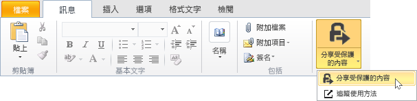

# 如何安全地以電子郵件共用文件

## &lt;系統管理員指示 – 提供給使用者之前刪除本區段&gt;
使用本文件做為您自己的使用者的起點，以協助使用者安全地以電子郵件共用文件。在下一個區段中的指示針對您想要的部分進行修改，然後刪除此第一個區段，再將本文件提供給使用者。

此處的指示是針對虛構的公司，**VanArsdel, Ltd**。將這些指示提供給使用者之前，取代螢幕擷取畫面和指示，讓它們顯示您自己的組織名稱，或修改指示，讓使用者知道在代表 VanArsdel, Ltd 的指示的位置，他們會看到他們自己的公司名稱。您可能想要進行的其他自訂：

-   在步驟 2 中，如果傳送給組織外部的人員，我們只建議可用選項中的其中兩個。您可能想要變更這些建議。

-   在步驟 2 中，我們建議說明以協助使用者識別要選取哪一個範本。您可能想要變更這些說明，讓它更特定或對於您的商務和使用者有意義。

-   在步驟 3 中，我們針對 [**檢視者 - 僅檢視**] 選項建議 [**允許我立即撤銷這些文件的存取權**]，做為您可能想要為使用者納入這個組態選項的範例。不過，您可能會決定每當使用者將文件傳送至組織外部時應該一律選取這個選項，或永遠不選取此選項。

-   在步驟 4 中，我們建議 [**當有人嘗試開啟這些文件時以電子郵件通知我**] 選項。如果使用者使用文件追蹤入口網站來追蹤其文件，您可能會決定不需要電子郵件通知，並且刪除此步驟。

> [!NOTE]
> 如需使用者可以選取之每個選項的詳細資訊，請參閱＜[適用於 Rights Management 共用應用程式的對話方塊選項](https://technet.microsoft.com/library/dn574738.aspx)＞

如果要讓使用者指示運作，必須滿足下列條件：

|Check|需求|如果需要更多資訊|
|---------|------|------------|
||您已針對 Azure Active Directory 準備帳戶和群組|[準備 Azure Rights Management](https://technet.microsoft.com/library/jj585029.aspx)|
||Azure Rights Management 已啟動|[啟用 Azure Rights Management](https://technet.microsoft.com/library/jj658941.aspx)|
||Rights Management 共用應用程式已部署至執行 Windows 的使用者電腦|[自動部署 Microsoft Rights Management 共用應用程式](https://technet.microsoft.com/library/dn339003%28v=ws.10%29.aspx)|
||如果您使用 Exchange Server，而不是 Exchange Online：  -   會部署 RMS 連接器並且設定 Exchange Server 角色以使用它|[部署 Azure Rights Management 連接器](https://technet.microsoft.com/library/dn375964.aspx)|
||使用者使用 Office 2010 的 Outlook。|如果使用者有 Office 2013，請將螢幕擷取畫面取代為對等版本，讓圖片符合使用者看到的項目。|
||您已設定自訂範本，如下所示|[設定 Azure Rights Management 的自訂範本](https://technet.microsoft.com/library/dn642472.aspx)|

#### 若要設定自訂範本：

1.  封存 2 個預設範本。

2.  建立 3 個新的範本，方法是複製預設範本，並進行下列變更：

    |要複製的範本|新的名稱|新的說明|授與這些自訂權限|其他設定|
    |----------|--------|--------|------------|--------|
    |**&lt;組織名稱&gt; - 僅限機密檢視**|**高度機密 - &lt;組織名稱&gt;**|&lt;組織名稱&gt; 的所有使用者具有檢視和編輯權限。無離線存取。|**檢視內容**  **儲存檔案**  **編輯內容**|更新使用者使用之語言的名稱和描述。  對於 [**內容到期**]：保持預設值 [**內容永久有效**]  對於 [**離線存取**]：選取 [**只有使用網際網路連線才能使用內容**]|
    |**&lt;組織名稱&gt; - 僅限機密檢視**|**機密 - &lt;組織名稱&gt;**|&lt;組織名稱&gt; 的所有使用者具有檢視和編輯權限。|**檢視內容**  **儲存檔案**  **編輯內容**|更新使用者使用之語言的名稱和描述。  對於 [**內容到期**]：保持預設值 [**內容永久有效**]  對於 [**離線存取**]：選取 [**沒有網際網路連線而可使用內容的天數**] 並且輸入 **1**|
    |**&lt;組織名稱&gt; - 機密**|**內部 - &lt;組織名稱&gt;**|&lt;組織名稱&gt; 的所有使用者具有完整權限，但無法取消保護內容。|**檢視內容**  **儲存檔案**  **編輯內容**  **複製和擷取內容**  **Print**|更新使用者使用之語言的名稱和描述。  對於 [**內容到期**]：保持預設值 [**內容永久有效**]  對於 [**離線存取**]：保持預設值 [**沒有網際網路連線而可使用內容的天數**] 並且保持預設值 **7**|

3.  發佈 3 個新範本。

## &lt;使用者指示從這裡開始，刪除此標題&gt;
從現在起，每當您以電子郵件將重要的文件傳送給其他人時，使用這些指示以協助防止文件被不應該看到它的人員讀取。

1.  建立您的電子郵件訊息，方法是指定電子郵件地址、輸入您的訊息，並且附加您要安全地共用的檔案。然後，在 [**訊息**] 索引標籤的 [**RMS**] 群組中按一下 [**共用保護**]，然後再按一下 [**共用保護**]：

    

2.  在 [**共用保護**] 對話方塊中，選取下列項目：

    當您將文件傳送給至少一位為其他組織工作的人員時：

    |若是如此...|做法：|
    |-----------|-------|
    |會自動為您選取 [**一般保護**]    →|保持選取：  |
    |不應該變更文件中的資訊    →|選取 [**檢視者 – 僅限檢視**]：  |
    |可以變更文件中的資訊    →|選取 [**共同作者 – 檢視、編輯、複製和列印**]：  |
    當您將文件傳送給組織內部的人員時：

    |若是如此...|做法：|
    |-----------|-------|
    |會自動為您選取 [**一般保護**]    →|保持選取：  |
    |文件中的資訊非常機密，如果公開會對組織或其員工造成異常高度的損害    →|選取 [**高度機密 - VanArsdel, Ltd**]：  |
    |文件中的資訊是機密，如果公開會對組織或其員工造成損害    →|選取 [**機密 - VanArsdel, Ltd**]：  |
    |文件中的資訊不應該與組織外部的人員共用，但是不包含組織或其員工的機密資訊    →|選取 [**內部 - VanArsdel, Ltd**]：  |

3.  如果您選取 [**檢視者 – 僅限檢視**]：選取 [**允許我立即撤銷這些文件的存取權**]：

    

4.  選取 [**當有人嘗試開啟這些文件時以電子郵件通知我**]：

    

5.  按一下 [**立即傳送**]：

    

當您將受保護文件傳送給他們的某人收到這封電子郵件時，他們會看到訊息，指示他們如何讀取。他們可以在許多裝置上讀取，包括 iPad、iPhone、Android 平板電腦和電話、Mac 電腦，以及 Windows 電腦。

若要追蹤您已傳送受保護文件給他們的人員是否已存取它們，請使用[文件追蹤網站](https://track.azurerms.com/)。

**需要協助嗎？**

-   如需其他資訊：

    -   [保護您以電子郵件共用的檔案](https://technet.microsoft.com/library/dn574735%28v=ws.10%29.aspx)

    -   [追蹤及撤銷您的文件](https://technet.microsoft.com/library/dn986611.aspx)

-   連絡技術支援人員：

    -   &lt;連絡人詳細資料&gt;

