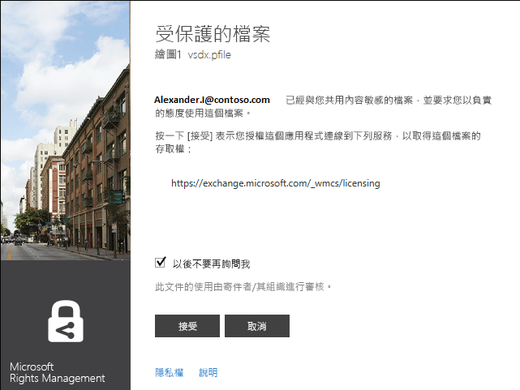
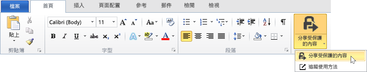

# Microsoft Rights Management 共用應用程式使用者指南 - 原始出版品
Windows 的 Microsoft Rights Management 共用應用程式使用者指南包含下列章節：

-   [評估及安裝 Microsoft Rights Management 共用應用程式](../Topic/Microsoft_Rights_Management_sharing_application_user_guide_-_original_publication.md#BKMK_Eval)

-   [使用 Microsoft Rights Management 共用應用程式](../Topic/Microsoft_Rights_Management_sharing_application_user_guide_-_original_publication.md#BKMK_UsingMSRMSApp)

-   [使用使用者撰寫的權限和共用受保護的內容](../Topic/Microsoft_Rights_Management_sharing_application_user_guide_-_original_publication.md#BKMK_Custom)

-   [使用 Office 工具列增益集](../Topic/Microsoft_Rights_Management_sharing_application_user_guide_-_original_publication.md#BKMK_OfficeToolbar)

-   [Microsoft Rights Management 共用應用程式的系統管理員指引](../Topic/Microsoft_Rights_Management_sharing_application_user_guide_-_original_publication.md#BKMK_AdminGuide)

如需常見問題與疑難排解資訊，請參閱＜[Windows 的 Microsoft Rights Management 共用應用程式常見問題集](http://go.microsoft.com/fwlink/?LinkId=303971)＞。

## <a name="BKMK_Eval"></a>評估與安裝 Microsoft Rights Management 共用應用程式
本節說明什麼是 Microsoft Rights Management 共用應用程式，以及如何安裝：

-   [什麼是 Microsoft Rights Management 共用應用程式？](../Topic/Microsoft_Rights_Management_sharing_application_user_guide_-_original_publication.md#BKMK_WhatIs)

-   [Microsoft Rights Management 共用應用程式的需求](../Topic/Microsoft_Rights_Management_sharing_application_user_guide_-_original_publication.md#BKMK_Reqs)

-   [安裝 Microsoft Rights Management 共用應用程式](../Topic/Microsoft_Rights_Management_sharing_application_user_guide_-_original_publication.md#BKMK_Install)

### <a name="BKMK_WhatIs"></a>什麼是 Microsoft Rights Management 共用應用程式？
Microsoft Rights Management 共用應用程式是可供 Microsoft Windows 下載的選擇性應用程式，可提供下列內容：

-   增強檔案總管 (在 Windows 7 和更舊版本中也稱為 Windows 檔案總管)，讓您可以保護單一檔案，或大量保護多個檔案，以及選取之資料夾中的所有檔案。

-   加入支援給任何類型檔案的保護，以及常用文字和影像檔案類型的內建檢視器。

-   將新按鈕加入至 Microsoft Office 的 Word、PowerPoint 和 Excel 工具列中。

### <a name="BKMK_Reqs"></a>Microsoft Rights Management 共用應用程式的需求
若要使用 Microsoft Rights Management 共用應用程式，您的電腦必須執行 Windows 8.1、Windows 8 或 Windows 7。

Microsoft Rights Management 共用應用程式需要安裝 AD RMS 用戶端 2.1，做為安裝套件的一部分。Microsoft Rights Management 共用應用程式只能使用這個版本的 AD RMS 用戶端。

### <a name="BKMK_Install"></a>安裝 Microsoft Rights Management 共用應用程式
若要安裝 Microsoft Rights Management 共用應用程式，請執行下列動作：

1.  移至 Microsoft 網站上的 [Microsoft Rights Management](http://go.microsoft.com/fwlink/?LinkId=303970) 頁面。

2.  在 [**電腦**] 區段中，按一下**適用於 Windows 的 RMS 應用程式**圖示，並將 Microsoft Rights Management 共用應用程式安裝套件儲存到您的電腦。

3.  按兩下已下載的壓縮檔，然後按兩下 **setup.exe**。如果您收到繼續進行的提示，請按一下 [**是**]。

4.  在 [**安裝 Microsoft RMS**] 頁面上，按 [**下一步**]，並等候安裝完成。

5.  安裝完成時，按一下 [**重新啟動**] 來重新啟動電腦並完成安裝。或者，按一下 [**關閉**]，稍後重新啟動電腦以完成安裝。

## <a name="BKMK_UsingMSRMSApp"></a>使用 Microsoft Rights Management 共用應用程式
本節涵蓋使用 Microsoft Rights Management 共用應用程式的各種方法：

-   [建立受保護的文字 (.ptxt) 檔案](../Topic/Microsoft_Rights_Management_sharing_application_user_guide_-_original_publication.md#BKMK_CreatePTXT)

-   [檢視受保護的文字 (.ptxt) 檔案或受保護的影像檔案](../Topic/Microsoft_Rights_Management_sharing_application_user_guide_-_original_publication.md#BKMK_ViewPTXT)

-   [建立一般受保護的 (.pfile) 檔案](../Topic/Microsoft_Rights_Management_sharing_application_user_guide_-_original_publication.md#BKMK_CreatePFILE)

-   [檢視一般受保護的 (.pfile) 檔案](../Topic/Microsoft_Rights_Management_sharing_application_user_guide_-_original_publication.md#BKMK_ViewPFILE)

-   [從檔案移除保護](../Topic/Microsoft_Rights_Management_sharing_application_user_guide_-_original_publication.md#BKMK_Unprotect)

### <a name="BKMK_CreatePTXT"></a>建立受保護的文字 (.ptxt) 檔案
Microsoft Rights Management 共用應用程式可以用來將一般文字 (.txt) 檔案轉換成受保護 (.ptxt) 檔案。

##### 建立受保護的文字 (.ptxt) 檔案

1.  在 [檔案總管] 中，以滑鼠右鍵按一下資料夾，指向 [**新增**]，然後按一下 [**文字文件**]。

2.  重新命名檔案 (例如，Sample.txt)。

3.  按兩下檔案以在 [記事本] 中開啟。

4.  在 [記事本] 中，將幾行文字加入至檔案，如下所示，並將其儲存：

    ```
    This is a sample text file.
    This is a sample text file.
    This is a sample text file.
    This is a sample text file. 
    This is a sample text file.
    This is a sample text file.
    ```

5.  以滑鼠右鍵按一下檔案，指向 [**就地保護**]，然後從清單中選取範本。(請注意，無論這是否為您第一次使用此工具，您都必須選取 [**公司保護**] 以起始下載適用於貴組織的範本。)

6.  在 **Microsoft Rights Management 共用應用程式** 畫面上，確認您要套用的原則，按一下 [**套用**]，並且在檔案受保護之後，按一下 [**關閉**]。

### <a name="BKMK_ViewPTXT"></a>檢視受保護的文字 (.ptxt) 或受保護的影像檔
若要檢視受保護的文字 (.ptxt) 檔案，請在 [檔案總管] 中按兩下檔案 (例如，Sample.ptxt)。您可能會收到授權應用程式取得權限的提示。保護原則會出現在檔案頂端。

受保護的影像可以同樣地開啟和檢視。

### <a name="BKMK_CreatePFILE"></a>建立一般受保護 (.pfile) 檔案
一般保護 (.pfile) 檔案格式可以用來提供一般層級的保護，對象為未直接受 Microsoft Rights Management 共用應用程式或其他提供內建 RMS 類型保護之應用程式支援的檔案類型。

例如，一般保護檔案格式可以保護使用 Microsoft Visio (目前不支援內建保護功能) 製作的 .vsd 檔案。

> [!NOTE]
> 使用一般保護的檔案只受到驗證的保護。已獲授權使用受保護檔案 (.pfile) 的使用者將會通過驗證，且會顯示使用者的權利與權限，但是一旦檔案以其原始格式 (例如，一旦在 Visio 中開啟.vsd 檔案) 開啟，即無法強制執行。未獲授權或無法通過驗證的使用者無法開啟受保護的檔案。

##### 從 Visio 繪圖 (.vsd) 檔案建立一般受保護檔案 (.pfile)

1.  在 [檔案總管] 中，以滑鼠右鍵按一下資料夾，指向 [**新增**]，然後按一下 [**新增 Visio 文件**]。

2.  重新命名檔案 (例如，Sample.vsd)。

3.  按兩下檔案在 Visio 中將其開啟。

4.  在 Visio 中，將項目加入至繪圖，然後儲存並關閉檔案。

5.  以滑鼠右鍵按一下檔案，指向 [**就地保護**]，然後從清單中選取原則範本。(請注意，無論這是否為您第一次使用此工具，您都必須選取 [**公司保護**] 以起始下載適用於貴組織的範本。)

6.  在 **Microsoft Rights Management 共用應用程式** 畫面上，選取您要套用的原則，然後按一下 [**套用**]。

7.  訊息會指出受保護的檔案已儲存為 Sample.vsd.pfile (原始的檔案已刪除)。

### <a name="BKMK_ViewPFILE"></a>檢視一般受保護 (.pfile) 檔案
若要檢視一般受保護 (.pfile) 檔案，請在 [檔案總管] 中，按兩下一般受保護 (.pfile) 檔案 (例如，Sample.vsd.pfile)，然後按一下 [**開啟**]。

### <a name="BKMK_Unprotect"></a>從檔案移除保護
Microsoft Rights Management 共用應用程式可讓您選擇從您先前保護的檔案移除保護。

若要移除先前受保護檔案的保護 (也就是取消保護)，請套用**移除保護**選項，如下所示：

1.  以滑鼠右鍵按一下 [**Sample.ptxt**]，指向 [**就地保護**]，然後按一下 [**移除保護**]。您可能會收到授權應用程式取得權限的提示。

2.  隨即會刪除 Sample.ptxt，而且以 Sample.txt 取代。

## <a name="BKMK_Custom"></a>使用使用者撰寫的權限和共用受保護內容
本節涵蓋如何保護和取用使用使用者撰寫權限的檔案、如何共用受保護的內容，以及如何保護多個檔案：

-   [使用使用者撰寫的權限保護檔案](../Topic/Microsoft_Rights_Management_sharing_application_user_guide_-_original_publication.md#BKMK_ProtectCustom)

-   [使用具有使用者撰寫保護的檔案](../Topic/Microsoft_Rights_Management_sharing_application_user_guide_-_original_publication.md#BKMK_UserDefined)

-   [共用受保護的內容](../Topic/Microsoft_Rights_Management_sharing_application_user_guide_-_original_publication.md#BKMK_ShareProtected)

-   [使用鍵盤快速鍵](../Topic/Microsoft_Rights_Management_sharing_application_user_guide_-_original_publication.md#BKMK_AccessKeys)

-   [將保護套用至多個檔案和資料夾](../Topic/Microsoft_Rights_Management_sharing_application_user_guide_-_original_publication.md#BKMK_Multiple)

### <a name="BKMK_ProtectCustom"></a>利用使用者撰寫權限保護檔案
使用者撰寫保護可用來達成下列項目：

-   限制檔案只能存取使用者的電子郵件地址所識別的個別使用者特定清單。

-   限制使用檔案的特定權限，例如文件的唯讀權限。

若要利用使用者撰寫權限保護檔案，請以滑鼠右鍵按一下檔案，按一下 [**就地保護**] 然後按一下 [**自訂權限**]。下列畫面將會啟動：


輸入使用者清單的電子郵件地址，使用滑桿選取檔案的權限，然後按一下 [**套用**]。

### <a name="BKMK_UserDefined"></a>使用具有使用者撰寫保護的檔案
由 Microsoft Rights Management 共用應用程式處理的大部分受保護檔案，已藉由套用範本式保護層級受到保護。不過，Microsoft Rights Management 共用應用程式也可能支援已獲得使用者撰寫保護層級的檔案。

使用者撰寫保護可用來達成下列類型的檔案保護：

-   限制檔案只能存取使用者的電子郵件地址所識別之個別使用者的非常特定清單。

-   限制使用檔案的單一特定權限，例如文件的僅限列印權限。

對於文字和影像檔案格式，這個保護層級需要用來編輯、儲存或限制文字或影像檔案的任何應用程式設計為支援 RMS 保護及實作 AD RMS SDK 中提供的保護 API。

檢視已套用使用者保護的受保護文字檔案時，您會發現權限顯示於檔案時會有些微的差異，如下列範例所示。

對於使用一般保護 (.pfile) 檔案格式保護的檔案，使用者的特定權利和權限會出現在確認畫面，而不是用來保護檔案的範本名稱，如下列圖表所示。



### <a name="BKMK_ShareProtected"></a>共用受保護的內容
若要保護和共用內容，請以滑鼠右鍵按一下檔案，然後按一下 [**共用保護**]。下列畫面將會啟動：


輸入使用者清單的電子郵件地址，使用滑桿選取檔案的權限，然後按一下 [**傳送**]。應用程式將會利用附加受保護檔案的 pre- 電子郵件啟動 Outlook。原始的檔案不會受到保護。

若要讓使用者能夠在非 Windows 裝置上檢視受保護的檔案，請按一下 [**允許在所有裝置上使用**]。使用者必須為其裝置[下載 Microsoft Rights Management 共用應用程式](http://go.microsoft.com/fwlink/?LinkId=303970)。

### <a name="BKMK_AccessKeys"></a>使用鍵盤快速鍵
按下 **Alt** 鍵以查看可用的存取金鑰。按下 **Alt** + 便捷鍵以選取一個選項。例如，在 [**共用保護**] 對話方塊中，按下 **Alt** 鍵以查看存取金鑰，然後按下 **Alt + u** 以選取 [**使用者每次開啟這個檔案時都必須登入**]。


### <a name="BKMK_Multiple"></a>將保護套用至多個檔案和資料夾
Microsoft Rights Management 共用應用程式也用來將保護套用至多個單一檔案，例如藉由選取多個檔案或在 [檔案總管] 中包含未受保護檔案的資料夾。

##### 保護多個檔案或選取之資料夾中的所有檔案

1.  在 [檔案總管] 中，選取多個檔案，或選取包含多個要保護之檔案的資料夾。

2.  以滑鼠右鍵按一下選取的資料夾或檔案，指向 [**就地保護**]，然後從清單中選取範本。(請注意，無論這是否為您第一次使用此工具，您都必須選取 [**公司保護**] 以起始下載適用於貴組織的範本。)

3.  在 **Microsoft Rights Management 共用應用程式** 畫面上，確認檔案已受保護。

如果發生錯誤，請參閱＜[Windows 的 Microsoft Rights Management 共用應用程式常見問題集](http://go.microsoft.com/fwlink/?LinkId=303971)＞。

## <a name="BKMK_OfficeToolbar"></a>使用 Office 工具列增益集
藉由使用 Microsoft Rights Management 共用應用程式的 Office 功能區增益集，您可以保護並共用 Microsoft Office 內的 Word、PowerPoint、Excel 檔案。按一下功能區上的 [**共用保護**] 以啟動 Microsoft Rights Management 共用應用程式。



## <a name="BKMK_AdminGuide"></a>Microsoft Rights Management 共用應用程式的管理員指引
Microsoft Rights Management 共用應用程式的管理員指引包含下列章節：

-   [Microsoft Rights Management 共用應用程式技術概觀](../Topic/Microsoft_Rights_Management_sharing_application_user_guide_-_original_publication.md#BKMK_AdminOverview)

-   [支援的檔案類型](../Topic/Microsoft_Rights_Management_sharing_application_user_guide_-_original_publication.md#BKMK_SupportFileTypes)

-   [Microsoft Rights Management 共用應用程式的自動部署](../Topic/Microsoft_Rights_Management_sharing_application_user_guide_-_original_publication.md#BKMK_ScriptedInstall)

### <a name="BKMK_AdminOverview"></a>Microsoft Rights Management 共用應用程式技術概觀
Microsoft Rights Management 共用應用程式是可供 Microsoft Windows 和其他平台下載的選擇性應用程式，可提供下列內容：

-   單一檔案的保護，或多個檔案以及選取之資料夾內所有檔案的大量保護。

-   任何類型檔案的完整保護支援，以及常用文字和影像檔案類型的內建檢視器。

-   不支援 RMS 保護之檔案的一般保護。

-   使用 Office 資訊版權管理 (IRM) 保護之檔案的完整互通性

-   使用 SharePoint、FCI 和受支援之 PDF 撰寫工具保護的檔案的完整互通性

Microsoft Rights Management 共用應用程式使用新的 [AD RMS 用戶端 2.1 執行階段](http://www.microsoft.com/download/details.aspx?id=38396)。它讓使用者可以保護使用預先定義或使用者定義範本的內容，您可以為組織自訂及部署這些範本。藉由使用 AD RMS 2.1 的功能，Microsoft Rights Management 共用應用程式可提供使用者簡單的保護和使用體驗。

利用 2013 年 10 月版本的 Windows Azure AD RMS，您可以原生方式使用 Office 2010 保護文件，並將它們傳送給另一家公司的人員，然後他們可以使用 Windows Azure AD RMS 來使用文件。此外，如果您在這個版本中以密碼編譯模式 2 使用 AD RMS，您可以使用個人版 RMS，並使用來自另一家公司中使用 Windows Azure AD RMS 之人員的內容。如需密碼編譯模式 2 的詳細資訊，請參閱＜[AD RMS 密碼編譯模式](http://technet.microsoft.com/library/hh867439%28v=ws.10%29.aspx)＞。

若要下載 Microsoft Rights Management 共用應用程式，請執行下列動作：

1.  立用您的 Microsoft 帳戶 (先前稱為 Live ID)登入 [Microsoft Connect](http://connect.microsoft.com/)。

2.  在 [**首頁**] 頁面上，搜尋 **Rights Management Services** 再加入群組。

3.  按一下[**下載**]，然後按一下 [**Microsoft Rights Management 共用應用程式**]。

4.  在 [**下載詳細資料**] 頁面上，選取 [**Microsoft Rights Management 共用應用程式 .zip**] 然後按一下 [**下載**]。

5.  如果有必要，請安裝 Microsoft File Transfer Manager，並完成步驟來下載 Microsoft Rights Management 共用應用程式。

#### Microsoft Rights Management 共用應用程式支援的保護層級
Microsoft Rights Management 共用應用程式支援兩個不同層級的保護，如下表所述。

||||
|-|-|-|
|保護類型|原生|泛型|
|說明|對於文字、影像、Microsoft Office (Word、Excel、PowerPoint) 檔案、.pdf 檔案及其他支援 AD RMS 的應用程式檔案類型，原生保護提供了包含加密和增強權利 (權限) 的強式保護層級。|對於所有其他應用程式和檔案類型，一般保護提供包含使用 .pfile 檔案類型及驗證的保護層級，可確認使用者是否獲得開啟檔案授權。|
|保護|完整加密檔案，並以下列方式強制執行保護：<br /><br />-   呈現受保護的內容之前，那些透過電子郵件接收檔案或透過檔案或共用權限存取檔案的人必須成功通過驗證。<br />-   此外，當檔案受到保護，且內容呈現於 IP 檢視器 (適用於受保護的文字和影像檔案) 或相關聯的應用程式 (適用於所有其他受支援的檔案類型) 中時，會強制執行由內容擁有者設定的使用權限和原則。|檔案保護會以下列方式強制執行：<br /><br />-   呈現受保護的內容之前，那些獲得授權開啟檔案並可存取檔案的人必須成功通過驗證。如果授權失敗，檔案就不會開啟。<br />-   隨即會顯示由內容擁有者設定的使用權限和原則，以通知獲授權的使用者預定的使用原則。<br />-   可開啟與存取檔案之獲授權使用者的稽核記錄會發生，不過，不支援的應用程式不會強制執行任何使用權限。|
|檔案類型的預設值|這是下列檔案類型的預設保護層級：<br /><br />-   文字和影像檔案<br />-   Microsoft Office (Word、Excel、PowerPoint) 檔案<br />-   可攜式文件格式 (.pdf)<br /><br />如需詳細資訊，請參閱「受支援的檔案類型」。|這是預設保護，適用於不透過保護受到支援的所有其他檔案類型 (例如 .vsdx、.rtf 等等)。|

### <a name="BKMK_SupportFileTypes"></a>支援的檔案類型
下表列出 Microsoft Rights Management 共用應用程式支援的檔案類型。

|副檔名|說明|原始副檔名|
|-------|------|---------|
|.ptxt|受保護的文字檔案|.txt|
|.pxml|受保護的 XML 檔案|.xml|
|.pjpg|受保護的 JPG 影像檔案|.jpg|
|.pjpeg|受保護的 JPEG 影像檔案|.jpeg|
|.ppng|受保護的 PNG 影像檔案|.png|
|.ptiff|受保護的 TIFF 影像檔案|.tiff|
|.pbmp|受保護的 Windows 點陣圖檔案|.bmp|
|.pgif|受保護的 GIF 影像檔案|.gif|
|.pgiff|受保護的 GIFF 影像檔案|.giff|
|.pjpe|受保護的 JPE 影像檔案|.jpe|
|.pjfif|受保護的 JFIF 影像檔案|.jfif|
|.pjif|受保護的 JIF 影像檔案|.jif|
下表列出 Microsoft Office 2013、Office 2010 和 Office 2007 支援的檔案類型。有兩個保護裝置類型：MsoIrmProtector 和 OpcIrmProtector。如需有關這些保護裝置類型的詳細資訊，請參閱＜[Microsoft Office 檔案格式保護裝置](http://archive.msdn.microsoft.com/OfficeProtectors)＞。

|||
|-|-|
|MsoIrmProtector 支援下列檔案類型：<br /><br />-   doc<br />-   dot<br />-   xla<br />-   xls<br />-   xlt<br />-   pps<br />-   ppt|OpcIrmProtector 支援下列檔案類型：<br /><br />-   docm<br />-   docx<br />-   dotm<br />-   dotx<br />-   xlam<br />-   xlsb<br />-   xlsm<br />-   xlsx<br />-   xltm<br />-   xltx<br />-   xps<br />-   potm<br />-   potx<br />-   ppsx<br />-   ppsm<br />-   pptm<br />-   pptx<br />-   thmx|

### <a name="BKMK_ScriptedInstall"></a>自動部署 Microsoft Rights Management 共用應用程式
RMS 共用應用程式的 Windows 版本支援已編寫指令碼的安裝，使其適用於企業部署。

##### 下載適用於自動部署的 RMS 共用應用程式

1.  移至 Microsoft 下載中心的 [[Windows 的 Microsoft Rights Management 共用應用程式](http://www.microsoft.com/download/details.aspx?id=40857)] 頁面，然後按一下 [**下載**]。

2.  選取並下載您需要的檔案。有兩個用戶端安裝套件：一個適用於 Windows 64 位元 (Microsoft Rights Management 共用應用程式 x64.zip)，另一個適用於 Windows 32 位元 (Microsoft Rights Management 共用應用程式 x86.zip)。

3.  從壓縮的安裝套件將檔案解壓縮，例如，按兩下檔案。然後將解壓縮的檔案複製到用戶端電腦可以存取的網路位置。

RMS 共用應用程式的安裝程式套件支援不同的部署案例，並包括下列項目：

|說明|部署狀況|
|------|--------|
|Microsoft Online 登入小幫手|下列項目的必要項：<br /><br />-   Office 2010 和 Windows Azure RMS|
|適用於 Office 的 Hotfix (KB 2596501)|下列項目的必要項：<br /><br />-   Office 2010 和 Windows Azure RMS|
|適用於密碼編譯模式 2 的 Hotfix (KB 2627273)|下列項目的必要項：<br /><br />-   Office 2010 和 Windows Azure RMS|
|AD RMS 用戶端和 RMS 共用應用程式|下列項目的必要項：<br /><br />-   Office 2013 和 Windows Azure RMS<br />-   Office 2010 和 Windows Azure RMS<br />-   Office 2013 和 Active Directory RMS<br />-   Office 2010 和 Active Directory RMS<br />-   RMS 共用應用程式的升級|
|功能區的 Office 增益集|下列項目的必要項：<br /><br />-   Office 2013 和 Windows Azure RMS<br />-   Office 2013 和 Active Directory RMS<br />-   Office 2010 和 Active Directory RMS<br />-   RMS 共用應用程式的升級|
|Windows Azure Active Directory Rights Management 準備工具|下列項目的必要項：<br /><br />-   Office 2010 和 Windows Azure RMS|
> [!NOTE]
> 針對 **Office 2010 和 Windows Azure RMS** 案例，您可能使用 Windows Azure RMS，或者您可能使用 Active Directory RMS，但您想要安全地將文件傳送給在另一家公司使用 Windows Azure RMS 的人員。
> 
> 當您安裝並執行 Windows Azure Active Directory Rights Management 準備工具以支援 Office 2010 時，它會執行兩件事：
> 
> -   它會編輯登錄以支援 RMS 共用應用程式。
> -   它會「啟動載入」使用者，意思是電腦會連絡 AD RMS 伺服器或 Windows Azure RMS，並取得電腦和使用者使用 RMS 所需的憑證。

使用下列程序來識別部署這些部署案例之 RMS 共用應用程式所需的命令：

-   Office 2013 和 Windows Azure RMS

-   Office 2010 和 Windows Azure RMS

-   Office 2013 或 Office 2010 和 Active Directory RMS

-   升級 RMS 共用應用程式

在命令中的範例假設您將已下載並解壓縮的檔案複製到用戶端電腦使用 **\\server5\apps\rms** 存取的網路共用，且用戶端電腦已經有一個名為 **C:\Log files** 的資料夾，您在其中儲存應用程式安裝記錄檔。對於每個安裝，您會選擇安裝記錄檔的名稱，但是它必須有 .log 副檔名。

> [!IMPORTANT]
> 部署 RMS 共用應用程式之前，您必須在這些程序中封裝必要的命令，這樣它們就可以安裝在所有使用者的機器內容中，並以本機系統管理員權限進行安裝。您接著可以使用您的標準應用程式部署機制，例如群組原則或 System Center Configuration Manager，將套件部署至電腦中。
> 
> 例外狀況為 Windows Azure Active Directory Rights Management 準備工具：這必須在電腦上為每個使用者執行一次，而且此工具必須以提高的權限執行，才能順利編輯登錄。有不同的方式可達成此目的，包括要求使用者執行命令 (例如，電子郵件訊息中的連結或技術支援入口網站上的連結)，或者您可以將它加入至其登入指令碼。如果您無法使用 runas 命令，因為使用者沒有本機系統管理員帳戶，有一些可根據您指定的規則自動提高命令的部署工具。

##### 部署適用於 Office 2013 和 Windows Azure RMS 的 RMS 共用應用程式

1.  使用下列命令安裝 AD RMS 用戶端和 RMS 共用應用程式：

    -   若為 64 位元 Windows：x64\setup_ipviewer.exe /norestart /quiet /msicl "MSIRESTARTMANAGERCONTROL=Disable" /log "&lt;log file path and name&gt;"

        ```
        x64\setup_ipviewer.exe /norestart /quiet /msicl "MSIRESTARTMANAGERCONTROL=Disable" /log "<log file path and name>"
        ```

    -   若為 32 位元 Windows：

        ```
        X86\setup_ipviewer.exe /norestart /quiet /msicl "MSIRESTARTMANAGERCONTROL=Disable" /log "<log file path and name>"
        ```

    例如：`\\server5\apps\rms\x64\setup_ipviewer.exe /norestart /quiet /msicl "MSIRESTARTMANAGERCONTROL=Disable" /log "C:\Log files\ipviewerinstall.log"`

2.  使用下列命令安裝 Office 增益集：

    -   若為 64 位元版本的 Office：

        ```
        msiexec.exe /norestart /quiet MSIRESTARTMANAGERCONTROL=Disable /i "x64\Setup64.msi" /L*v "<log file path and name>"
        ```

    -   若為 32 位元版本的 Office：

        ```
        msiexec.exe /norestart /quiet MSIRESTARTMANAGERCONTROL=Disable /i "x86\Setup.msi" /L*v "<log file path and name>"
        ```

    > [!NOTE]
    > 您必須重新啟動電腦，才能完成安裝。您可以使用命令 (例如關機 /i) 起始自動重新啟動。

    例如：`\\server5\apps\rms\msiexec.exe /norestart /quiet MSIRESTARTMANAGERCONTROL=Disable /i "x64\Setup64.msi" /L*v "C:\Log files\rmsoffice.log"`

##### 部署適用於 Office 2010 和 Windows Azure RMS 的 RMS 共用應用程式

1.  使用下列命令安裝 Microsoft Online 登入小幫手：

    -   若為 64 位元 Windows：

        ```
        msiexec.exe /norestart /quiet MSIRESTARTMANAGERCONTROL=Disable /i "x64\msoidcli_64bit.msi" /L*v "<log file path and name >"
        ```

    -   若為 32 位元 Windows：

        ```
        msiexec.exe /norestart /quiet MSIRESTARTMANAGERCONTROL=Disable /i "x64\msoidcli_64bit.msi" /L*v "<log file path and name>"
        ```

    例如：`\\server5\apps\rms\msiexec.exe /norestart /quiet MSIRESTARTMANAGERCONTROL=Disable /i "x64\msoidcli_64bit.msi" /L*v "C:\Log files\assistant.log"`

2.  使用下列命令安裝 Office hotfix：

    -   若為 64 位元版本的 Office：

        ```
        x64\office2010-kb2596501-fullfile-x64-glb.exe /norestart /quiet /log:"<log file path and name >"
        ```

    -   若為 32 位元版本的 Office：

        ```
        x86\office2010-kb2596501-fullfile-x86-glb.exe /norestart /quiet /log:"<log file path and name>"
        ```

    例如：`\\server5\apps\rms\x64\office2010-kb2596501-fullfile-x64-glb.exe /norestart /quiet /log:"C:\Log files\kb2596501install.log"`

3.  使用下列命令安裝密碼編譯模式 2 hotfix：

    -   若為 64 位元 Windows：

        ```
        wusa.exe /norestart /quiet "x64\Windows6.1-KB2627273-v4-x64.msu" /log:"<log file path and name >"
        ```

    -   若為 32 位元 Windows：

        ```
        wusa.exe /norestart /quiet "x86\Windows6.1-KB2627273-v4-x86.msu" /log:"<log file path and name>"
        ```

    例如：`\\server5\apps\rms\wusa.exe /norestart /quiet "x64\Windows6.1-KB2627273-v4-x64.msu" /log:"C:\Log files\kb267273.log"`

4.  使用下列命令安裝 AD RMS 用戶端和 RMS 共用應用程式：

    -   若為 64 位元 Windows：

        ```
        x64\setup_ipviewer.exe /norestart /quiet /msicl "MSIRESTARTMANAGERCONTROL=Disable" /log "<log file path and name >"
        ```

    -   若為 32 位元 Windows：

        ```
        X86\setup_ipviewer.exe /norestart /quiet /msicl "MSIRESTARTMANAGERCONTROL=Disable" /log "<log file path and name>"
        ```

    例如：`\\server5\apps\rms\x64\setup_ipviewer.exe /norestart /quiet /msicl "MSIRESTARTMANAGERCONTROL=Disable" /log "C:\Log files\ipviewerinstall.log"`

5.  使用下列命令安裝 Office 增益集：

    -   若為 64 位元版本的 Office：

        ```
        msiexec.exe /norestart /quiet MSIRESTARTMANAGERCONTROL=Disable /i "x64\Setup64.msi" /L*v "<log file path and name>"
        ```

    -   若為 32 位元版本的 Office：

        ```
        msiexec.exe /norestart /quiet MSIRESTARTMANAGERCONTROL=Disable /i "x86\Setup.msi" /L*v "<log file path and name>"
        ```

    > [!NOTE]
    > 您必須重新啟動電腦，才能完成安裝。您可以使用命令 (例如關機 /i) 起始自動重新啟動。

    例如：`\\server5\apps\rms\msiexec.exe /norestart /quiet MSIRESTARTMANAGERCONTROL=Disable /i "x64\Setup64.msi" /L*v "C:\Log files\rmsoffice.log"`

6.  將下列命令加入至登入指令碼以安裝 Windows Azure Active Directory Rights Management 準備工具：

    > [!IMPORTANT]
    > 若要成功執行此命令，使用者必須擁有本機系統管理員權限。

    -   若為 Windows 8，64 位元：

        ```
        x64\aadrmprep.exe /initiateMe /logfile "<log file path and name>"
        ```

    -   若為 Windows 8，32 位元：

        ```
        X86\aadrmprep.exe /initiateMe /logfile "<log file path and name>"
        ```

    -   若為 Windows 7，64 位元：

        ```
        x64\win7\aadrmprep.exe /initiateMe /logfile "<log file path and name>"
        ```

    -   若為 Windows 7，32 位元：

        ```
        X86\win7\aadrmprep.exe /initiateMe /logfile "<log file path and name>"
        ```

    > [!NOTE]
    > 此命令可能會提示使用者輸入其 Windows Azure 認證。如果電腦未聯結至網域，將會提示使用者。如果電腦已聯結至網域，此工具可能可以使用快取的認證。

    例如：`\\server5\apps\rms\x64\aadrmprep.exe /initiateMe /logfile "C:\Log files\aadrmprepinstall.log"`

##### 部署適用於 Office 2013 或 Office 2010 和 Active Directory RMS 的 RMS 共用應用程式

1.  使用下列命令安裝 AD RMS 用戶端和 RMS 共用應用程式：

    -   若為 64 位元 Windows：

        ```
        x64\setup_ipviewer.exe /norestart /quiet /msicl "MSIRESTARTMANAGERCONTROL=Disable" /log "<log file path and name>"
        ```

    -   若為 32 位元 Windows：

        ```
        X86\setup_ipviewer.exe /norestart /quiet /msicl "MSIRESTARTMANAGERCONTROL=Disable" /log "<log file path and name>"
        ```

    例如：`\\server5\apps\rms\x64\setup_ipviewer.exe /norestart /quiet /msicl "MSIRESTARTMANAGERCONTROL=Disable" /log "C:\Log files\ipviewerinstall.log"`

2.  使用下列命令安裝 Office 增益集：

    -   若為 64 位元版本的 Office：

        ```
        msiexec.exe /norestart /quiet MSIRESTARTMANAGERCONTROL=Disable /i "x64\Setup64.msi" /L*v "<log file path and name>"
        ```

    -   若為 32 位元版本的 Office：

        ```
        msiexec.exe /norestart /quiet MSIRESTARTMANAGERCONTROL=Disable /i "x86\Setup.msi" /L*v "<log file path and name>"
        ```

    > [!NOTE]
    > 您必須重新啟動電腦，才能完成安裝。您可以使用命令 (例如關機 /i) 起始自動重新啟動。

    例如：`\\server5\apps\rms\msiexec.exe /norestart /quiet MSIRESTARTMANAGERCONTROL=Disable /i "x64\Setup64.msi" /L*v "C:\Log files\rmsofficeinstall.log"`

##### 升級 RMS 共用應用程式

1.  使用下列命令安裝 AD RMS 用戶端和 RMS 共用應用程式：

    -   若為 64 位元 Windows：

        ```
        x64\setup_ipviewer.exe /norestart /quiet /msicl "MSIRESTARTMANAGERCONTROL=Disable" /log "<log file path and name>"
        ```

    -   若為 32 位元 Windows：

        ```
        X86\setup_ipviewer.exe /norestart /quiet /msicl "MSIRESTARTMANAGERCONTROL=Disable" /log "<log file path and name>"
        ```

    例如：`\\server5\apps\rms\x64\setup_ipviewer.exe /norestart /quiet /msicl "MSIRESTARTMANAGERCONTROL=Disable" /log "C:\Log files\ipviewerinstall.log"`

2.  使用下列命令安裝 Office 增益集：

    -   若為 64 位元版本的 Office：

        ```
        msiexec.exe /norestart /quiet MSIRESTARTMANAGERCONTROL=Disable /i "x64\Setup64.msi" /L*v "<log file path and name>"
        ```

    -   若為 32 位元版本的 Office：

        ```
        msiexec.exe /norestart /quiet MSIRESTARTMANAGERCONTROL=Disable /i "x86\Setup.msi" /L*v "<log file path and name>"
        ```

    > [!NOTE]
    > 您必須重新啟動電腦，才能完成安裝。您可以使用命令 (例如關機 /i) 起始自動重新啟動。

    例如：`\\server5\apps\rms\msiexec.exe /norestart /quiet MSIRESTARTMANAGERCONTROL=Disable /i "x64\Setup64.msi" /L*v "C:\Log files\rmsofficeinstall.log"`

#### <a name="BKMK_verifyscripted"></a>確認安裝成功
您可以使用安裝記錄檔確認安裝成功。

###### 確認 Microsoft Online 登入小幫手安裝成功

-   若要驗證成功，請搜尋安裝記錄檔中的下列文字：**安裝成功或錯誤狀態：0**

    安裝成功的範例行：

    **MSI (s) (9C:88) [18:49:04:007]:產品：Microsoft RMS Office 增益集 -- 安裝順利完成。**

    **MSI (s) (9C:88) [18:49:04:007]:Windows Installer 已安裝產品。產品名稱：Microsoft RMS Office 增益集。產品版本：1.0.7。產品語言：1033。製造商：Microsoft。安裝成功或錯誤狀態：0。**

###### 確認適用於 Online 的 hotfix 安裝成功

-   若要驗證成功，請搜尋安裝記錄檔中的下列任一文字字串：

    -   若為 64 位元版本的 Office：

        -   **office2010-kb2596501-fullfile-x64-glb.exe 結束狀態為 SUCCESS**

        -   **office2010-kb2596501-fullfile-x64-glb.exe 結束狀態為 NOTAPPLICABLE**

    -   若為 32 位元版本的 Office：

        -   **office2010-kb2596501-fullfile-x86-glb.exe 結束狀態為 SUCCESS**

        -   **office2010-kb2596501-fullfile-x86-glb.exe 結束狀態為 NOTAPPLICABLE**

###### 確認適用於密碼編譯模式 2 的 hotfix 安裝成功

-   若要驗證成功，請搜尋安裝記錄檔中的下列任一文字字串：

    -   若為 64 位元 Windows：

        -   **Windows6.1-KB2627273-v4-x64.msu 結束狀態為 SUCCESS**

        -   **Windows6.1-KB2627273-v4-x64.msu 結束狀態為 NOTAPPLICABLE**

    -   若為 32 位元 Windows：

        -   **Windows6.1-KB2627273-v4-x86.msu 結束狀態為 SUCCESS**

        -   **Windows6.1-KB2627273-v4-x86.msu 結束狀態為 NOTAPPLICABLE**

###### 確認 AD RMS 用戶端和 RMS 共用應用程式安裝成功

-   若要驗證成功，請搜尋安裝記錄檔中的下列文字：**安裝成功或錯誤狀態：0**

    安裝成功的範例行：

    **MSI (s) (F0:B8) [14:19:57:854]:產品：Active Directory Rights Management Services 用戶端 2.1 -- 安裝順利完成。**

    **MSI (s) (F0:B8) [14:19:57:854]:Windows Installer 已安裝產品。產品名稱：Active Directory Rights Management Services 用戶端 2.1。產品版本：1.0.1179.1。產品語言：1033。製造商：Microsoft Corporation。安裝成功或錯誤狀態：0。**

###### 確認 Office 增益集安裝成功

-   若要驗證成功，請搜尋安裝記錄檔中的下列文字：**安裝成功或錯誤狀態：0**

    安裝成功的範例行：

    **MSI (s) (9C:88) [18:49:04:007]:產品：Microsoft RMS Office 增益集 -- 安裝順利完成。**

    **MSI (s) (9C:88) [18:49:04:007]:Windows Installer 已安裝產品。產品名稱：Microsoft RMS Office 增益集。產品版本：1.0.7。產品語言：1033。製造商：Microsoft。安裝成功或錯誤狀態：0。**

###### 確認 Windows Azure Active Directory Rights Management 準備工具安裝成功

-   若要確認成功，請搜尋安裝記錄檔中的下列文字：**aadrmprep.exe 結束狀態為 SUCCESS**

    > [!NOTE]
    > 有時候，這項安裝可以執行兩次；第一次失敗，而第二次成功。

如果您想要手動檢查這項工具所產生的登錄變更，如下所示：

-   [HKEY_LOCAL_MACHINE\SOFTWARE\Microsoft\MSDRM\Federation]

    "FederationHomeRealm"="urn:HostedRmsOnlineService:Certification"

-   [HKEY_LOCAL_MACHINE\SOFTWARE\Wow6432Node\Microsoft\MSDRM\Federation]

    "FederationHomeRealm"="urn:HostedRmsOnlineService:Certification"

-   [HKEY_LOCAL_MACHINE\SOFTWARE\Wow6432Node\Microsoft\MSDRM\ServiceLocation\Activation]

    @="&lt;certification url&gt;"

-   [HKEY_CURRENT_USER\SOFTWARE\Microsoft\Office\14.0\Common\DRM]

    DefaultUser="&lt;default_user&gt;"

#### <a name="BKMK_uninstallscripted"></a>解除安裝命令
並非這些部署所需的所有安裝命令都支援解除安裝命令。您可以解除安裝 AD RMS 用戶端和共用應用程式，且您可以解除安裝 Office 增益集。使用下列命令解除安裝這些項目。

###### 若要解除安裝 AD RMS 用戶端和 RMS 共用應用程式

-   使用下列命令：

    -   若為 64 位元 Windows：

        ```
        x64\setup_ipviewer.exe /uninstall /quiet
        ```

    -   若為 32 位元 Windows：

        ```
        x86\setup_ipviewer.exe /uninstall /quiet
        ```

###### 解除安裝 Office 增益集

-   使用下列命令：

    -   若為 64 位元版本的 Office：

        ```
        msiexec /x \x64\Setup[64].msi /quiet
        ```

    -   若為 32 位元版本的 Office：

        ```
        msiexec /x \x86\Setup.msi /quiet
        ```

## 請參閱
[Microsoft Rights Management 共用應用程式下載 (http://go.microsoft.com/fwlink/?LinkId=303970)](http://go.microsoft.com/fwlink/?LinkId=303970)
 [Windows 的 Microsoft Rights Management 共用應用程式常見問題集](http://go.microsoft.com/fwlink/?LinkId=303971)

