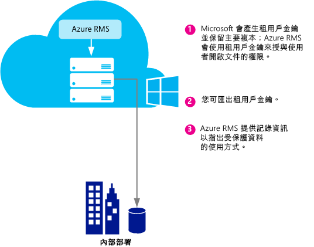
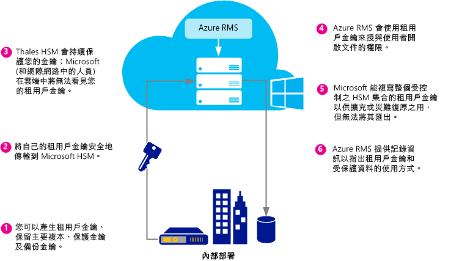
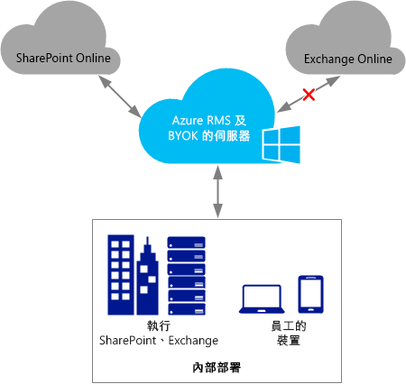
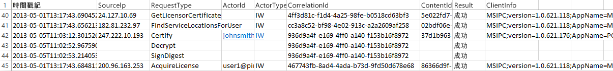

# 規劃及實作 Azure Rights Management 租用戶金鑰
請使用本主題的資訊來協助您規劃和管理 Azure RMS 的 Rights Management 服務 (RMS) 租用戶金鑰。 例如，不是 Microsoft 管理租用戶金鑰 (預設值)，而是您可能想要管理您自己的租用戶金鑰，以遵循適用於貴組織的特定法規。  管理您自己的租用戶金鑰也稱為整合您自己的金鑰或 BYOK。

> [!NOTE]
> RMS 租用戶金鑰也稱為「伺服器授權人憑證 (SLC)」金鑰。 Azure RMS 為訂閱 Azure RMS 的每個組織維護一或多個金鑰。 只要組織內的 RMS 使用金鑰時 (例如使用者金鑰、電腦金鑰、文件加密金鑰)，便會以加密編譯的方式鏈結至您的 RMS 租用戶金鑰。

**概覽：**使用下表做為您建議的租用戶金鑰拓撲的快速指南。 然後，如需詳細資訊，請使用其他各節。

如果您使用 Microsoft 管理的租用戶金鑰部署 Azure RMS，則稍後可以變更為 BYOK。 不過，您目前無法將 Azure RMS 租用戶金鑰從 BYOK 變更為 Microsoft 管理的租用戶金鑰。

|商務需求|建議的租用戶金鑰拓撲|
|--------|--------------|
|快速部署 Azure RMS 且不需要特殊硬體|由 Microsoft 管理|
|在 Exchange Online (含 Azure RMS) 中需要完整的 IRM 功能|由 Microsoft 管理|
|您的金鑰是由您建立，並以硬體安全性模組 (HSM) 加以保護|BYOK<br /><br />目前，此組態將在 Exchange Online 中導致精簡的 IRM 功能。 如需詳細資訊，請參閱＜[BYOK 定價和限制](../Topic/Planning_and_Implementing_Your_Azure_Rights_Management_Tenant_Key.md#BKMK_Pricing)＞一節。|
請使用下列各節來協助您選擇要使用的租用戶金鑰拓撲、瞭解租用戶金鑰生命週期、如何實作「整合您自己的金鑰 (BYOK)」，及接下來應採取的步驟：

-   [選擇您的租用戶金鑰拓撲：由 Microsoft 管理 (預設) 或由您管理 (BYOK)](../Topic/Planning_and_Implementing_Your_Azure_Rights_Management_Tenant_Key.md#BKMK_ChooseTenantKey)

-   [BYOK 定價和限制](../Topic/Planning_and_Implementing_Your_Azure_Rights_Management_Tenant_Key.md#BKMK_Pricing)

-   [實作整合您自己的金鑰 (BYOK)](../Topic/Planning_and_Implementing_Your_Azure_Rights_Management_Tenant_Key.md#BKMK_ImplementBYOK)

-   [後續步驟](../Topic/Planning_and_Implementing_Your_Azure_Rights_Management_Tenant_Key.md#BKMK_NextSteps)

## <a name="BKMK_ChooseTenantKey"></a>選擇您的租用戶金鑰拓撲：由 Microsoft 管理 (預設) 或由您管理 (BYOK)
決定最適合您組織的租用戶金鑰拓撲。 依預設，Azure RMS 會產生您的租用戶金鑰，並管理租用戶金鑰生命週期的大多數作業。 這是系統管理負擔最小的最簡單選項。 在大多數情況下，您甚至無需知道您擁有租用戶金鑰。 您只要申請 Azure RMS，Microsoft 會為您處理金鑰管理程序的剩餘部分。

此外，您可能想要完整控制您的租用戶金鑰，包含建立您的租用戶金鑰，並在您的部署中保留主要複本。 這種案例通常稱為「整合您自己的金鑰 (BYOK)」。 使用此選項時會發生下列狀況：

1.  您會依據您的 IT 原則在部署上產生租用戶金鑰。

2.  您可從擁有的硬體安全模組 (HSM) 中，將租用戶金鑰安全地傳輸至 Microsoft 擁有及管理的 HSM。 在整個程序中，您的租用戶金鑰絕對不會離開硬體防護範圍。

3.  當您將租用戶金鑰傳輸到 Microsoft 時，Thales HSM 會持續保護該金鑰。 Microsoft 與 Thales 合作，確保您的租用戶金鑰無法從 Microsoft 的 HSM 擷取。

雖然是選用項，您也可能想要使用來自 Azure RMS 幾近即時的使用記錄，查看您的租用戶金鑰目前的實際使用方式與時間。

> [!NOTE]
> 作為其他防護措施，Azure RMS 對其在北美、EMEA (歐洲、中東和非洲) 和亞洲的資料中心使用不同的安全園地。 當您管理自己的租用戶金鑰時，它會連結到您 RMS 租用戶所登錄地區的安全園地。 例如，歐洲客戶的租用戶金鑰無法在北美或亞洲的資料中心使用。

## <a name="BKMK_OverviewLifecycle"></a>租用戶金鑰生命週期
若您決定 Microsoft 應管理您的租用戶金鑰，Microsoft 會處理大多數金鑰生命週期作業。 不過，若您決定管理您的租用戶金鑰，則您必須負責許多金鑰生命週期作業和其他部分程序。

下列圖表顯示並比較這兩個選項。 第一個圖表顯示當 Microsoft 管理租用戶金鑰時，您在預設設定下承受的系統管理員負擔是如此的低。



第二張圖顯示當您管理自己的租用戶金鑰時所需執行的其他步驟。



若您決定讓 Microsoft 管理您的租用戶金鑰，則您在產生金鑰時無需採取進一步動作，並可略過下列各節而直接前往[後續步驟](../Topic/Planning_and_Implementing_Your_Azure_Rights_Management_Tenant_Key.md#BKMK_NextSteps)。

若您決定自行管理租用戶金鑰，請閱讀下列各節以取得詳細資訊。

### Thales HSM 和 Microsoft 新增功能的相關資訊
Azure RMS 使用 Thales HSM 來保護您的金鑰。

Thales e-Security 是全球資料加密和網域安全解決方案領導廠商，為金融服務、高科技、製造業、政府及科技業提供服務。 藉助 40 年保護公司和政府資訊的追蹤記錄，全球最大的五家能源和航太公司有四家公司、22 個 NATO 國家採用了 Thales 解決方案，這些解決方案保護全球超過 80% 的付款交易。

Microsoft 與 Thales 合作增強 HSM 的最新功能。 這些增強功能可讓您獲得一般託管服務的好處，而且不必放棄您對金鑰的控制權。 尤其是這些增強功能可讓 Microsoft 為您管理 HSM。 作為雲端服務，Azure RMS 會依據您組織的用量尖峰需求短暫上調。 同時會在 Microsoft 的 HSM 內部保護您的金鑰：您仍可保留金鑰生命週期的控制權，因為您會產生金鑰並將金鑰傳輸給 Microsoft 的 HSM。

如需詳細資訊，請參閱 Thales 網站上的＜[Thales HSM 和 Azure RMS](http://www.thales-esecurity.com/msrms/cloud)＞。

## <a name="BKMK_Pricing"></a>BYOK 定價和限制
具 IT 管理之 Azure 訂閱的組織可免費使用 BYOK 並記錄其使用情況。 使用個人版 RMS 的組織無法使用 BYOK 和記錄，因為它們沒有租用戶系統管理員來設定這些功能。

> [!NOTE]
> 如需個人版 RMS 的詳細資訊，請參閱＜[個人版 RMS 和 Azure Rights Management](../Topic/RMS_for_Individuals_and_Azure_Rights_Management.md)＞。



BYOK 和記錄與整合 Azure RMS 的每個應用程式皆能完美合作。 這包括 SharePoint Online 之類的雲端服務、使用 RMS 連接器來執行使用 Azure RMS 的 Exchange 和 SharePoint 的內部部署伺服器，以及 Office 2013 等用戶端應用程式。 無論哪個應用程式要求 Azure RMS，您都會得到金鑰使用記錄。

但有一個例外：目前，**Azure RMS BYOK 與 Exchange Online 不相容**。  如果您想要使用 Exchange Online，我們建議您立即在預設金鑰管理模式中設定 Azure RMS，Microsoft 會在此種模式下產生並管理您的金鑰。 稍後當 Exchange Online 真的支援 Azure RMS BYOK 時，您就可以選擇移至 BYOK。 不過，如果您無法等待，另一個選項為立即部署 Azure RMS 與 BYOK 搭配，如此 Exchange online 將具有精簡的 RMS 功能 (未受保護的電子郵件及未受保護的附件仍然可以完全運作)。

-   無法顯示 Outlook Web Access 中受保護的電子郵件或受保護的附件。

-   無法顯示行動裝置上使用 Exchange ActiveSync IRM 的受保護電子郵件。

-   傳輸解密 (例如掃描惡意程式碼) 和日誌解密不可行，因此將略過受保護的電子郵件和受保護的附件。

-   強制執行 IRM 原則的傳輸保護規則和資料外洩防護 (DLP) 不可行，因此無法使用這些方法套用 RMS 保護。

-   以伺服器為基礎搜尋受保護的電子郵件，因此將略過受保護的電子郵件。

當您使用 Azure RMS BYOK 與 Exchange online 的精簡 RMS 功能搭配時，RMS 將在 Windows 和 Mac 上使用 Outlook 中的電子郵件用戶端，以及其他未使用 Exchange ActiveSync IRM 的電子郵件用戶端。

如果您是從 AD RMS 移轉至 Azure RMS，您可能已將做為信任的發佈網域 (TPD) 的金鑰匯入至 Exchange Online (在 Exchange 術語中也稱為 BYOK，其是從 Azure RMS BYOK 分開的)。 在此案例中，您必須從 Exchange Online 中移除 TPD，才能避免衝突的範本和原則。 如需詳細資訊，請從 Exchange Online Cmdlet 文件庫中參閱[移除 RMSTrustedPublishingDomain](https://technet.microsoft.com/library/jj200720%28v=exchg.150%29.aspx)。

有時候，Exchange Online 的 Azure RMS BYOK 實際上不是問題。 例如，需要 BYOK 和記錄的組織會在內部部署上執行其資料應用程式 (Exchange、SharePoint、Office)，並對無法使用內部部署 AD RMS 輕易取得的功能使用 Azure RMS (例如，與其他公司協同作業及從行動用戶端存取)。 BYOK 和記錄在此情況中皆運作正常，且可讓組織完全控制其 Azure RMS 訂閱。

## <a name="BKMK_ImplementBYOK"></a>實作整合您自己的金鑰 (BYOK)
若您已決定產生並管理您的租用戶金鑰，請使用本節的資訊和程序；整合您自己的金鑰 (BYOK) 案例：

-   [BYOK 的必要條件](../Topic/Planning_and_Implementing_Your_Azure_Rights_Management_Tenant_Key.md#BKMK_Preqs)

-   [產生並傳輸您的租用戶金鑰 – 透過網際網路](../Topic/Planning_and_Implementing_Your_Azure_Rights_Management_Tenant_Key.md#BKMK_BYOK_Internet)

-   [產生和傳輸您的租用戶金鑰 – 親自轉交](../Topic/Planning_and_Implementing_Your_Azure_Rights_Management_Tenant_Key.md#BKMK_BYOK_InPerson)

> [!IMPORTANT]
> 若已開始使用 [!INCLUDE[aad_rightsmanagement_1](../Token/aad_rightsmanagement_1_md.md)] (服務已啟動)，且具執行 Office 2010 的使用者，請先連絡 Microsoft 客戶支援服務 (CSS)，再執行這些程序。 依據您的案例和需求，您仍可使用 BYOK，但會有一些限制或其他步驟。
> 
> 如果您的組織具有處理金鑰的特殊原則，亦請連絡 CSS。

### <a name="BKMK_Preqs"></a>BYOK 的必要條件
請參閱下表以取得「整合您自己的金鑰 (BYOK)」的必要條件清單。

|需求|詳細資訊|
|------|--------|
|支援 Azure RMS 的訂閱|如需可用訂閱的詳細資訊，請參閱＜[Azure Rights Management 的需求](../Topic/Requirements_for_Azure_Rights_Management.md)＞主題中的＜[支援 Azure RMS 的雲端訂閱](../Topic/Requirements_for_Azure_Rights_Management.md#BKMK_SupportedSubscriptions)＞一節。|
|您未使用個人版 RMS 或 Exchange Online。 或者，如果使用 Exchange Online，您了解並接受使用 BYOK 與此組態搭配的限制。|如需 BYOK 限制和目前限制的詳細資訊，請參閱本主題中的＜[BYOK 定價和限制](../Topic/Planning_and_Implementing_Your_Azure_Rights_Management_Tenant_Key.md#BKMK_Pricing)一節。 **Important:** 目前，BYOK 與 Exchange Online 不相容。|
|Thales HSM、智慧卡和支援軟體<br /><br />如果您使用軟體金鑰對硬體金鑰從 AD RMS 移轉到 Azure RMS，則 Thales 驅動程式的版本至少必須是 11.62 版。|您必須擁有 Thales 硬體安全模組的存取權並具備 Thales HSM 的基礎操作知識。 如需相容模型的清單，或者如果您沒有 HSM 而想要購買，請參閱＜[Thales 硬體安全性模組](http://www.thales-esecurity.com/msrms/buy)＞。|
|若要透過網際網路傳輸您的租用戶金鑰，而非實體遞交到美國的雷德蒙德：<br /><br />1.  一部離線 x64 工作站，至少安裝 Windows 7 的 Windows 作業系統，及至少為 11.62 版的 Thales nShield 軟體。<br />    如果此工作站執行 Windows 7，您必須[安裝 Microsoft .NET Framework 4.5](http://go.microsoft.com/fwlink/?LinkId=225702)。<br />2.  連線至網際網路的工作站，至少有 Windows 7 的 Windows 作業系統。<br />3.  至少有 16 MB 可用空間的 USB 磁碟機或其他可攜式儲存裝置。|如果您去雷德蒙德並親自轉交您的租用戶金鑰，則無需符合這些必要條件。<br /><br />基於安全考量，我們建議您不要將第一個工作站連線至網路。 但無法透過設計程式完成這項工作。 **Note:** 在接下來的指示中，此工作站稱為中斷連線的工作站。<br />此外，若您的租用戶金鑰適用於生產網路，則我們建議您使用第二部個別工作站來下載工具組並上傳租用戶金鑰。 但為了測試用途，您可以使用第一部工作站。 **Note:** 在接下來的指示中，此第二部工作站稱為「連線網際網路的工作站」。|
|選用：Azure 訂閱|若要記錄租用戶金鑰使用情況 (和 Rights Management 使用情況)，您必須訂閱 Azure，並在 Azure 上擁有儲存記錄的足夠空間。|
您自己之租用戶金鑰的產生和使用程序，視您要透過網際網路還是親自交付而定：

-   **透過網際網路：**這需要執行一些額外的設定步驟，例如下載及使用工具組和 Windows PowerShell Cmdlet。 不過，您不必親自光臨 Microsoft 機構就能傳輸您的租用戶金鑰。 可藉由下列方法維護安全性：

    -   您可從離線工作站產生租用戶金鑰，從而縮小攻擊面。

    -   租用戶金鑰是使用「金鑰互換 (KEK)」加密，將金鑰傳輸至 Azure RMS HSM 之前會持續加密該金鑰。 只有租用戶金鑰的加密版本會離開原始工作站。

    -   工具會在您的租用戶金鑰上設定屬性，以便將您的租用戶金鑰繫結至 Azure RMS 安全園地。 因此在 Azure RMS HSM 接收和解密租用戶金鑰後，只有這些 HSM 可使用該金鑰。 您的租用戶金鑰無法匯出。 此繫結是由 Thales HSM 強制執行。

    -   用來加密租用戶金鑰的「金鑰互換 (KEK)」是在 Azure RMS HSM 內部產生，而且無法匯出。 在該處強制執行該動作的 HSM 在 HSM 外部可能沒有全新的 KEK 版本。 此外，工具組包含了 Thales 的認證，證明 KEK 無法匯出，且是在 Thales 製造的正版 HSM 內部產生。

    -   工具組包含了 Thales 的認證，證明 Azure RMS 安全園地也是在 Thales 製造的正版 HSM 上產生。 這向您證明 Microsoft 正在使用正版硬體。

    -   Microsoft 在每個地理區使用不同的 KEK 與安全園地，如此可確保您的租用戶金鑰只能在加密該金鑰的地區資料中心內使用。 例如，歐洲客戶的租用戶金鑰無法在北美或亞洲的資料中心使用。

    > [!NOTE]
    > 您的租用戶金鑰可在不受信任的電腦和網路之間安全地移動，因為金鑰經過加密，並以存取控制層級權限保護，確保僅可在您 HSM 及 Microsoft 的 Azure RMS HSM 中使用。 您可使用工具組提供的指令碼來確認安全性措施，並從 Thales 閱讀這項工作的詳細資訊：[RMS 雲端中的硬體金鑰管理](https://www.thales-esecurity.com/knowledge-base/white-papers/hardware-key-management-in-the-rms-cloud)。

-   **親自轉交：**您需要連絡 Microsoft 客戶支援服務 (CSS) 來安排 Azure RMS 金鑰轉交事宜。 您必須到美國華盛頓州雷德蒙德的 Microsoft 辦事處，將您的租用戶金鑰轉交給 Azure RMS 安全園地。

### <a name="BKMK_BYOK_Internet"></a>產生並傳輸您的租用戶金鑰 – 透過網際網路
若要透過網際網路傳輸您的租用戶金鑰，而非至 Microsoft 機構親自轉交租用戶金鑰，請使用下列程序：

-   [準備連線網際網路的工作站](../Topic/Planning_and_Implementing_Your_Azure_Rights_Management_Tenant_Key.md#BKMK_InternetPrepareWorkstation)

-   [準備中斷連線的工作站](../Topic/Planning_and_Implementing_Your_Azure_Rights_Management_Tenant_Key.md#BKMK_DisconnectedPrepareWorkstation)

-   [產生您的租用戶金鑰](../Topic/Planning_and_Implementing_Your_Azure_Rights_Management_Tenant_Key.md#BKMK_InternetGenerate)

-   [準備您的租用戶金鑰進行傳輸](../Topic/Planning_and_Implementing_Your_Azure_Rights_Management_Tenant_Key.md#BKMK_InternetPrepareTransfer)

-   [將租用戶金鑰傳輸至 Azure RMS](../Topic/Planning_and_Implementing_Your_Azure_Rights_Management_Tenant_Key.md#BKMK_InternetTransfer)

#### <a name="BKMK_InternetPrepareWorkstation"></a>準備連線網際網路的工作站
若要準備連線至網際網路的工作站，請執行以下 3 個步驟：

-   [步驟 1：安裝 Azure Rights Management 的 Windows PowerShell](../Topic/Planning_and_Implementing_Your_Azure_Rights_Management_Tenant_Key.md#BKMK_PrepareInternetConnectedWorkstation1)

-   [步驟 2：取得您的 Azure Active Directory 租用戶識別碼](../Topic/Planning_and_Implementing_Your_Azure_Rights_Management_Tenant_Key.md#BKMK_PrepareInternetConnectedWorkstation2)

-   [步驟 3：下載 BYOK 工具組](../Topic/Planning_and_Implementing_Your_Azure_Rights_Management_Tenant_Key.md#BKMK_PrepareInternetConnectedWorkstation3)

##### <a name="BKMK_PrepareInternetConnectedWorkstation1"></a>步驟 1：安裝 Azure Rights Management 的 Windows PowerShell
從連線網際網路的工作站，下載並安裝 Azure Rights Management 的 Windows PowerShell 模組。

> [!NOTE]
> 如果您先前已下載此 Windows PowerShell 模組，請執行下列命令來檢查版本號碼至少為 2.1.0.0：`(Get-Module aadrm -ListAvailable).Version`

如需安裝指示，請參閱[針對 Azure Rights Management 安裝 Windows PowerShell](../Topic/Installing_Windows_PowerShell_for_Azure_Rights_Management.md)。

##### <a name="BKMK_PrepareInternetConnectedWorkstation2"></a>步驟 2：取得您的 Azure Active Directory 租用戶識別碼
使用 [**以系統管理員身分執行**] 選項啟動 Windows PowerShell，然後執行下列命令：

-   使用 [Connect-AadrmService](http://msdn.microsoft.com/library/windowsazure/dn629415.aspx) Cmdlet，以連接至 Azure RMS 服務：

    ```
    Connect-AadrmService
    ```
    出現提示時，輸入您的 [!INCLUDE[aad_rightsmanagement_1](../Token/aad_rightsmanagement_1_md.md)] 租用戶系統管理員認證 (通常需要使用 Azure Active Directory 或 Office 365 的全域系統管理員帳戶)。

-   使用 [Get-AadrmConfiguration](http://msdn.microsoft.com/library/windowsazure/dn629410.aspx) Cmdlet 以顯示您的租用戶的組態：

    ```
    Get-AadrmConfiguration
    ```
    從輸出中，儲存第一行的 GUID (BPOSId)。 這是您的 Azure Active Directory 租用戶識別碼，您於稍後準備上傳租用戶金鑰時會用到。

-   使用 [Disconnect-AadrmService](http://msdn.microsoft.com/library/windowsazure/dn629416.aspx) Cmdlet 來中斷 Azure RMS 服務的連線，直到您準備好上傳您的金鑰為止：

    ```
    Disconnect-AadrmService
    ```

請勿關閉 Windows PowerShell 視窗。

##### <a name="BKMK_PrepareInternetConnectedWorkstation3"></a>步驟 3：下載 BYOK 工具組
移至 Microsoft 下載中心並且針對您的地區[下載 BYOK 工具組](http://go.microsoft.com/fwlink/?LinkId=335781)：

|地區|封裝名稱|
|------|--------|
|北美|AzureRMS-BYOK-tools-UnitedStates.zip|
|歐洲|AzureRMS-BYOK-tools-Europe.zip|
|亞洲|AzureRMS-BYOK-tools-AsiaPacific.zip|
工具組包含下列組件：

-   名稱開頭為 **BYOK-KEK-pkg-** 的金鑰互換 (KEK) 封裝。

-   名稱開頭為 **BYOK-SecurityWorld-pkg-** 的安全園地封裝。

-   名為 **verifykeypackage.py** 的 Python 指令碼。

-   名為 **KeyTransferRemote.exe** 的命令列可執行檔、名為 **KeyTransferRemote.exe.config** 的中繼資料檔案，以及相關聯的 DLL。

-   名為 **vcredist_x64.exe** 的 Visual C++ 可轉散發套件。

將封裝複製到 USB 磁碟機或其他可攜式儲存裝置。

#### <a name="BKMK_DisconnectedPrepareWorkstation"></a>準備中斷連線的工作站
若要準備未連線至網路 (網際網路或您的內部網路) 的工作站，請執行以下 2 個步驟：

-   [步驟 1：使用 Thales HSM 準備中斷連線的工作站](../Topic/Planning_and_Implementing_Your_Azure_Rights_Management_Tenant_Key.md#BKMK_PrepareDisconnectedWorkstation1)

-   [步驟 2：在中斷連線的工作站上安裝 BYOK 工具組](../Topic/Planning_and_Implementing_Your_Azure_Rights_Management_Tenant_Key.md#BKMK_PrepareDisconnectedWorkstation2)

##### <a name="BKMK_PrepareDisconnectedWorkstation1"></a>步驟 1：使用 Thales HSM 準備中斷連線的工作站
在中斷連線的工作站，於 Windows 電腦上安裝 nCipher (Thales) 支援軟體，然後將 Thales HSM 連接至該電腦。

確定 Thales 工具位於您的路徑 **(%nfast_home%\bin** 和 **%nfast_home%\python\bin**)。 例如，鍵入下列命令：

```
set PATH=%PATH%;”%nfast_home%\bin”;”%nfast_home%\python\bin”
```
如需詳細資訊，請參閱 Thales HSM 隨附的使用者指南，或造訪 Azure RMS 的 Thales 網站：[http://www.thales-esecurity.com/msrms/cloud](http://www.thales-esecurity.com/msrms/cloud)。

##### <a name="BKMK_PrepareDisconnectedWorkstation2"></a>步驟 2：在中斷連線的工作站上安裝 BYOK 工具組
從 USB 磁碟機或其他可攜式儲存裝置中複製 BYOK 工具組封裝，然後執行下列動作：

1.  從下載的封裝中將檔案解壓縮至任何資料夾。

2.  從該資料夾中執行 vcredist_x64.exe。

3.  依照指示安裝 Visual Studio 2012 的 Visual C++ 執行階段元件。

#### <a name="BKMK_InternetGenerate"></a>產生您的租用戶金鑰
在中斷連線的工作站上，執行下列 3 個步驟以產生您自己的租用戶金鑰：

-   [步驟 1：建立安全園地](../Topic/Planning_and_Implementing_Your_Azure_Rights_Management_Tenant_Key.md#BKMK_InternetGenerate1)

-   [步驟 2：驗證下載的封裝](../Topic/Planning_and_Implementing_Your_Azure_Rights_Management_Tenant_Key.md#BKMK_InternetGenerate2)

-   [步驟 3：建立新金鑰](../Topic/Planning_and_Implementing_Your_Azure_Rights_Management_Tenant_Key.md#BKMK_InternetGenerate3)

##### <a name="BKMK_InternetGenerate1"></a>步驟 1：建立安全園地
啟動命令提示字元並執行 Thales new-world 程式。

```
new-world.exe --initialize --cipher-suite=DLf1024s160mRijndael --module=1 --acs-quorum=2/3
```
此程式會在 %NFAST_KMDATA%\local\world 中建立與 C:\ProgramData\nCipher\Key Management Data\local 資料夾對應的**安全園地**檔案。 您可為仲裁使用不同值，但在我們的範例中，系統會提示您為每個值輸入三張卡片和 Pin 碼。 然後，任兩張卡片必須具有系統管理權限來存取安全園地 (您指定的仲裁)。  這些卡片將成為新安全園地的**系統管理員卡組**。 在這個階段，您可以為每一張 ACS 卡片指定密碼或 PIN，或稍後以命令來新增。

> [!TIP]
> 您可以使用 `nkminfo` 命令，確認您 HSM 的目前組態狀態。

然後執行下列動作：

1.  依照 Thales 文件的說明安裝 Thales CNG 提供者，並進行設定以使用新安全園地。

2.  備份 **%nfast_kmdata%\local** 中的園地檔案。 保護園地檔案、系統管理員卡及其 Pin 碼，並確定沒有一個人可存取多張卡。

##### <a name="BKMK_InternetGenerate2"></a>步驟 2：驗證下載的封裝
這是選用性步驟，但建議您使用以驗證下列情況：

-   已從正版 Thales HSM 中產生工具組所包含的「金鑰互換」。

-   已在正版 Thales HSM 中產生工具組中包含的「Azure RMS 安全園地」雜湊。

-   金鑰互換無法匯出。

> [!NOTE]
> 若要驗證下載的封裝，必須連接 HSM 並開機，且必須具有安全園地 (如您剛才建立的一個安全園地)。

###### 若要驗證下載的封裝

1.  依據您的地區輸入下列一項，以執行 verifykeypackage.py 指令碼：

    -   適用於北美：

        ```
        python verifykeypackage.py -k BYOK-KEK-pkg-NA-1 -w BYOK-SecurityWorld-pkg-NA-1
        ```

    -   適用於歐洲：

        ```
        python verifykeypackage.py -k BYOK-KEK-pkg-EU-1 -w BYOK-SecurityWorld-pkg-EU-1
        ```

    -   適用於亞洲：

        ```
        python verifykeypackage.py -k BYOK-KEK-pkg-AP-1 -w BYOK-SecurityWorld-pkg-AP-1
        ```

    > [!TIP]
    > Thales 軟體包含 Python 解釋器，位於 %NFAST_HOME%\python\bin

2.  確認看到下列表示成功驗證的結果：**結果：成功**

此指令碼會驗證簽章者鏈結，最高至 Thales 根金鑰。 此根金鑰的雜湊內嵌於指令碼中，且其值必須為 **59178a47 de508c3f 291277ee 184f46c4 f1d9c639**。 您也可以藉由造訪 [Thales 網站](http://www.thalesesec.com/)，個別確認此值。

您現在準備建立新金鑰，它將是您的 RMS 租用戶金鑰。

##### <a name="BKMK_InternetGenerate3"></a>步驟 3：建立新金鑰
使用 Thales **generatekey** 和 **cngimport** 程式來產生 CNG 金鑰。

執行下列命令以產生金鑰：

```
generatekey --generate simple type=RSA size=2048 protect=module ident=contosokey plainname=contosokey nvram=no pubexp=
```
執行此命令時，請使用下列指示：

-   對於金鑰大小，我們建議設為 2048，但對於擁有此類金鑰並正在移轉至 Azure RMS 的現有 AD RMS 客戶，也支援 1024 位元 RSA 金鑰。

-   以任何字串值取代 **ident** 和 **plainname** 的 *contosokey* 值。 為了盡可能降低系統管理負擔並降低錯誤風險．我們建議您對二者使用相同值，並全部使用小寫字元。

-   此範例中的 pubexp 保留空白 (預設值)，但您可以指定特定值。 如需詳細資訊，請參閱 Thales 文件。

接著執行下列命令，將金鑰匯入至 CNG：

```
cngimport --import -M --key=contosokey --appname=simple contosokey
```
執行此命令時，請使用下列指示：

-   以＜*產生您的租用戶金鑰*＞一節的[步驟 1：建立安全園地](../Topic/Planning_and_Implementing_Your_Azure_Rights_Management_Tenant_Key.md#BKMK_InternetGenerate1)中指定的相同值來取代 *contosokey*。

-   使用 **-M** 選項，使金鑰適用於此案例。 若未執行此動作，導出的金鑰將是目前使用者的使用者特定金鑰。

此命令會在您的 %NFAST_KMDATA%\local 資料夾中建立信號化金鑰檔案，檔案名稱的開頭為 **key_caping_**，後面接著 SID。 例如：**key_caping_machine--801c1a878c925fd9df4d62ba001b94701c039e2fb**。 此檔案包含加密的金鑰。

> [!TIP]
> 您可以使用 `nkminfo –k` 命令，查看您金鑰的目前組態狀態。

在安全的位置備份此信號化金鑰檔案。

> [!IMPORTANT]
> 當您稍後將金鑰傳輸至 Azure RMS 時，Microsoft 無法將此金鑰回傳給您，因此請務必安全地備份您的金鑰和安全園地。 如需備份金鑰的指引及最佳作法，請連絡 Thales。

您現在準備好將租用戶金鑰傳輸至 Azure RMS。

#### <a name="BKMK_InternetPrepareTransfer"></a>準備您的租用戶金鑰進行傳輸
在中斷連線的工作站上，執行下列 4 個步驟以準備您自己的租用戶金鑰：

-   [步驟 1：以降低的權限建立金鑰複本](../Topic/Planning_and_Implementing_Your_Azure_Rights_Management_Tenant_Key.md#BKMK_InternetPrepareTransfer1)

-   [步驟 2：檢查金鑰的新複本](../Topic/Planning_and_Implementing_Your_Azure_Rights_Management_Tenant_Key.md#BKMK_InternetPrepareTransfer2)

-   [步驟 3：使用 Microsoft 的金鑰互換來加密您的金鑰](../Topic/Planning_and_Implementing_Your_Azure_Rights_Management_Tenant_Key.md#BKMK_InternetPrepareTransfer3)

-   [步驟 4：將您的金鑰傳輸封裝複製至連線網際網路的工作站](../Topic/Planning_and_Implementing_Your_Azure_Rights_Management_Tenant_Key.md#BKMK_InternetPrepareTransfer4)

##### <a name="BKMK_InternetPrepareTransfer1"></a>步驟 1：以降低的權限建立金鑰複本
若要降低租用戶金鑰上的權限，請執行下列動作：

-   視您的地區而定，從命令提示字元執行下列其中一項：

    -   適用於北美：

        ```
        KeyTransferRemote.exe -ModifyAcls -KeyAppName simple -KeyIdentifier contosokey -ExchangeKeyPackage BYOK-KEK-pkg-NA-1 -NewSecurityWorldPackage BYOK-SecurityWorld-pkg-NA-1
        ```

    -   適用於歐洲：

        ```
        KeyTransferRemote.exe -ModifyAcls -KeyAppName simple -KeyIdentifier contosokey -ExchangeKeyPackage BYOK-KEK-pkg-EU-1 -NewSecurityWorldPackage BYOK-SecurityWorld-pkg-EU-1
        ```

    -   適用於亞洲：

        ```
        KeyTransferRemote.exe -ModifyAcls -KeyAppName simple -KeyIdentifier contosokey -ExchangeKeyPackage BYOK-KEK-pkg-AP-1 -NewSecurityWorldPackage BYOK-SecurityWorld-pkg-AP-1
        ```

當您執行此命令時，以＜*產生您的租用戶金鑰*＞一節的[步驟 1：建立安全園地](../Topic/Planning_and_Implementing_Your_Azure_Rights_Management_Tenant_Key.md#BKMK_InternetGenerate1)中指定的相同值來取代 *contosokey*。

系統會要求您插入安全園地 ACS 卡片，並詢問其密碼或 PIN (如果指定的話)。

完成命令時，您會看到**結果：成功**，並將在名為 key_xferacId_*&lt;contosokey&gt;* 的檔案中看到降低權限的租用戶金鑰複本。

##### <a name="BKMK_InternetPrepareTransfer2"></a>步驟 2：檢查金鑰的新複本
選擇性執行 Thales 公用程式來確認新租用戶金鑰上的最低權限：

-   aclprint.py：

    ```
    "%nfast_home%\bin\preload.exe" -m 1 -A xferacld -K contosokey "%nfast_home%\python\bin\python" "%nfast_home%\python\examples\aclprint.py"
    ```

-   kmfile-dump.exe：

    ```
    "%nfast_home%\bin\kmfile-dump.exe" "%NFAST_KMDATA%\local\key_xferacld_contosokey"
    ```

當您執行這些命令時，以＜*產生您的租用戶金鑰*＞一節的[步驟 1：建立安全園地](../Topic/Planning_and_Implementing_Your_Azure_Rights_Management_Tenant_Key.md#BKMK_InternetGenerate1)中指定的相同值來取代 *contosokey*。

##### <a name="BKMK_InternetPrepareTransfer3"></a>步驟 3：使用 Microsoft 的金鑰互換來加密您的金鑰
視您的地區而定，執行下列其中一個命令：

-   適用於北美：

    ```
    KeyTransferRemote.exe -Package -KeyIdentifier contosokey -ExchangeKeyPackage BYOK-KEK-pkg-NA-1 -NewSecurityWorldPackage BYOK-SecurityWorld-pkg-NA-1 -TenantBposId GUID -KeyFriendlyName ContosoFirstkey
    ```

-   適用於歐洲：

    ```
    KeyTransferRemote.exe -Package -KeyIdentifier contosokey -ExchangeKeyPackage BYOK-KEK-pkg-EU-1 -NewSecurityWorldPackage BYOK-SecurityWorld-pkg-EU-1 -TenantBposId GUID -KeyFriendlyName ContosoFirstkey
    ```

-   適用於亞洲：

    ```
    KeyTransferRemote.exe -Package -KeyIdentifier contosokey -ExchangeKeyPackage BYOK-KEK-pkg-AP-1 -NewSecurityWorldPackage BYOK-SecurityWorld-pkg-AP-1 -TenantBposId GUID -KeyFriendlyName ContosoFirstkey
    ```

執行此命令時，請使用下列指示：

-   使用從＜*產生您的租用戶金鑰*＞一節的 [步驟 1：建立安全園地](../Topic/Planning_and_Implementing_Your_Azure_Rights_Management_Tenant_Key.md#BKMK_InternetGenerate1)中用來產生金鑰的識別碼來取代 *contosokey*。

-   以您在＜*準備連線網際網路的工作站*＞一節的[步驟 2：取得您的 Azure Active Directory 租用戶識別碼](../Topic/Planning_and_Implementing_Your_Azure_Rights_Management_Tenant_Key.md#BKMK_PrepareInternetConnectedWorkstation2)中所擷取 Azure Active Directory 租用戶識別碼來取代 *GUID*。

-   以將用於輸出檔案名稱的標籤來取代 *ContosoFirstKey*。

成功完成時會顯示**結果**：**成功**，且目前資料夾具有下列名稱的新檔案：TransferPackage-*ContosoFirstkey*.byok

##### <a name="BKMK_InternetPrepareTransfer4"></a>步驟 4：將您的金鑰傳輸封裝複製至連線網際網路的工作站
使用 USB 磁碟機或其他可攜式儲存裝置，將輸出檔案從上一個步驟 (KeyTransferPackage-*ContosoFirstkey*.byok) 複製到連線網際網路的工作站。

> [!NOTE]
> 安全性作法可用來保護檔案，因為其中包含您的私密金鑰。

#### <a name="BKMK_InternetTransfer"></a>將租用戶金鑰傳輸至 Azure RMS
在連線網際網路的工作站上，執行下列 3 個步驟將新租用戶金鑰傳輸至 Azure RMS：

-   [步驟 1：連線至 Azure RMS](../Topic/Planning_and_Implementing_Your_Azure_Rights_Management_Tenant_Key.md#BKMK_InternetTransfer1)

-   [步驟 2：上傳金鑰封裝](../Topic/Planning_and_Implementing_Your_Azure_Rights_Management_Tenant_Key.md#BKMK_InternetTransfer2)

-   [步驟 3：列舉您的租用戶金鑰 - 視需要](../Topic/Planning_and_Implementing_Your_Azure_Rights_Management_Tenant_Key.md#BKMK_InternetTransfer3)

##### <a name="BKMK_InternetTransfer1"></a>步驟 1：連線至 Azure RMS
返回 Windows PowerShell 視窗並鍵入下列命令：

1.  重新連線到 [!INCLUDE[aad_rightsmanagement_1](../Token/aad_rightsmanagement_1_md.md)] 服務：

    ```
    Connect-AadrmService
    ```

2.  使用 [Get-AadrmKeys](http://msdn.microsoft.com/library/windowsazure/dn629420.aspx) Cmdlet 來查看目前的租用戶金鑰組態：

    ```
    Get-AadrmKeys
    ```

##### <a name="BKMK_InternetTransfer2"></a>步驟 2：上傳金鑰封裝
使用 [Add-AadrmKey](http://msdn.microsoft.com/library/windowsazure/dn629418.aspx) Cmdlet 來上傳從中斷連線的工作站中複製的金鑰傳輸封裝：

```
Add-AadrmKey –KeyFile <PathToPackageFile> -Verbose
```
> [!WARNING]
> 系統會提示您確認此動作。 請務必瞭解此動作是無法還原的。 當您上傳租用戶金鑰時，它會自動成為您組織的主要租用戶金鑰，且使用者在保護文件和檔案時將開始使用此租用戶金鑰。

若上傳成功，您會看到下列訊息：**Rights Management 服務已成功新增金鑰。**

將變更傳播到所有 [!INCLUDE[aad_rightsmanagement_1](../Token/aad_rightsmanagement_1_md.md)] 資料中心時預期會發生複寫延遲。

##### <a name="BKMK_InternetTransfer3"></a>步驟 3：列舉您的租用戶金鑰 - 視需要
再次使用 Get-AadrmKeys 指令程式來查看租用戶金鑰中的變更，並查看您的租用戶金鑰清單。 隨即顯示租用戶金鑰，包含 Microsoft 為您產生的初始租用戶金鑰，及您新增的任何租用戶金鑰：

```
Get-AadrmKeys
```
標示為 [**作用中**] 的租用戶金鑰是您組織目前用來保護文件和檔案的金鑰。

您現在已完成透過網際網路整合您自己金鑰的所有必要步驟，並可移至[後續步驟](../Topic/Planning_and_Implementing_Your_Azure_Rights_Management_Tenant_Key.md#BKMK_NextSteps)。

### <a name="BKMK_BYOK_InPerson"></a>產生和傳輸您的租用戶金鑰 – 親自轉交
若不想透過網際網路傳輸您的租用戶金鑰，而是要親自轉交您的租用戶金鑰，請使用下列程序。

-   [產生您的租用戶金鑰](../Topic/Planning_and_Implementing_Your_Azure_Rights_Management_Tenant_Key.md#BKMK_GenerateKey)

-   [將租用戶金鑰傳輸至 Azure RMS](../Topic/Planning_and_Implementing_Your_Azure_Rights_Management_Tenant_Key.md#BKMK_Transfer)

#### <a name="BKMK_GenerateKey"></a>產生您的租用戶金鑰
若要產生您自己的租用戶金鑰，請執行下列 3 個步驟：

-   [步驟 1：使用 Thales HSM 準備工作站](../Topic/Planning_and_Implementing_Your_Azure_Rights_Management_Tenant_Key.md#BKMK_GenerateYourKey1)

-   [步驟 2：建立安全園地](../Topic/Planning_and_Implementing_Your_Azure_Rights_Management_Tenant_Key.md#BKMK_GenerateYourKey2)

-   [步驟 3：建立新金鑰](../Topic/Planning_and_Implementing_Your_Azure_Rights_Management_Tenant_Key.md#BKMK_GenerateYourKey3)

##### <a name="BKMK_GenerateYourKey1"></a>步驟 1：使用 Thales HSM 準備工作站
在 Windows 電腦上安裝 nCipher (Thales) 支援軟體。 將 Thales HSM 附加至該電腦。 確定 Thales 工具位於您的路徑。 如需詳細資訊，請參閱 Thales HSM 隨附的使用者指南，或造訪 Azure RMS 的 Thales 網站，網址為 [http://www.thales-esecurity.com/msrms/cloud](http://www.thales-esecurity.com/msrms/cloud)。

##### <a name="BKMK_GenerateYourKey2"></a>步驟 2：建立安全園地
啟動命令提示字元並執行 Thales new-world 程式。

```
new-world.exe --initialize --cipher-suite=DLf1024s160mRijndael --module=1 --acs-quorum=2/3
```
此程式會在 %NFAST_KMDATA%\local\world 中建立與 C:\ProgramData\nCipher\Key Management Data\local 資料夾對應的**安全園地**檔案。 您可為仲裁使用不同值，但在我們的範例中，系統會提示您為每個值輸入三張卡片和 Pin 碼。 接著，會將安全園地的完整存取權授予任兩張卡片。  這些卡片將成為新安全園地的**系統管理員卡組**。

然後執行下列動作：

1.  依照 Thales 文件的說明安裝 Thales CNG 提供者，並進行設定以使用新安全園地。

2.  備份園地檔案。 保護園地檔案、系統管理員卡及其 Pin 碼，並確定沒有一個人可存取多張卡。

您現在準備建立新金鑰，它將是您的 RMS 租用戶金鑰。

##### <a name="BKMK_GenerateYourKey3"></a>步驟 3：建立新金鑰
使用 Thales **generatekey** 和 **cngimport** 程式來產生 CNG 金鑰。

執行下列命令以產生金鑰：

```
generatekey --generate simple type=RSA size=2048 protect=module ident=contosokey plainname=contosokey nvram=no pubexp=
```
執行此命令時，請使用下列指示：

-   對於金鑰大小，我們建議設為 2048，但對於擁有此類金鑰並正在移轉至 Azure RMS 的現有 AD RMS 客戶，也支援 1024 位元 RSA 金鑰。

-   以任何字串值取代 **ident** 和 **plainname** 的 *contosokey* 值。 為了盡可能降低系統管理負擔並降低錯誤風險．我們建議您對二者使用相同值，並全部使用小寫字元。

-   此範例中的 pubexp 保留空白 (預設值)，但您可以指定特定值。 如需詳細資訊，請參閱 Thales 文件。

接著執行下列命令，將金鑰匯入至 CNG：

```
cngimport --import –M --key=contosokey --appname=simple contosokey
```
執行此命令時，請使用下列指示：

-   以您在步驟 1 中指定的相同值取代 *contosokey*。

-   使用 **-M** 選項，使金鑰適用於此案例。 若未執行此動作，導出的金鑰將是目前使用者的使用者特定金鑰。

此命令會在您的 %NFAST_KMDATA%\local 資料夾中建立信號化金鑰檔案，檔案名稱的開頭為 **key_caping_**，後面接著 SID。 例如：**key_caping_machine--801c1a878c925fd9df4d62ba001b94701c039e2fb**。 此檔案包含加密的金鑰。

在安全的位置備份此信號化金鑰檔案。

> [!IMPORTANT]
> 稍後將金鑰傳輸至 Azure RMS 時，Microsoft 將具有您的金鑰複本，而且無法復原。 這表示沒有任何人可從 Microsoft 上的 HSM 擷取您的金鑰。 如此可讓您保有租用戶金鑰的專有控制權。 因此安全地備份您的金鑰及安全園地是極為重要的動作。 如需備份金鑰的指引及最佳作法，請連絡 Thales。

您現在準備好將租用戶金鑰傳輸至 Azure RMS。

#### <a name="BKMK_Transfer"></a>將租用戶金鑰傳輸至 Azure RMS
產生您自己的金鑰後，必須先將它傳輸至 Azure RMS 再進行使用。 如需最高等級的安全性，您必須飛抵美國華盛頓州雷德蒙德的 Microsoft 辦事處以手動執行轉交程序。 若要完成此程序，請執行下列 3 個步驟：

-   [步驟 1：將您的金鑰帶到 Microsoft](../Topic/Planning_and_Implementing_Your_Azure_Rights_Management_Tenant_Key.md#BKMK_TransferYourKey1)

-   [步驟 2：將您的金鑰傳輸至 Window Azure RMS 安全園地](../Topic/Planning_and_Implementing_Your_Azure_Rights_Management_Tenant_Key.md#BKMK_TransferYourKey2)

-   [步驟 3：關閉程序](../Topic/Planning_and_Implementing_Your_Azure_Rights_Management_Tenant_Key.md#BKMK_TransferYourKey3)

###### 步驟 1：將您的金鑰帶到 Microsoft

-   連絡 Microsoft 客戶支援服務 (CSS) 來安排 Azure RMS 金鑰轉交事宜。 將下列物品攜至雷德蒙德的 Microsoft：

    -   系統管理卡的仲裁。 若您遵循[步驟 2：建立安全園地](../Topic/Planning_and_Implementing_Your_Azure_Rights_Management_Tenant_Key.md#BKMK_GenerateYourKey2)的前述指示，則為您三張卡片的任兩張。

    -   獲授權攜帶您的系統管理卡和 Pin 碼的人員，通常是兩人 (一人一張卡片)。

    -   您在 USB 磁碟機中的安全園地檔案 (%NFAST_KMDATA%\local\world)。

    -   您在 USB 磁碟機中的信號化金鑰檔案。

###### 步驟 2：將您的金鑰傳輸至 Window Azure RMS 安全園地

1.  當您抵達 Microsoft 轉交您的金鑰時，會發生下列情況：

    -   Microsoft 提供您已連接 Thales HSM、已安裝 Thales 軟體，並已將 Azure RMS 安全園地檔案預先載入至 C:\Temp\Destination 資料夾的離線工作站。

    -   在此工作站上，您會將安全園地檔案和信號化金鑰檔案從您的 USB 磁碟機載入至 C:\Temp\Source 資料夾。

    -   Azure RMS 操作員會使用 Thales 公用程式，將您的金鑰安全地傳輸至 Azure RMS 安全園地。

    此程序與下列程序類似，在此範例中，會以您的信號化金鑰檔案名稱取代 key-xfer-im 的最後一個參數：

    **C:\&gt; mk-reprogram.exe --owner c:\Temp\Destination add c:\Temp\Source**

    **C:\&gt; key-xfer-im.exe c:\Temp\Source c:\Temp\Destination --module c:\Temp\Source\key_caping_machine--801c1a878c925fd9df4d62ba001b94701c039e2fb**

2.  Mk-reprogram 將要求您和 Azure RMS 操作員插入其相對的系統管理員卡和 Pin 碼。 這些命令會在 C:\Temp\Destination 中輸出信號化金鑰檔案，包含您受 Azure RMS 安全園地所保護的金鑰。

###### 步驟 3：關閉程序

-   Azure RMS 操作員會在您在場的情況下執行下列工作：

    -   執行 Microsoft 與 Thales 合作開發的工具，該工具會移除兩個權限：用來復原金鑰的權限，及用來變更權限的權限。 完成此動作後，會將此金鑰複本鎖定至 Azure RMS 安全園地。 Thales HSM 不會允許 Azure RM 操作員使用其系統管理員卡來復原您金鑰的純文字複本。

    -   將導出的金鑰檔案複製至 USB 磁碟機，於稍後上傳至 Azure RMS 服務。

    -   原廠會重設 HSM，並完全清理工作站。

您現在已完成親自轉交您自己金鑰的所有必要步驟，並可回到您的組織執行接下來的步驟。

## <a name="BKMK_NextSteps"></a>後續步驟

1.  開始使用您的租用戶金鑰：

    -   若您尚未這麼做，則現在必須啟用 Rights Management，如此您的組織才能開始使用 RMS。 使用者會立即開始使用您的租用戶金鑰 (由 Microsoft 管理或由您自行管理)。

        如需啟動的詳細資訊，請參閱＜[啟用 Azure Rights Management](../Topic/Activating_Azure_Rights_Management.md)＞。

    -   如果您已啟用 Rights Management，然後決定管理您自己的租用戶金鑰，使用者會逐漸從舊租用戶金鑰轉移至新租用戶金鑰，而此交錯轉移可能會耗費數週才能完成。 授權的使用者仍可存取舊租用戶金鑰所保護的文件和檔案。

2.  請考慮啟用使用記錄，它會記錄 RMS 執行的每筆交易。

    如果您決定管理您自己的租用戶金鑰，記錄將包含您租用戶金鑰的相關使用資訊。 請參閱 Excel 中顯示的下列記錄檔範例，其中 **Decrypt** 和 **SignDigest** 要求類型會顯示正在使用的租用戶金鑰。

    

    如需使用記錄的詳細資訊，請參閱＜[記錄和分析 Azure Rights Management 使用情況](../Topic/Logging_and_Analyzing_Azure_Rights_Management_Usage.md)＞。

3.  維護您的租用戶金鑰。

    如需詳細資訊，請參閱[Azure Rights Management 租用戶金鑰的作業](../Topic/Operations_for_Your_Azure_Rights_Management_Tenant_Key.md)。

## 請參閱
[設定 Azure Rights Management](../Topic/Configuring_Azure_Rights_Management.md)

