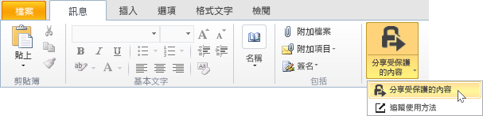
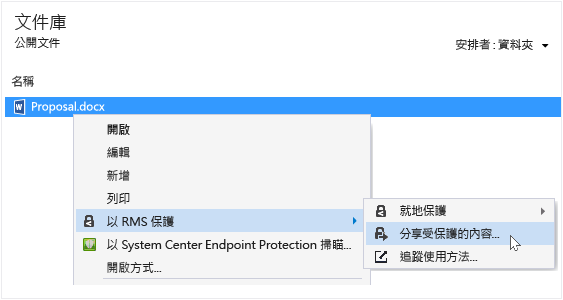
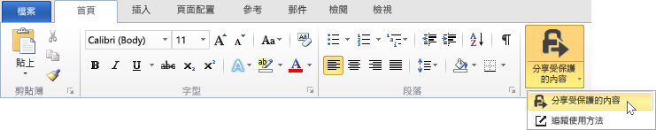
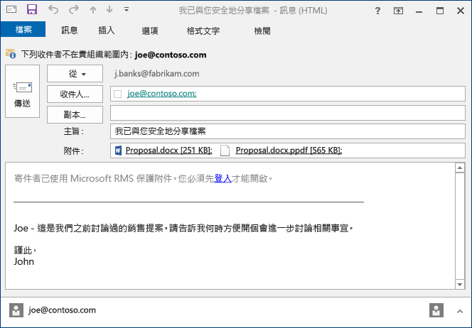

# 藉由使用 Rights Management 共用應用程式，保護您透過電子郵件共用的檔案
當您保護您透過電子郵件共用的檔案時，它會建立原始檔案的新版本。 原始檔案仍未受保護而新的版本為受保護且自動附加到您稍後傳送的電子郵件。

在某些情況下 (Microsoft Word、Excel 和 PowerPoint 所建立的檔案)，RMS 共用應用程式會針對其附加至電子郵件的檔案建立兩個版本。 檔案的第二個版本具有 **.ppdf** 副檔名，而且這是 PDF 檔案的陰影複製。 這個版本的檔案可確保收件者永遠可以讀取檔案，即使他們未安裝您用來建立檔案的相同應用程式。 這是使用者在行動裝置上讀取電子郵件且想要檢視其電子郵件附件時的通例。 他們開啟檔案所需要的就是 RMS 共用應用程式。 然後，他們可以讀取附加的檔案，但是無法變更它，直到他們使用支援 RMS 的應用程式開啟檔案的另一個版本。

如果您的組織使用 Azure RMS，您可以追蹤您藉由共用來保護的檔案：

-   選取選項以在有人嘗試開啟這些受保護的附件時收到電子郵件。 每次檔案被存取時，您會收到通知，知道誰在何時嘗試開啟檔案，以及他們是否成功 (是否成功驗證)。

-   使用文件追蹤網站。 您甚至可以停止共用檔案，方法是在文件追蹤網站中撤銷檔案的存取權。 如需詳細資訊，請參閱[當您使用 RMS 共用應用程式時，追蹤及撤銷文件](../Topic/Track_and_revoke_your_documents_when_you_use_the_RMS_sharing_application.md)。

## 使用 Outlook：若要保護您透過電子郵件共用的檔案

1.  建立電子郵件訊息和附加檔案。 然後，在 **[訊息]** 索引標籤的 **[RMS]** 群組中，按一下 **[共用保護]**，接著再按一下 **[共用保護]**：

    

    如果您看不到此按鈕，可能是您的電腦上未安裝 RMS 共用應用程式、未安裝最新版本，或您的電腦必須重新啟動以完成安裝。 如需有關如何安裝共用應用程式的詳細資訊，請參閱[下載及安裝 Rights Management 共用應用程式](../Topic/Download_and_install_the_Rights_Management_sharing_application.md)。

2.  在[共用保護對話方塊](http://technet.microsoft.com/library/dn574738.aspx)中，指定您想用於這個檔案的選項，然後按一下 [立即傳送]。

### 保護您透過電子郵件共用的檔案的其他方式
除了使用 Outlook 共用受保護的檔案之外，您也可以使用以下替代方案：

-   從檔案總管：這個方法適用於所有檔案。

-   從 Office 應用程式：這個方法適用於 RMS 共用應用程式使用 Office 增益集支援的應用程式，如此您就會在功能區上看到 **RMS** 群組。

##### 使用檔案總管或 Office 應用程式：若要保護您透過電子郵件共用的檔案

1.  使用下列其中一個選項：

    -   針對檔案總管：以滑鼠右鍵按一下檔案，選取 [利用 RMS 保護]，然後選取 [共用保護]。

        

    -   針對 Office 應用程式，Word、Excel 和 PowerPoint：首先確定您已儲存檔案。 然後，在 [首頁] 索引標籤的 [RMS] 群組中，按一下 [共用保護]，接著再次按一下 [共用保護]：

        

    如果您看不到這些保護的選項，可能是您的電腦上未安裝 RMS 共用應用程式、未安裝最新版本，或您的電腦必須重新啟動以完成安裝。 如需有關如何安裝共用應用程式的詳細資訊，請參閱[下載及安裝 Rights Management 共用應用程式](../Topic/Download_and_install_the_Rights_Management_sharing_application.md)。

2.  在[共用保護對話方塊](http://technet.microsoft.com/library/dn574738.aspx)中，指定您想用於這個檔案的選項，然後按一下 [傳送]。

3.  您可能會很快看到一個對話方塊，告訴您檔案已受到保護，然後您會看到為您建立的電子郵件，告知收件者附件已受到 Microsoft RMS 保護，他們必須登入。 當他們按一下連結登入時，他們會看到指示與連結，以確保他們可以開啟您的受保護的附件。

    範例：

    

    您想知道：[什麼是自動建立的 .ppdf 檔案？](../Topic/Dialog_box_options_for_the_Rights_Management_sharing_application.md#BKMK_PPDF)

4.  選用：您可以在此電子郵件訊息中變更您想要的任何項目。 例如，您可以新增或變更訊息中的主旨或文字。

    > [!WARNING]
    > 雖然您可以從此電子郵件訊息中新增或移除人員，這不會變更您在 [共用保護] 對話方塊中對附件指定的權限。 如果您想要變更這些權限，例如授與新的個人權限以開啟檔案，請關閉電子郵件訊息且不儲存或傳送，並返回步驟 1。

5.  傳送電子郵件訊息。

## 範例和其他指示
如需 Rights Management 共用應用程式的使用範例及作法指示，請參閱 Rights Management 共用應用程式使用者指南中下列各節：

-   [使用 RMS 共用應用程式的範例](../Topic/Rights_Management_sharing_application_user_guide.md#BKMK_SharingExamples)

-   [您想要做什麼事？](../Topic/Rights_Management_sharing_application_user_guide.md#BKMK_SharingInstructions)

## 請參閱
[Rights Management 共用應用程式使用者指南 &#40;英文&#41;](../Topic/Rights_Management_sharing_application_user_guide.md)

