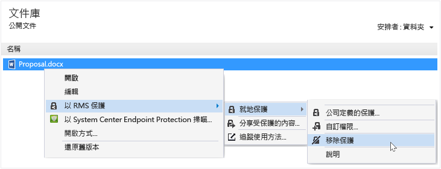

# 透過使用 Rights Management 共用應用程式從檔案移除保護
若要從先前使用 RMS 共用應用程式保護的檔案移除保護 (也就是取消保護檔案)，從 [檔案總管] 使用 [移除保護] 選項。

> [!IMPORTANT]
> 您必須是檔案的擁有者才能移除保護。

### 若要移除檔案的保護

1.  從 [檔案總管] 中以滑鼠右鍵按一下檔案 (例如 Sample.ptxt)，選取 [施以 RMS 保護]，按一下 [就地保護]，然後按一下 [移除保護]：

    

    系統不會提示您提供認證。

原始受保護的檔案 (例如 Sample.ptxt) 已刪除，並且以有相同名稱但沒有受保護副檔名的檔案 (例如 Sample.txt) 取代。

## 範例和其他指示
如需 Rights Management 共用應用程式的使用範例及作法指示，請參閱 Rights Management 共用應用程式使用者指南中下列各節：

-   [使用 RMS 共用應用程式的範例](../Topic/Rights_Management_sharing_application_user_guide.md#BKMK_SharingExamples)

-   [您想要做什麼事？](../Topic/Rights_Management_sharing_application_user_guide.md#BKMK_SharingInstructions)

## 請參閱
[Rights Management 共用應用程式使用者指南 &#40;英文&#41;](../Topic/Rights_Management_sharing_application_user_guide.md)

