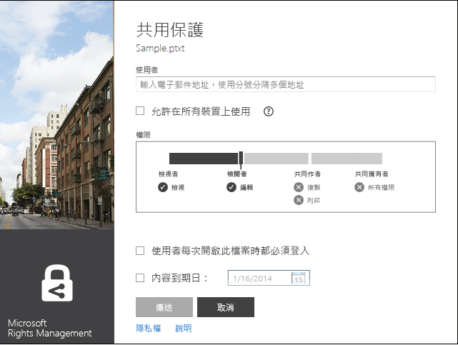

# 修訂版 3：Microsoft Rights Management 共用應用程式指南
使用適用於 Windows 的 Microsoft Rights Management (RMS) 共用應用程式的這本指南協助您保護重要文件與圖片的安全，即使您以電子郵件傳送，或將它們儲存到另一個裝置，也不會讓不該看到它們的人看到。同樣地，此應用程式可讓您開啟並使用其他人使用相同的權限管理技術保護的檔案。

此共用應用程式以下列方式為您的檔案提供這項保護：

-   它會將功能加入至 [檔案總管] (在 Windows 7 和舊版中，也稱為 [Windows 檔案總管])，讓您在管理資料夾中的檔案時，可以輕鬆地保護單一檔案、大量保護多個檔案，或保護資料夾中的所有檔案。

-   它為所有檔案類型提供保護，而且有內建的檢視器，供常用的文字和影像檔案類型使用。

-   它會將 [已保護共用] 按鈕新增至 Word、PowerPoint 和 Excel 的 Microsoft Office 工具列。

您只需要一部執行 Windows 7 或 Windows 8 的電腦以及一個本機系統管理員帳戶，就可以安裝 RMS 共用應用程式。接著，從 Microsoft 下載並安裝這個免費的應用程式。

如果您有本指南未回答的問題，請參閱[適用於 Windows 的 Microsoft Rights Management 共用應用程式常見問題集](http://go.microsoft.com/fwlink/?LinkId=303971)。

## 使用 RMS 共用應用程式的範例
以下是您如何使用 RMS 共用應用程式協助保護您的檔案的一些範例。

|案例|使用 RMS 共用應用程式的解決方案|
|------|----------------------|
|**我想要將公司機密文件安全地複製到另一個裝置**<br /><br />您打算使用您的電腦處理公司機密的策略文件，而且您想要將其複製到 USB 隨身碟，讓您可以在離開辦公室後繼續處理它，而且不需要存取公司網路。|您已經在您的電腦和膝上型電腦上安裝 RMS 共用應用程式。您使用您電腦上的 [檔案總管] 保護使用範本的檔案，讓您公司以外的人員無法存取。接著，您將檔案複製到隨身碟、將隨身碟連接至您的膝上型電腦，然後繼續處理文件。如果您卸除隨身碟，或您的膝上型電腦遭竊，您公司以外的任何人都無法存取該文件。|
|**我想要與組織外部我信任的某個人安全地分享財務資訊**<br /><br />您與合作夥伴公司一起工作，而且想要以電子郵件將包含預測的銷售數字的 Excel 試算表傳送給他們。您希望他們能夠檢視這些數字，但不要變更。|在 Excel 中，使用功能區上的 [已保護共用] 按鈕，輸入合作夥伴公司中與您一起工作的兩個人的電子郵件地址，選取滑桿上的 [檢視者]，然後按一下 [傳送]。<br /><br />在當電子郵件抵達合作夥伴公司時，只有電子郵件中的收件者可以檢視試算表，而且他們無法儲存、編輯、列印或轉寄該試算表。|
|**我需要透過電子郵件將工程圖安全地傳送給使用 iOS 裝置的某個人**<br /><br />您的公司使用自訂的工程應用程式，而且您想要將具有高度機密的圖表以電子郵件傳送給您知道會在其 iOS 裝置上定期檢查電子郵件的同事。|您使用 [檔案總管]，以滑鼠右鍵按一下該檔案，然後選取 [已保護共用]。RMS 共用應用程式會辨識副檔名不是來自原生支援 RMS 的應用程式，因此當它將檔案附加到電子郵件時，它會自動將該檔案轉換成一般受保護的檔案，並自動選取 [允許在所有裝置上使用] 選項。<br /><br />收件者在其 iOS 裝置上收到電子郵件，按一下電子郵件中告訴他們如何下載 RMS 共用應用程式、安裝適用於 iOS 裝置的版本，然後檢視圖表的連結。|
|**我的公司沒有使用 Rights Management，但是我所收到的電子郵件訊息中包含一個受 RMS 保護的附件**<br /><br />電子郵件寄件者是因為您過去曾與他們做過生意而信任的人，而且您懷疑他們可能是要將潛在新商機的相關資訊傳送給您。|您按一下電子郵件中告訴您如何為電腦下載 RMS 共用應用程式、安裝該程式，然後為個人註冊 RMS 的連結。Microsoft 確認您的組織沒有訂閱 Office 365 後，傳送一封電子郵件給您以完成免費的註冊程序，然後您使用您的新帳戶登入。接著，您可以開啟電子郵件附件，以讀取新商機的相關資訊。|

## <a name="BKMK_Install"></a>如何下載並安裝 RMS 共用應用程式
> [!IMPORTANT]
> 您必須具備本機系統管理員帳戶，才能安裝 RMS 共用應用程式。如果您沒有以本機系統管理員身分登入，可以在步驟 3 中執行 Setup.exe 時，使用 [以系統管理員身分執行] 選項。

若要安裝 RMS 共用應用程式，請遵循下列步驟：

1.  移至 Microsoft 網站上的 [Microsoft Rights Management](http://go.microsoft.com/fwlink/?LinkId=303970) 頁面。

2.  在 [電腦] 區段中，按一下 [適用於 Windows 的 RMS 應用程式] 的圖示，然後將 Microsoft Rights Management 共用應用程式安裝套件儲存到您的電腦。

3.  按兩下已下載的壓縮檔，然後按兩下 [setup.exe]。如果提示您繼續，請按一下 [是]。

4.  在 [安裝 Microsoft RMS] 頁面上，按一下 [下一步]，並等候安裝完成。

5.  當安裝完成時，按一下 [重新啟動] 來重新啟動電腦，並完成安裝。或者按一下 [關閉]，稍後重新啟動電腦，以完成安裝。

您現在準備好開始保護您的檔案，或讀取其他人已保護的檔案。

## <a name="BKMK_UsingMSRMSApp"></a>您要執行什麼作業？
使用下列指示協助您處理受保護的檔案。

### <a name="BKMK_CreatePTXT"></a>建立受保護的文字檔
您可以將一般文字 (.txt) 檔案轉換成副檔名為 .ptxt 的受保護檔案。

##### 建立受保護的文字 (.ptxt) 檔案

1.  在 [檔案總管] 中，以滑鼠右鍵按一下某個資料夾，按一下 [新增]，然後按一下 [文字文件]。

2.  重新命名檔案 (例如，Sample.txt)。

3.  按兩下該檔案，以便在 [記事本] 中開啟。

4.  在 [記事本] 中，將幾行文字加入至檔案，然後儲存起來。您可以使用下列範例文字。

    ```
    This is a sample text file.
    This is a sample text file.
    This is a sample text file.
    This is a sample text file. 
    This is a sample text file.
    This is a sample text file.
    ```

5.  以滑鼠右鍵按一下檔案，按一下 [就地保護]，然後從清單中選取範本。如果這是您第一次使用 RMS 共用應用程式，您必須先選取 [公司保護]，下載適用於您組織的範本。

6.  在 [Microsoft Rights Management 共用應用程式] 畫面上，確認您要套用的原則，按一下 [套用]，並在檔案受保護後，按一下 [關閉]。

### <a name="BKMK_ViewPTXT"></a>檢視受保護的文字檔案 (.ptxt) 或受保護的影像檔案
若要檢視受保護的文字 (.ptxt) 檔案，在 [檔案總管] 中按兩下該檔案 (例如，Sample.ptxt)。系統可能會提示您輸入認證。當檔案開啟時，您會在檔案頂端看到檔案的保護原則。

您可以用相同的方式檢視和開啟受保護的影像。

### <a name="BKMK_CreatePFILE"></a>建立一般受保護的檔案
使用一般保護 (.pfile) 檔案格式針對不會直接受到 RMS 共用應用程式或提供內建 RMS 型保護的其他應用程式支援的檔案類型，提供一般層級的保護。您可以使用 Microsoft 網站上的 [Microsoft Rights Management](http://go.microsoft.com/fwlink/?LinkId=303970) 頁面，快速檢查支援 RMS 內建保護的應用程式。

例如，因為 Microsoft Visio 目前不支援 RMS 的內建保護，因此您可以針對您使用 Microsoft Visio 建立的 .vsd 檔案使用一般保護。

> [!TIP]
> 內建 (原生) 保護與一般保護之間的差異為何？
> 
> -   以一般方式保護檔案時，未經授權的人員無法開啟檔案。但是在獲得授權的人員開啟該檔案之後，就可以將解除保護的檔案轉寄給其他人，或將其儲存在其他人可以存取的位置。不過，他們的確會在檔案頂端看到一個訊息，告知他們對該檔案所擁有的權限，而且系統會要求他們履行這些權限，但無法強制執行這項保護。此外，當您以一般方式保護檔案時，就無法限制超出授權之外的權限。如果您使用自訂權限，RMS 共用應用程式中的滑桿會自動選取 [共同擁有者]，而且您無法變更這個設定以獲得更嚴格的權限，例如 [檢視者] 或 [共同撰寫者]。
> -   相較之下，當您使用 RMS 的內建保護搭配支援此保護的應用程式 (例如，Office 檔案) 時，即使之後將檔案傳送給其他人或儲存在另一個位置，此保護還是會套用到該檔案。而且，當您保護這些檔案時，可以使用嚴格的權限 (例如唯讀)，或編輯但不列印或複製的權限。例如，如果您使用自訂權限，共用應用程式中的滑桿會自動針對權限選取 [檢閱者]，但是您之後可以變更為較嚴格或較不嚴格。

##### 範例：從 Visio 繪圖 (.vsd) 檔案建立一般受保護的檔案 (.pfile)

1.  在 [檔案總管] 中，以滑鼠右鍵按一下某個資料夾，按一下 [新增]，然後按一下 [新增 Visio 文件]。

2.  重新命名檔案 (例如，Sample.vsd)。

3.  按兩下該檔案，以便在 Visio 中開啟。

4.  在 Visio 中，將元素新增到繪圖，然後儲存並關閉檔案。

5.  以滑鼠右鍵按一下檔案，按一下 [就地保護]，然後從清單中選取原則範本。如果這是您第一次使用 RMS 共用應用程式，您必須先選取 [公司保護]，下載適用於您組織的範本。

6.  在 [Microsoft Rights Management 共用應用程式] 畫面上，選取您想要套用的原則，然後按一下 [套用]。

7.  此時會出現一個訊息，說明受保護的檔案已儲存為 .pfile 檔案 (例如，Sample.vsd.pfile)。原始檔案會遭到刪除。

### <a name="BKMK_ViewPFILE"></a>檢視一般受保護的 (.pfile) 檔案
若要檢視一般受保護的 (.pfile) 檔案，在 [檔案總管] 中，按兩下一般受保護的 (.pfile) 檔案 (例如，Sample.vsd.pfile)，然後按一下 [開啟]。

### <a name="BKMK_Unprotect"></a>從檔案移除保護
若要從先前受到保護的檔案移除保護 (也就是取消保護檔案)，請使用 [移除保護] 選項：

1.  以滑鼠右鍵按一下檔案 (例如，Sample.ptxt)，按一下 [就地保護]，然後按一下 [移除保護]。系統可能會提示您輸入認證。

2.  原始受保護的檔案會遭到刪除 (例如，Sample.ptxt)，並取代成名稱相同，但副檔名未受保護的檔案 (例如，Sample.txt)。

### <a name="BKMK_ProtectCustom"></a>使用您自己的自訂權限保護檔案
保護檔案最簡單的方式是使用範本，但您也可以指定自己的權限。這稱為使用者撰寫的保護，這在下列情況下很有用：

-   您想要將檔案存取限制為僅透過其電子郵件地址所識別之個別使用者的特定清單。

-   您想要將檔案的使用限制為僅特定權限，例如對文件的唯讀權限。

若要使用使用者撰寫的權限保護檔案，以滑鼠右鍵按一下該檔案，按一下 [就地保護]，然後按一下 [自訂權限]。您將會看到以下畫面：


輸入使用者的電子郵件地址，使用滑桿選取檔案的權限，然後按一下 [套用]。

### <a name="BKMK_UserDefined"></a>使用具有自訂保護的檔案
您開啟的大部分受保護檔案已經透過套用範本受到保護。不過，使用者也可以使用他們自己的自訂權限 (也就是所謂的使用者撰寫的保護) 保護檔案。

對於文字和影像檔案格式，這個保護等級需要用來編輯、儲存或限制這些檔案的任何應用程式已經設計為支援 RMS 保護，並實作 AD RMS SDK 中提供的保護 API。

當您檢視具有使用者撰寫的保護的受保護文字檔案時，您會發現在權限上有些微的差異，因為這些權限是針對檔案而顯示，如以下範例所示。

對於使用一般保護 (.pfile) 檔案格式保護的檔案，使用者指定的特定權利或權限會出現在 [確認] 畫面中，而不是用來保護檔案之範本的名稱中，如下圖所示。


### <a name="BKMK_ShareProtected"></a>保護透過電子郵件共用的內容
若要保護您想要使用電子郵件訊息共用的內容，以滑鼠右鍵按一下檔案，然後按一下 [已保護共用]。您將會看到以下畫面：



輸入使用者清單的電子郵件地址，使用滑桿選取檔案的權限，然後按一下 [傳送]。接著，Outlook 會為收件者建立一個電子郵件訊息，其中包含您可以變更的簡短訊息，並附加受保護的檔案。原始檔案不會受到保護。

若要讓使用者檢視非 Windows 裝置上的受保護檔案，按一下 [允許在所有裝置上使用]。使用者可能需要下載適用於其裝置的 RMS 共用應用程式，因此電子郵件中會有一個下載的連結。

### <a name="BKMK_Multiple"></a>將保護套用至多個檔案和資料夾
當您使用 [檔案總管] 時，您不需要逐一將保護套用至檔案。您可以選取多個檔案或某個資料夾中的所有檔案 (如果這些檔案尚未受到保護)。

##### 保護所選資料夾中的多個檔案或所有檔案

1.  在 [檔案總管] 中，選取多個檔案，或選取一個包含要保護的多個檔案的資料夾。

2.  以滑鼠右鍵按一下選取的資料夾或檔案，按一下 [就地保護]，並從清單中選取範本。如果這是您第一次使用 RMS 共用應用程式，您必須先選取 [公司保護]，下載適用於您組織的範本。

3.  在 [Microsoft Rights Management 共用應用程式] 畫面上，確認檔案已受到保護。

> [!TIP]
> 如果您遇到錯誤，請參閱[適用於 Windows 的 Microsoft Rights Management 共用應用程式常見問題集](http://go.microsoft.com/fwlink/?LinkId=303971)。

### <a name="BKMK_OfficeToolbar"></a>使用 Office 工具列增益集
您可以直接從 Microsoft Office 中使用 Microsoft Rights Management 共用應用程式的 Office 功能區增益集，保護並共用 Word、PowerPoint、Excel 的檔案。

在 [保護] 群組中，按一下 [已保護共用] 以啟動 Microsoft Rights Management 共用應用程式。


### <a name="BKMK_AccessKeys"></a>使用鍵盤快速鍵
按下 **Alt** 鍵查看可用的便捷鍵，然後按下 **Alt** + 便捷鍵以選取一個選項。

例如，在 [已保護共用] 對話方塊中，按下 **Alt** 以查看便捷鍵，然後按下 **Alt + u** 以選取 [使用者必須在每次開啟此檔案時登入] 核取方塊。


## 請參閱
[Microsoft Rights Management 共用應用程式下載](http://go.microsoft.com/fwlink/?LinkId=303970)
 [適用於 Windows 的 Microsoft Rights Management 共用應用程式常見問題集](http://go.microsoft.com/fwlink/?LinkId=303971)

