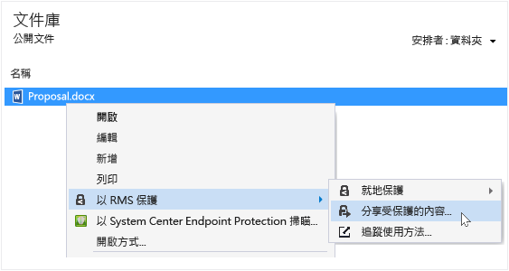
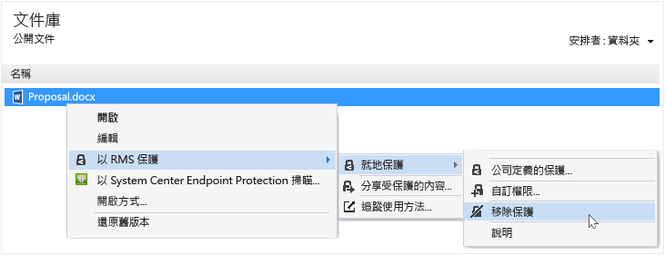

# Rights Management 共用應用程式使用者指南 - 單一主題的修訂
適用於 Windows 的 Microsoft Rights Management (RMS) 共用應用程式可協助您保護重要文件與圖片的安全，即使您以電子郵件傳送，或將它們儲存到另一個裝置，也不會讓不該看到它們的人看到。您也可以使用此應用程式開啟並使用其他人已使用相同的權限管理技術保護的檔案。

您只需要一部至少執行 Windows 7 的電腦以及一個本機系統管理員帳戶，就可以安裝 RMS 共用應用程式。接著，從 Microsoft [下載並安裝](http://go.microsoft.com/fwlink/?LinkId=303970)這個免費的應用程式。

如果您有本指南未回答的問題，請參閱[適用於 Windows 的 Microsoft Rights Management 共用應用程式常見問題集](http://go.microsoft.com/fwlink/?LinkId=303971)。

以下是您如何使用共用應用程式協助保護您的檔案的一些範例。

|我想要...|如何執行此動作|
|----------|-----------|
|**...與組織外部我信任的某個人安全地共用財務資訊**  您與合作夥伴公司一起工作，而且想要以電子郵件將包含預測的銷售數字的 Excel 試算表傳送給他們。您希望他們能夠檢視這些數字，但不要變更。|您在 Excel 中，使用功能區上的 [已保護共用] 按鈕，輸入合作夥伴公司中與您一起工作的兩個人的電子郵件地址，選取滑桿上的 [檢視者]，然後按一下 [傳送]。  在當電子郵件抵達合作夥伴公司時，只有電子郵件中的收件者可以檢視試算表，而且他們無法儲存、編輯、列印或轉寄該試算表。  詳細資料：請參閱本指南[您要執行什麼作業？](../Topic/Rights_Management_sharing_application_user_guide_-_revision_for_single_topic.md#BKMK_UsingMSRMSApp)一節的**保護您透過電子郵件共用的檔案** 。|
|**...將文件透過電子郵件安全地傳送給使用 iOS 裝置的某個人**  您想要以電子郵件將具有高度機密的 Word 文件傳送給您知道會在其 iOS 裝置上定期檢查電子郵件的同事。|您使用 [檔案總管]，以滑鼠右鍵按一下該檔案，然後選取 [已保護共用]。在 RMS 共用應用程式中，您選取 [允許在所有裝置上使用] 選項，然後將檔案當做附件，傳送給您的同事。  收件者在其 iOS 裝置上收到電子郵件，按一下告訴他們如何下載共用應用程式、安裝適用於 iOS 裝置的版本，然後檢視文件的電子郵件中的連結。  詳細資料：請參閱本指南[您要執行什麼作業？](../Topic/Rights_Management_sharing_application_user_guide_-_revision_for_single_topic.md#BKMK_UsingMSRMSApp)一節的**保護您透過電子郵件共用的檔案** 。|
|**...讀取我在包含安全共用檔案附件的電子郵件訊息中收到的附件，但是因為我的公司不使用 Rights Management 而無法讀取**  電子郵件寄件者是因為您過去曾與他們做過生意而信任的人，而且您懷疑他們可能是要將潛在新商機的相關資訊傳送給您。|您遵循電子郵件中的指示，按一下連結以註冊 Microsoft Rights Management。Microsoft 確認您的組織沒有訂閱 Office 365 後，傳送一封電子郵件給您以完成免費的註冊程序，然後您使用您的新帳戶登入。您按一下電子郵件中的第二個連結以安裝 Rights Management 共用應用程式，然後就可以開啟電子郵件附件，讀取新商機的相關資訊。  詳細資料：請參閱本指南[您要執行什麼作業？](../Topic/Rights_Management_sharing_application_user_guide_-_revision_for_single_topic.md#BKMK_UsingMSRMSApp)一節的**檢視並使用 Rights Management 保護的檔案**。|
|**...保護我的膝上型電腦上的公司機密檔案，讓我的公司以外的人員無法存取**  您經常出差，並使用您的膝上型電腦存取和更新資料夾中的檔案。這些檔案必須加以保護，以免未經授權者存取。|您的膝上型電腦上有安裝 RMS 共用應用程式。您使用 [檔案總管] 保護使用範本的檔案，這樣可以快速地保護檔案。如果您的膝上型電腦遭竊，您不用擔心您公司以外的人存取這些文件。  詳細資料：請參閱本指南[您要執行什麼作業？](../Topic/Rights_Management_sharing_application_user_guide_-_revision_for_single_topic.md#BKMK_UsingMSRMSApp)一節的**保護裝置上的檔案 (就地保護)**。|

## 您要執行什麼作業？
使用下列指示協助您處理受保護的檔案。

### 下載並安裝 Rights Management 共用應用程式

1.  移至 Microsoft 網站上的 [Microsoft Rights Management](http://go.microsoft.com/fwlink/?LinkId=303970) 頁面。

2.  在 [電腦] 區段中，按一下 [適用於 Windows 的 RMS 應用程式] 的圖示，然後將 Microsoft Rights Management 共用應用程式安裝套件儲存到您的電腦。

3.  按兩下已下載的壓縮檔，然後按兩下 [setup.exe]。如果提示您繼續，請按一下 [是]。

    > [!TIP]
    > 您可能必須捲動至目前資料夾中的清單底部，才能看到 **setup.exe**。

4.  在 [安裝 Microsoft RMS] 頁面上，按一下 [下一步]，並等候安裝完成。

5.  當安裝完成時，按一下 [重新啟動] 來重新啟動電腦，並完成安裝。或者按一下 [關閉]，稍後重新啟動電腦，以完成安裝。

您現在準備好開始保護您的檔案，或讀取其他人已保護的檔案。

#### 其他資訊
您必須具備本機系統管理員帳戶，才能安裝共用應用程式。如果您沒有以本機系統管理員身分登入，可以在步驟 3 中執行 Setup.exe 時，使用 [以系統管理員身分執行] 選項。

### 保護裝置上的檔案 (就地保護)

1.  在 [檔案總管] 中，選取要保護的一個檔案、一個資料夾或多個檔案。按一下滑鼠右鍵，然後選取 [就地保護]。例如：

    

    > [!NOTE]
    > 如果您沒有看到 [就地保護] 選項，可能是您的電腦上未安裝共用應用程式，或者您的電腦必須重新啟動以完成安裝。如需有關如何安裝共用應用程式的詳細資訊，請參閱本指南[您要執行什麼作業？](../Topic/Rights_Management_sharing_application_user_guide_-_revision_for_single_topic.md#BKMK_UsingMSRMSApp)一節的**下載並安裝 Rights Management 共用應用程式**指示。

2.  執行下列其中一個步驟：

    -   選取原則範本：這些是預先定義的權限，會限制您組織中人員的存取和使用。如果這是您第一次保護此電腦上的檔案，您必須先選取 [公司定義的保護] 以下載範本。範本的名稱開頭是您公司的名稱，然後是權限的描述性名稱。例如：**Contoso - Confidential View Only**

    -   選取 [自訂權限]：如果範本沒有提供您需要的保護層級，請選擇這個選項。例如，您想要將存取權授與您組織外部的人員，或您想要明確地自行設定保護選項。在 [新增保護] 對話方塊中指定這個檔案的選項，然後按一下 [套用]。

        > [!NOTE]
        > 如需有關此對話方塊中選項的詳細資訊，請參閱本指南[您要執行什麼作業？](../Topic/Rights_Management_sharing_application_user_guide_-_revision_for_single_topic.md#BKMK_UsingMSRMSApp)一節的**在 Rights Management 對話方塊中指定選項**指示。

3.  您可能會快速看到一個對話方塊，告訴您檔案受到保護，然後焦點就會回到 [檔案總管]。選取的一或多個檔案現在會受到保護。在某些情況下 (新增保護變更副檔名時)，會將 [檔案總管] 中的原始檔案取代成具有 Rights Management 保護鎖定圖示的新檔案。例如：

    

如果您之後需要從檔案移除保護，請參閱本指南[您要執行什麼作業？](../Topic/Rights_Management_sharing_application_user_guide_-_revision_for_single_topic.md#BKMK_UsingMSRMSApp)一節的**從檔案移除保護**指示。

#### 其他資訊
當您就地保護檔案時，它會取代原始未受保護的檔案。接著，您可以將該檔案保留在原地、將其複製到另一個資料夾或裝置，或共用仍在其中且檔案仍然受到保護的資料夾。您也可以將受保護的檔案附加到電子郵件訊息，但是共用受保護檔案的建議方式是透過電子郵件，直接從 [檔案總管] 或 Office 應用程式共用 (請參閱本指南[您要執行什麼作業？](../Topic/Rights_Management_sharing_application_user_guide_-_revision_for_single_topic.md#BKMK_UsingMSRMSApp)一節的**保護您透過電子郵件共用的檔案**)。

您可以使用相同的技術，同時保護多個檔案或一個資料夾。當您保護某個資料夾時，會自動選取該資料夾中的所有檔案進行保護，但是您在該資料夾中建立的新檔案將不會自動受到保護。

嘗試保護檔案時如果遇到錯誤，請參閱[適用於 Windows 的 Microsoft Rights Management 共用應用程式常見問題集](http://go.microsoft.com/fwlink/?LinkId=303971)。

### 保護您透過電子郵件共用的檔案

1.  使用下列其中一個選項：

    -   對於 [檔案總管]：以滑鼠右鍵按一下檔案，並選取 [已保護共用]：

        

    -   對於 Office 應用程式：請確定您已經先儲存檔案。然後，在 [保護] 群組中，按一下 [已保護共用]。

        

    > [!NOTE]
    > 如果您沒有看到這些用於共用保護的按鈕，可能是您的電腦上未安裝共用應用程式，或者您的電腦必須重新啟動以完成安裝。如需有關如何安裝共用應用程式的詳細資訊，請參閱本指南[您要執行什麼作業？](../Topic/Rights_Management_sharing_application_user_guide_-_revision_for_single_topic.md#BKMK_UsingMSRMSApp)一節的**下載並安裝 Rights Management 共用應用程式**指示。

2.  在 [已保護共用] 對話方塊中指定這個檔案的選項，然後按一下 [傳送]。

    

    > [!NOTE]
    > 如需有關此對話方塊中選項的詳細資訊，請參閱本指南[您要執行什麼作業？](../Topic/Rights_Management_sharing_application_user_guide_-_revision_for_single_topic.md#BKMK_UsingMSRMSApp)一節的**在 Rights Management 對話方塊中指定選項**指示。

3.  您可能會快速看到一個對話方塊，告訴您檔案受到保護，然後您會看到為您所建立的電子郵件，其主旨是：[我已經安全地與您共用檔案]。在此電子郵件訊息中，會附加並保護您所選取的檔案，而且電子郵件中的文字包含以下內容的連結：

    -   個人版 RMS

    -   RMS 共用應用程式

    -   本使用者指南

    範例：

    

4.  選擇性：您可以變更此電子郵件訊息中的任何項目。例如，您可以加入或變更訊息中的主旨或文字。

    > [!WARNING]
    > 雖然您可以從此電子郵件訊息新增或移除人員，但是這不會變更您在 [已保護共用] 對話方塊中指定之附件的權限。如果您想要變更這些權限 (例如，授與新的人員開啟檔案的權限)，請關閉電子郵件訊息，但不儲存或傳送，然後返回步驟 1。

5.  傳送電子郵件訊息。

#### 其他資訊
當您保護您以電子郵件共用的檔案時，它會建立原始檔案的新版本。原始檔案仍未受保護，而新版本受到保護，且會自動附加到您之後要傳送的電子郵件中。

電子郵件訊息包含您可以在傳送之前變更的預設主旨和預設文字。

保護您透過電子郵件共用的檔案有兩種方式：

-   從 [檔案總管]：這個方法適用於所有檔案。

-   從 Office 應用程式：這個方法適用於 Rights Management 共用應用程式使用 Office 增益集支援的應用程式，讓您可以在功能區上看見 [保護] 群組。

> [!NOTE]
> 在這個版本的 Rights Management 共用應用程式中，沒有適用於 Outlook 的增益集可讓您直接從 Outlook 應用程式保護檔案和電子郵件訊息。因此，請改用本節中的程序。

### 檢視並使用 Rights Management 保護的檔案

#### 檢視受保護的檔案
使用 [檔案總管] 或含有附件的電子郵件訊息，按兩下受保護的檔案，然後輸入您的認證 (如果您收到提示)。檔案開啟的方式取決於受保護的方式。

-   如果檔案以一般方式受到保護 (副檔名為 .pfile)：

    您會看到來自共用應用程式的 [受保護的檔案] 對話方塊，告訴您是誰在保護檔案，而且您應該履行共同擁有者權限。當您開啟檔案時，您會收到通知，此動作經過稽核。

    

    按一下 [開啟] 以讀取檔案。

-   如果檔案以原生方式受到保護 (副檔名不是 .pfile)：

    使用與原始副檔名相關聯的應用程式開啟檔案，並在檔案頂端顯示一個限制橫幅。該橫幅可能會顯示套用到檔案的權限，或者可能提供可用來顯示權限的連結。例如，您可能看到下列訊息，其中，您必須按一下 [目前權限限制] 以查看套用到檔案的實際權限，以及可以存取該檔案的人員：

    

    這個檔案也經過稽核，而且只要檔案受到保護，就會維持稽核狀態。

##### 其他資訊
RMS 必須先檢查您的使用者名稱和密碼，確認您獲得授權可以檢視檔案，然後您就可以檢視受保護的檔案。在某些情況下，這可能都經過快取，因此您不會看到要求您提供認證的提示。在其他情況下，系統將會提示您提供認證。

如果您的組織不使用 Windows Azure Rights Management (Windows Azure RMS) 或 AD RMS，您可以申請可接受您的認證的免費帳戶，讓您可以開啟使用 RMS 保護的檔案。若要申請此帳戶，按一下連結以申請[個人版 RMS](http://go.microsoft.com/fwlink/?LinkId=309469)。

#### 使用已受保護的檔案 (例如，編輯和列印檔案)
如果受保護檔案的副檔名為 .pfile：

-   儲存開啟的檔案，並賦予一個與您要使用之應用程式相關聯的新副檔名。

    例如，如果檔案是透過使用檔案名稱 document.vsdx.pfile 而受到保護，請檢視該檔案，並在 [檔案總管] 中，將該檔案另存為 document.vsdx。

    新檔案將不再受到保護。如果要保護它，您必須手動執行。如需指示，請參閱本指南[您要執行什麼作業？](../Topic/Rights_Management_sharing_application_user_guide_-_revision_for_single_topic.md#BKMK_UsingMSRMSApp)一節的**如何使用 Rights Management 共用應用程式保護裝置上的檔案 (就地保護)**。

如果最初受保護檔案的副檔名不是 .pfile：

-   除非您有了解 Rights Management 的應用程式，否則您只能檢視檔案。這些應用程式稱為 Rights Management 架構應用程式。Rights Management 架構的應用程式範例包括 Office 2013 與 Office 2010 (例如 Word、Excel、PowerPoint 和 Outlook) 的應用程式。但是，如果不是 Microsoft 的應用程式，例如其他軟體公司和您自己的企業營運系統應用程式，也可能具有 Rights Management 架構。

    Rights Management 架構的應用程式知道如何開啟受到其他 Rights Management 架構應用程式所保護的檔案。即使您編輯檔案或將它儲存為其他檔名或其他位置，它們也會繼續保留套用到檔案的保護。這些應用程式可讓您根據目前套用至檔案的權限來使用檔案，如此一來，如果您具有使用檔案的權限，就可以這樣做。例如，如果檔案以「唯讀」方式受到保護，您將無法變更或列印檔案。

### 從檔案移除保護
從 [檔案總管]，以滑鼠右鍵按一下檔案 (例如，Sample.ptxt)，按一下 [就地保護]，然後按一下 [移除保護]：

系統可能會提示您輸入認證。

#### 其他資訊
原始受保護的檔案會遭到刪除 (例如，Sample.ptxt)，並取代成名稱相同，但副檔名未受保護的檔案 (例如，Sample.txt)。

若要從先前使用 RMS 共用應用程式保護的檔案移除保護 (也就是取消保護檔案)，請從 [檔案總管] 使用 [移除保護] 選項。

> [!IMPORTANT]
> 您必須是檔案擁有者才能移除保護。

### 在 Rights Management 共用應用程式中使用鍵盤快速鍵
按下 **Alt** 鍵查看可用的便捷鍵，然後按下 **Alt** + 便捷鍵以選取一個選項。

#### 其他資訊
例如，在 [已保護共用] 對話方塊中，按下 **Alt** 以查看便捷鍵，然後按下 **Alt + u** 以選取 [使用者必須在每次開啟此檔案時登入] 核取方塊。

### 在 Rights Management 對話方塊中指定選項

|選項|說明|
|------|------|
|**使用者**|輸入您希望能夠開啟檔案之人員的電子郵件地址。請使用分號分隔多個地址。這些可能是您組織內部或外部的電子郵件地址。  例如：janetm@contoso.com; pdover@fabricom.com|
|**允許在所有裝置上使用**|當您選擇此選項，讓使用者開啟 iPad 等行動裝置上的檔案時，會將權限自動設為 [共同擁有者] (所有權限)，以便使用一般保護來保護檔案。|
|**權限**|將滑桿移至您想要為此檔案賦予的權限。  在某些情況下，權限會自動設定為 [共同擁有者]，而且無法變更。如果您選取 [允許在所有裝置上使用] 便會發生此狀況。此外，如果您要保護無法受到 RMS 以原生方式保護的檔案，而必須以一般方式保護時，也會發生這個情況。共用應用程式會根據副檔名來判斷。 **Tip:** 您可以使用 Microsoft 網站上的 [Microsoft Rights Management](http://go.microsoft.com/fwlink/?LinkId=303970) 頁面，快速檢查支援內建保護的應用程式。|
|**使用者必須在每次開啟此檔案時登入**|如果某個檔案因為要求您指定的使用者在每次存取時一律要經過驗證而需要較高的安全性，請選取此選項。若要這樣做，如果他們的認證沒有經過快取，將會提示他們輸入其使用者名稱和密碼。不過，此設定會要求這些使用者一律在連線至網際網路時，才能開啟檔案，而且要收到解除鎖定檔案的提示，因此，等待驗證程序完成可能很令人沮喪。|
|**內容到期日**|只有針對您選取的使用者在您指定的日期之後無法開啟的時間有限的檔案，才選取此選項。您仍然可以開啟原始檔案。|

#### 其他資訊
使用此表格協助您在共用應用程式的 [新增保護] 對話方塊或 [已保護共用] 對話方塊中指定選項。當您就地保護檔案，並選擇自訂權限時，或保護要共用的檔案時，您會看到這個對話方塊。

如需有關就地保護檔案以及保護要共用的檔案的詳細資訊，請參閱本指南的[您要執行什麼作業？](../Topic/Rights_Management_sharing_application_user_guide_-_revision_for_single_topic.md#BKMK_UsingMSRMSApp)一節。

## 請參閱
[Rights Management 共用應用程式系統管理員指南 &#40;英文&#41;](../Topic/Rights_Management_sharing_application_administrator_guide.md)
 [Microsoft Rights Management 共用應用程式下載](http://go.microsoft.com/fwlink/?LinkId=303970)
 [適用於 Windows 的 Microsoft Rights Management 共用應用程式常見問題集](http://go.microsoft.com/fwlink/?LinkId=303971)

