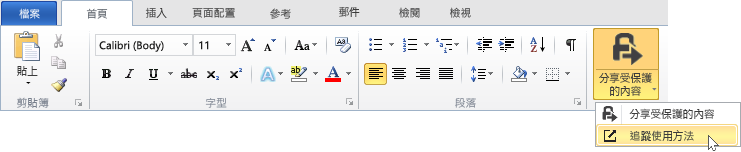
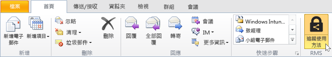
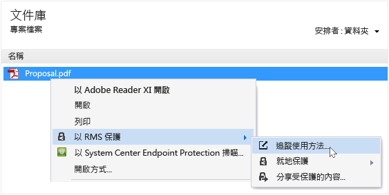
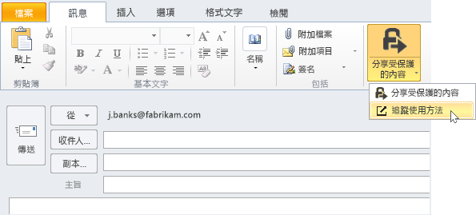

# 當您使用 RMS 共用應用程式時，追蹤及撤銷文件
您使用 RMS 共用應用程式來保護您的文件之後，如果您的組織使用 Azure Rights Management 而非 Active Directory Rights Management Services，您可以追蹤人員使用受保護文件的方式。 如有必要，您也可以在想要停止共用這些文件時，撤銷其存取權。 若要這樣做，請使用**文件追蹤網站**，您可以從 Windows 電腦、Mac 電腦甚至是從平板電腦和電話存取此網站。

> [!TIP]
> 兩分鐘的影片：[Azure RMS 文件追蹤和撤銷](http://channel9.msdn.com/Series/Information-Protection/Azure-RMS-Document-Tracking-and-Revocation)

當您存取此網站時，請登入來追蹤您的文件。 假設您的組織有[可支援文件追蹤和撤銷的訂用帳戶](https://technet.microsoft.com/dn858608.aspx)，而且您已獲得此訂用帳戶的授權，則您可以看見有誰試圖開啟您所保護的檔案以及是否開啟成功 (他們已驗證成功)。 他們嘗試存取文件的時間，以及當時的位置。 此外：

-   如果您要停止共用文件：按一下 [撤銷存取權]，記下文件繼續可用的時間期間，並決定是否讓他人知道您要撤銷您先前共用的文件存取權，並提供自訂訊息。

-   如果您想要匯出至 Excel 中：按一下 [在 Excel 中開啟]，如此您就可以修改資料，並且建立您自己的檢視和圖形。

-   如果您想要設定電子郵件通知：按一下 [設定] 並且選取如何及是否在文件被存取時寄送電子郵件。

-   如果您有任何疑問或想要提供有關文件追蹤網站的意見反應：按一下 [說明] 圖示來存取[文件追蹤的常見問題集](http://go.microsoft.com/fwlink/?LinkId=523977)。

## 使用 Office 來存取文件追蹤網站

-   針對 Office 應用程式，Word、Excel 和 PowerPoint：在 [首頁] 索引標籤的 [RMS] 群組中，按一下 [共用保護]，然後按一下 [追蹤使用情況]：

    

-   針對 Outlook：在 [首頁] 索引標籤的 [RMS] 群組中，按一下 [追蹤使用情況]。

    

如果您看不到 RMS 的這些選項，可能是您的電腦上未安裝 RMS 共用應用程式、未安裝最新版本，或您的電腦必須重新啟動以完成安裝。 如需有關如何安裝共用應用程式的詳細資訊，請參閱[下載及安裝 Rights Management 共用應用程式](../Topic/Download_and_install_the_Rights_Management_sharing_application.md)。

### 追蹤及撤銷您的文件的其他方式
除了使用 Office 應用程式在 Windows 電腦上追蹤您的文件之外，也可以使用以下替代方案：

-   **使用網頁瀏覽器**：這個方法適用於所有支援的裝置。

-   **使用檔案總管**：這個方法適用於 Windows 電腦。

-   **使用 Outlook 電子郵件訊息**：這個方法適用於 Windows 電腦。

##### 使用網頁瀏覽器來存取文件追蹤網站

-   使用支援的瀏覽器，移至[文件追蹤網站](http://go.microsoft.com/fwlink/?LinkId=529562)。

    支援的瀏覽器：我們建議使用至少為第 10 版的 Internet Explorer，但是您可以使用下列任何瀏覽器來使用文件追蹤網站：

    -   Internet Explorer：至少第 10 版

    -   Internet Explorer 9，至少為 MS12-037：Internet Explorer 的累積安全性更新：2012 年 6 月 12 日

    -   Mozilla Firefox：至少第 12 版

    -   Apple Safari 5：至少第 5 版

    -   Google Chrome：至少第 18 版

##### 使用檔案總管來存取文件追蹤網站

-   以滑鼠右鍵按一下檔案，選取 [利用 RMS 保護]，然後選取 [追蹤使用情況]。

    

##### 使用 Outlook 電子郵件訊息來存取文件追蹤網站

-   在電子郵件訊息中，在 [訊息] 索引標籤的 [RMS] 群組中，按一下 [共用保護]，然後按一下 **[追蹤使用情況]**：

    

## 範例和其他指示
如需 Rights Management 共用應用程式的使用範例及作法指示，請參閱 Rights Management 共用應用程式使用者指南中下列各節：

-   [使用 RMS 共用應用程式的範例](../Topic/Rights_Management_sharing_application_user_guide.md#BKMK_SharingExamples)

-   [您想要做什麼事？](../Topic/Rights_Management_sharing_application_user_guide.md#BKMK_SharingInstructions)

## 請參閱
[Rights Management 共用應用程式使用者指南 &#40;英文&#41;](../Topic/Rights_Management_sharing_application_user_guide.md)

