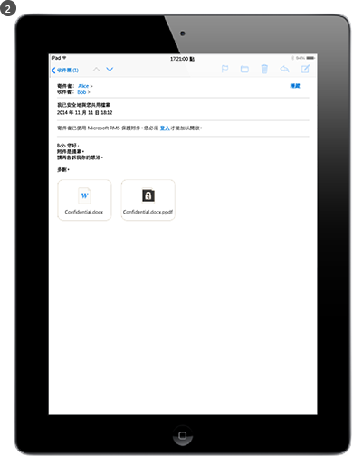

# 什麼是 Azure Rights Management？
Azure Rights Management (Azure RMS) 是一項資訊保護解決方案，可供組織在現在這個充滿挑戰的工作環境中保護資料。

這些挑戰包含連上網際網路的需求，因為使用者會攜帶個人裝置到公司、在路上和從家裡存取公司資料，並與重要商業夥伴分享敏感資訊。 使用者的部分例行工作是透過使用電子郵件、檔案共用網站及雲端服務分享資訊。 在這些案例中，如果您想要保護公司資料並同時提高使用者的工作效率，則傳統安全性控制項 (例如存取控制清單和 NTFS 權限) 和防火牆的成效有限。

相較之下，Azure RMS 在所有這些情況下可保護公司的敏感資訊。 它會使用加密、身分識別及授權原則來協助保護您的檔案和電子郵件安全，並且可在多個裝置 (電話、平板電腦及 PC) 中運作。 資訊在組織內外同樣都會受到保護，因為資料的保護如影隨行，即使資料離開組織範圍也不例外。 例如，員工可能會透過電子郵件傳送文件到夥伴公司，或將文件儲存到其雲端磁碟。 Azure RMS 提供的持續性保護不僅可以協助您保護公司資料的安全，還可依法律規定，滿足法規遵循和法令搜尋要求，或只用作良好的資訊管理應用。

但非常重要的是，已獲授權的人員和服務 (例如搜尋和編製索引) 可以繼續讀取和檢查 Azure RMS 所保護的資料，這一點不是使用其他對等加密資訊保護方案就可以輕鬆達到的。 這個功能有時又稱為「資料的推理」，是維護組織資料控制權的一個關鍵要素。

下圖說明 Azure RMS 如何作為 Office 365 的 Rights Management 解決方案，以及內部部署伺服器和服務使用。 並支援執行 Windows、Mac OS、iOS、Android 和 Windows Phone 的熱門使用者裝置。

> [!TIP]
> 此時，您可能會發現其他資源很有用：
> 
> -   兩分鐘的影片：[什麼是 Microsoft Azure Rights Management？](http://technet.microsoft.com/dn833005.aspx)
> -   五個步驟教學課程：[Azure Rights Management 的快速入門教學指導](../Topic/Quick_Start_Tutorial_for_Azure_Rights_Management.md)
> -   Azure RMS 需求，包括要購買或評估的訂用帳戶選項：[Azure Rights Management 的需求](../Topic/Requirements_for_Azure_Rights_Management.md)

請使用下列各節以深入了解 Azure RMS：

-   [Azure RMS 可以解決哪些問題？](../Topic/What_is_Azure_Rights_Management_.md#BKMK_RMSrequirements)

    -   [安全性、規範和法規要求](../Topic/What_is_Azure_Rights_Management_.md#BKMK_RMScompliance)

-   [Azure RMS 運作方式：系統管理員和使用者看到的內容](../Topic/What_is_Azure_Rights_Management_.md#BKMK_RMSpictures)

    -   [啟用及設定 Rights Management](../Topic/What_is_Azure_Rights_Management_.md#BKMK_Example_ManagementPortal)

    -   [在執行 Windows Server 和檔案分類基礎結構的檔案伺服器上自動保護檔案](../Topic/What_is_Azure_Rights_Management_.md#BKMK_Example_FCI)

    -   [使用 Exchange Online 和資料外洩防護原則來自動保護電子郵件](../Topic/What_is_Azure_Rights_Management_.md#BKMK_Example_DLP)

    -   [使用 SharePoint Online 和受保護的文件庫自動保護檔案](../Topic/What_is_Azure_Rights_Management_.md#BKMK_Example_SharePoint)

    -   [使用者安全地與行動使用者共用附件](../Topic/What_is_Azure_Rights_Management_.md#BKMK_Example_SharingApp)

-   [Azure RMS 如何運作？ 背後原理](../Topic/What_is_Azure_Rights_Management_.md#BKMK_HowRMSworks)

    -   [Azure RMS 使用的密碼編譯控制項：演算法和金鑰長度](../Topic/What_is_Azure_Rights_Management_.md#BKMK_RMScrytographics)

    -   [Azure RMS 運作方式的逐步解說：第一次使用、內容保護、內容取用](../Topic/What_is_Azure_Rights_Management_.md#BKMK_Walthrough)

-   [後續步驟](../Topic/What_is_Azure_Rights_Management_.md#BKMK_NextSteps)

## Azure RMS 可以解決哪些問題？
使用下表來識別組織可能會有的業務需求或問題，以及 Azure RMS 如何解決這些需求或問題的方式。

|需求或問題|透過 Azure RMS 解決|
|---------|-------------------|
|保護所有檔案類型|√ 在先前的版權管理實作中，使用原生保護時只會保護 Office 檔案。 現在，[一般保護](https://technet.microsoft.com/library/dn574738%28v=ws.10%29.aspx)表示支援所有檔案類型。|
|隨時隨地保護檔案|√ 當檔案儲存至位置時 ([就地保護](https://technet.microsoft.com/library/dn574733%28v=ws.10%29.aspx))，檔案便可持續受到保護，即使它複製到不受 IT 控制的儲存體中也是一樣，例如雲端儲存體服務。|
|透過電子郵件以安全的方式共用檔案|√ 透過電子郵件共用檔案時 ([共用保護](https://technet.microsoft.com/library/dn574735%28v=ws.10%29.aspx))，檔案是以電子郵件訊息的附件形式受到保護，具有如何開啟受保護的附件的指示。 電子郵件文字不會進行加密，所以收件者一定可以讀取這些指示。 不過，因為附加的文件會受到保護，即使將該電子郵件或文件轉寄給其他人，只有授權的使用者才能夠開啟附件。|
|稽核與監視|√ 您可以對於受保護的檔案[稽核與監視使用量](https://technet.microsoft.com/library/dn529121.aspx)，即使這些檔案離開您的組織範圍也不例外。  例如，您效力於 Contoso, Ltd。 您與 3 位來自 Fabrikam, Inc 的人員合作聯合專案。您透過電子郵件將您保護且限制為唯讀的文件傳送給這 3 位人員。 Azure RMS 稽核可提供下列資訊：  -   您所指定的 Fabrikam 人員是否開啟文件以及開啟的時間。 -   您未指定的其他人是否嘗試開啟文件 (且沒有成功) — 或許因為轉寄或儲存到其他人可以存取的共用位置。 -   任何指定的人員是否嘗試列印或變更文件 (且沒有成功)。|
|支援所有常見的裝置，不僅是 Windows 電腦|√ [支援的裝置](https://technet.microsoft.com/library/dn655136.aspx)包括：  -   Windows 電腦和電話 -   Mac 電腦 -   iOS 平板電腦和電話 -   Android 平板電腦和電話|
|支援企業對企業的共同作業|√ 因為 Azure RMS 屬於雲端服務，所以在與其他組織共用受保護的內容之前，您無需明確設定與其他組織的信任。 如果他們已經有 Office 365 或 Azure AD 目錄，則會自動支援跨組織的共同作業。 如果沒有的話，使用者可以註冊免費的[個人版 RMS](https://technet.microsoft.com/library/dn592127.aspx) 訂閱。|
|支援內部部署服務以及 Office 365|√ 除了[順暢地搭配 Office 365](https://technet.microsoft.com/library/jj585004.aspx) 之外，您也可以在部署 [RMS 連接器](https://technet.microsoft.com/library/dn375964.aspx)時使用具有下列內部部署服務的 Azure RMS：  -   Exchange Server -   SharePoint Server -   執行檔案分類基礎結構的 Windows Server|
|輕鬆啟用|√ 只需要在 Azure 傳統入口網站中按幾下，就能為使用者[啟用 Rights Management 服務](https://technet.microsoft.com/library/jj658941.aspx)。|
|視需要調整組織的能力|√ 因為 Azure RMS 會在 Azure 中以雲端服務的方式彈性執行以向上擴充和向外擴充，您無需佈建或部署其他內部部署伺服器。|
|建立簡單且彈性原則的能力|√ [自訂的權限原則範本](https://technet.microsoft.com/library/dn642472.aspx)提供了一個快速簡易的解決方案，可讓系統管理員套用原則，讓使用者為每份文件套用正確的保護層級，並限制組織內部人員的存取權。  例如，若要將全公司策略白皮書與所有員工分享，您可以對所有內部員工套用唯讀原則。 但若是更為敏感的文件 (例如財務報告)，您可以限制只有高層主管才能存取。|
|廣泛的應用程式支援|√ Azure RMS 與 Microsoft Office 應用程式和服務緊密整合，並使用 RMS 共用應用程式來延伸對其他應用程式的支援。  √ [Microsoft Rights Management SDK](https://msdn.microsoft.com/library/hh552972%28v=vs.85%29.aspx) 為您的內部開發人員和軟體廠商，提供了可撰寫自訂應用程式以支援 Azure RMS 的 API。  如需詳細資訊，請參閱[應用程式如何支援 Azure Rights Management](../Topic/How_Applications_Support_Azure_Rights_Management.md)。|
|IT 必須維護資料的控制權|√ 組織可以選擇管理他們自己的租用戶金鑰，並使用「[整合您自己的金鑰](https://technet.microsoft.com/library/dn440580.aspx)」(BYOK) 解決方案，將其租用戶金鑰儲存在硬體安全性模組 (HSM)。  √ 支援稽核和[使用量記錄](https://technet.microsoft.com/library/dn529121.aspx)，如此您就可以分析商業見解、監督濫用情形，以及 (如果有發生資訊外洩) 執行蒐證分析。  √ 即使文件之前是由已離開組織的員工進行保護，委派存取可以藉由使用[進階使用者功能](https://technet.microsoft.com/library/mt147272.aspx)確保 IT 永遠可存取受保護的內容。 對照之下，對等加密解決方案會有遺失公司資料存取權的風險。  √ 使用[目錄同步處理工具](https://azure.microsoft.com/documentation/articles/active-directory-aadconnect-get-started-tools-comparison/) (例如 Azure AD Connect)，僅同步處理 Azure RMS 為您的內部部署 Active Directory 帳戶支援通用識別身分[所需的目錄屬性](https://azure.microsoft.com/documentation/articles/active-directory-aadconnectsync-attributes-synchronized/)。  √ 使用 AD FS 啟用單一登入，但不將密碼複寫至雲端。  √ 組織永遠可以選擇停止使用 Azure RMS 而不會遺失先前受 Azure RMS 保護的內容的存取權。 如需解除委任選項的相關資訊，請參閱[解除委任並停用 Azure Rights Management](../Topic/Decommissioning_and_Deactivating_Azure_Rights_Management.md)。 此外，已部署 Active Directory Rights Management Services (AD RMS) 的組織可以[移轉至 Azure RMS](https://technet.microsoft.com/library/dn858447.aspx)，且不會失去先前受 AD RMS 保護之資料的存取權。|
> [!TIP]
> 如果您熟悉內部部署版本的 Rights Management、Active Directory Rights Management Services (AD RMS)，您可能會對[比較 Azure Rights Management 與 AD RMS](../Topic/Comparing_Azure_Rights_Management_and_AD_RMS.md) 中的比較表格有興趣。

### 安全性、規範和法規要求
Azure RMS 支援下列安全性、規範和法規要求：

√ 使用產業標準的密碼編譯，並支援 FIPS 140-2。 如需詳細資訊，請參閱本主題中的[Azure RMS 使用的密碼編譯控制項：演算法和金鑰長度](../Topic/What_is_Azure_Rights_Management_.md#BKMK_RMScrytographics)一節。

√ 支援 Thales 硬體安全性模組 (HSM)，以便將您的租用戶金鑰儲存在 Microsoft Azure 資料中心內。 Azure RMS 對其在北美、EMEA (歐洲、中東和非洲) 和亞洲的資料中心使用不同的安全園地，因此您的金鑰只能用在您的地區。

√ 獲得下列項目的認證：

-   ISO/IEC 27001:2013 (包括 [ISO/IEC 27018](http://azure.microsoft.com/blog/2015/02/16/azure-first-cloud-computing-platform-to-conform-to-isoiec-27018-only-international-set-of-privacy-controls-in-the-cloud/))

-   SOC 2 SSAE 16/ISAE 3402 認證

-   HIPAA BAA

-   EU 模型條款

-   FedRAMP 是 Office 365 憑證中 Azure Active Directory 的一部分，由 HHS 營運的 FedRAMP 機構發行

-   PCI DSS 層級 1

如需有關這些外部認證的詳細資訊，請參閱＜[Azure 信任中心](http://azure.microsoft.com/support/trust-center/compliance/)＞。

## Azure RMS 運作方式：系統管理員和使用者看到的內容
本節的圖片顯示系統管理員和使用者所見內容，以及使用 Azure RMS 來保護敏感或機密資訊的一些常見例子。

> [!NOTE]
> 在 Azure RMS 保護資料的所有這些例子中，內容擁有者持續擁有資料 (檔案或電子郵件) 的完整存取權，即使套用的保護授與權限給擁有者未隸屬的群組，或套用的保護包含到期日也一樣。
> 
> 同樣地，利用 Rights Management 的進階使用者功能，將委派存取權授與您指定的獲授權使用者或服務，IT 即可毫無限制地存取受保護的資料。 此外，IT 可以追蹤和監視受保護資料的使用情況 - 例如，誰在存取資料和何時存取。

如需顯示作用中 RMS 的其他螢幕擷取畫面和影片，請參閱 [Microsoft Rights Management Services 入口網站](http://www.microsoft.com/rms)、[Microsoft Rights Management (RMS) 小組部落格](http://blogs.technet.com/b/rms)，和 [Curah! 網站上 Azure RMS 的策劃內容](http://curah.microsoft.com/Search?query="Azure%20RMS")。

### 啟用及設定 Rights Management
雖然您可以使用 Windows PowerShell 來啟用及設定 Azure RMS，但從管理入口網站來做最簡單。 啟用此服務之後，隨即就有兩個預設範本供系統管理員和使用者選擇，可快速又輕鬆地將資訊保護套用至檔案。 但是，您也可以建立自己的自訂範本以進行其他選項和設定。

|||
|-|-|
|  [宏觀](http://technet.microsoft.com/98d53a12-3b19-4622-bb1e-75ef56df5438) (依預設，在相同的瀏覽器視窗)|您可以使用 Office 365 系統管理中心 (第一個圖片) 或 Azure 傳統入口網站 (第二個圖片) 來啟用 RMS。  只要按一下來啟用，再按一下來確認，組織中的系統管理員和使用者即可受到資訊保護。|
|  [宏觀](http://technet.microsoft.com/596e4fec-124c-41b1-8efd-63d5179193fb) (依預設，在相同的瀏覽器視窗)|啟用之後，自動就有兩個權限原則範本可供組織使用。 其中一個範本用於唯讀存取權 (名稱中包含 [僅限機密檢視])，另一個用於讀取和修改存取權 ([機密])。  將這些範本套用至檔案或電子郵件，就可限制只有組織中的使用者才能存取。 這是防止公司資料洩漏給組織外部人士最快速又輕鬆的方法。 **Tip:** 這些預設範本的開頭都會自動加上您的組織名稱，很容易識別。 我們的範例中是 **VanArsdel, Ltd**。 如果不想讓使用者看到這些範本，或者您想要建立您自己的範本，您可以從 Azure 傳統入口網站執行這項作業。 依下圖所示，精靈會引導您完成自訂範本建立程序。|
|  [宏觀](http://technet.microsoft.com/f5df80e5-efc9-4c0f-91be-060225977356) (依預設，在相同的瀏覽器視窗)|如果您決定要建立自己的範本，可用的一些組態設定包括離線存取、到期日設定，以及是否要立即發佈範本 (讓它顯示在支援 Rights Management 的應用程式中)。|
|  [宏觀](http://technet.microsoft.com/597a3402-fd5a-4bcf-b5e6-5c983dbde697) (依預設，在相同的瀏覽器視窗)|由於發佈這些範本，使用者現在可以在檔案總管和 Microsoft Word 等應用程式中選取它們：  -   使用者可以選擇預設範本：[VanArsdel, Ltd – 機密]。 然後，只有 VanArsdel 組織的員工才能開啟和使用這份文件，即使後來以電子郵件傳送給組織外部的人或儲存到公用位置也一樣。 -   使用者可以選擇系統管理員建立的自訂範本：[銷售和行銷 - 僅限讀取和列印]。 然後，不只是組織外部的人無法存取檔案，更限制只有銷售和行銷部門的員工才能存取此檔案。 此外，這些員工沒有此文件的完整權限，只能讀取和列印。 例如，他們不能修改或複製此文件。|
如需詳細資訊，請參閱[啟用 Azure Rights Management](../Topic/Activating_Azure_Rights_Management.md)和[設定 Azure Rights Management 的自訂範本](../Topic/Configuring_Custom_Templates_for_Azure_Rights_Management.md)。

若要協助使用者保護重要的公司檔案，請參閱＜[協助使用者使用 Azure Rights Management 來保護檔案](../Topic/Helping_Users_to_Protect_Files_by_Using_Azure_Rights_Management.md)＞。

接下來，請參閱系統管理員如何套用範本來自動為檔案和電子郵件設定資訊保護的一些範例。

### 在執行 Windows Server 和檔案分類基礎結構的檔案伺服器上自動保護檔案
此範例示範如何使用 Azure RMS，在至少執行 Windows Server 2012 且設定為使用檔案分類基礎結構的檔案伺服器上，自動保護檔案。

有許多方法可將分類值套用至檔案。 例如，您可以檢查檔案的內容，再據以套用內建的分類，例如「機密性」和「個人識別資訊」。 不過，在此範例中，系統管理員建立 [行銷] 這個自訂分類，將自動套用到 [促銷] 資料夾中儲存的所有使用者文件。 雖然此資料夾受到 NTFS 權限的保護，限制只有 [行銷] 群組的成員才能存取，但系統管理員知道，如果該群組中的某人移動或以電子郵件傳送檔案，可能會丟失這些權限。 然後，未經授權的使用者就可能存取檔案中的資訊。

|||
|-|-|
|  [宏觀](http://technet.microsoft.com/cf18c56b-c301-4640-8d9e-9e677e494091) (依預設，在相同的瀏覽器視窗)|系統管理員安裝並設定 Rights Management (RMS) 連接器，做為內部部署伺服器與 Azure RMS 之間的轉送站。|
|  [宏觀](http://technet.microsoft.com/ba3e247d-ea5e-4009-8eac-74f70270ece0) (依預設，在相同的瀏覽器視窗)|在檔案伺服器上，系統管理員設定分類規則和工作，以自動將 [促銷] 資料夾中的所有使用者檔案分類為 [行銷]，並以 RMS 加密來保護。  她選取我們在第一個範例中建立的自訂 RMS 範本，限制只有銷售和行銷部門的成員才能存取：**銷售和行銷 - 僅限讀取和列印**。  因此，該資料夾中的所有文件都自動設定為 [行銷] 分類，並以 [銷售和行銷] RMS 範本來保護。|
|  [宏觀](http://technet.microsoft.com/ad666594-68df-4289-835a-235b2af9bf4b) (依預設，在相同的瀏覽器視窗)|RMS 如何協助防止資料洩漏給不應該存取敏感或機密資訊的人：  -   [行銷] 群組中的 Janet 從 [促銷] 資料夾中以電子郵件傳送一份機密報表。 此報表包含新的產品功能和廣告計劃，正在出差的同事要求取得一份。 不過，Janet 誤將此報表寄給別人，她沒發現到已經不小心選取另一家公司中名稱類似的收件者。     該收件者無法讀取此機密報表，因為他不是 [銷售和行銷] 群組的成員。|
如需詳細資訊，請參閱[部署 Azure Rights Management 連接器](../Topic/Deploying_the_Azure_Rights_Management_Connector.md)。

### 使用 Exchange Online 和資料外洩防護原則來自動保護電子郵件
前一個範例示範如何自動保護包含敏感或機密資訊的檔案，但如果資訊不是在檔案中，而是在電子郵件訊息中，該怎麼辦？ Exchange Online 資料外洩防護 (DLP) 原則在此派上用場，可提示使用者套用資訊保護 (利用原則提示) 或自動套用 (利用傳輸規則)。

在此範例中，系統管理員設定原則來協助組織遵守美國的個人識別資訊資料保護規定，但也可以針對其他法規來設定規則，或根據您定義的自訂規則。

|||
|-|-|
|  [宏觀](http://technet.microsoft.com/58461319-3981-4b7f-a195-956a1778e907) (依預設，在相同的瀏覽器視窗)|系統管理員使用名為[美國個人識別資訊 (PII) 資料] 的 Exchange 範本來建立及設定新的 DLP 原則。 此範本會在電子郵件訊息中尋找社會安全號碼和駕駛執照號碼等資訊。  對於包含這項資訊和傳送到組織外部的電子郵件訊息，設定的規則會利用 RMS 範本來自動套用權限保護，以限制只有公司員工才能存取。  在這裡，規則設定為使用我們第一個範例的其中一個預設範本：[VanArsdel, Ltd – 機密]。 此外，您也可以看到可供選擇的範本中包含您已建立的任何自訂範本，以及 Exchange 專用的 [禁止轉寄] 選項。|
|  [宏觀](http://technet.microsoft.com/bfb0762d-06fb-42e4-beff-eb391f4bedf0) (依預設，在相同的瀏覽器視窗)|人事經理撰寫一封電子郵件，內容中含有一位新進員工的社會安全號碼號碼。 他將此電子郵件訊息傳送給人力資源部門的 Sherrie。|
|  [宏觀](http://technet.microsoft.com/59e3b68e-4bed-4962-bb1e-e82d82f8000a) (依預設，在相同的瀏覽器視窗)|如果此電子郵件訊息傳送或轉寄到組織外部的某人，DLP 規則會自動套用權限保護。  電子郵件在離開組織基礎結構時會經過加密，因此，不論是在傳輸中或收件者的收件匣中，都無法讀取電子郵件訊息中的社會安全號碼號碼。 除非收件者是 VanArsdel 員工，否則無法讀取訊息。|
如需詳細資訊，請參閱下列各節：

-   [應用程式如何支援 Azure Rights Management](../Topic/How_Applications_Support_Azure_Rights_Management.md) 主題中的 [Exchange Online 和 Exchange Server](../Topic/How_Applications_Support_Azure_Rights_Management.md#BKMK_ExchangeIntro)。

-   [設定 Azure Rights Management 的應用程式](../Topic/Configuring_Applications_for_Azure_Rights_Management.md) 主題中的 [Exchange Online：IRM 設定](../Topic/Configuring_Applications_for_Azure_Rights_Management.md#BKMK_ExchangeOnline)。

### 使用 SharePoint Online 和受保護的文件庫自動保護檔案
本節示範如何使用 SharePoint Online 和受保護的文件庫來輕鬆保護文件。

在此範例中，Contoso 的 SharePoint 系統管理員已經為每個部門建立文件庫，用以集中儲存和取出文件來編輯和進行版本控制。 例如，銷售、行銷、人力資源等部門各有一個文件庫。 當新文件上傳或建立於其中一個受保護的文件庫時，該文件會獲得文件庫的保護 (不需要選取權限原則範本)，而且該文件會自動且持續受到保護，即使移到 SharePoint 文件庫之外也一樣。

|||
|-|-|
|  [宏觀](http://technet.microsoft.com/2fc90989-9289-4431-9e6a-07740b7f6e5a) (依預設，在相同的瀏覽器視窗)|系統管理員對 SharePoint 網站啟用資訊版權管理。|
|  [宏觀](http://technet.microsoft.com/a18f2e99-5ac4-4103-a88c-527846374091) (依預設，在相同的瀏覽器視窗)|然後，她對一個文件庫啟用 Rights Management。 雖然還有其他選項，但這個簡單的設定通常就足夠。  從此文件庫下載文件後，文件便自動受到 Rights Management 的保護，並繼承針對文件庫所設定的保護。|
|  [宏觀](http://technet.microsoft.com/0ebd6806-0190-441e-84db-72ac4b97e4a2) (依預設，在相同的瀏覽器視窗)|當銷售部門的人從文件庫取出此銷售報表時，他們會在頂端的資訊橫幅清楚看到這是受保護的文件且限制存取。  就算使用者將文件重新命名、儲存到其他位置或透過電子郵件分享，文件仍受到保護。 不論檔案如何命名、儲存在何處，或是否透過電子郵件分享，只有銷售部門的成員才能讀取。|
如需詳細資訊，請參閱下列各節：

-   [應用程式如何支援 Azure Rights Management](../Topic/How_Applications_Support_Azure_Rights_Management.md) 主題中的 [SharePoint Online 和 SharePoint Server](../Topic/How_Applications_Support_Azure_Rights_Management.md#BKMK_SharePointIntro)。

-   [設定 Azure Rights Management 的應用程式](../Topic/Configuring_Applications_for_Azure_Rights_Management.md) 主題中的 [SharePoint Online 和商務用 OneDrive：IRM 設定](../Topic/Configuring_Applications_for_Azure_Rights_Management.md#BKMK_SharePointOnline)。

### 使用者安全地與行動使用者共用附件
前述範例示範系統管理員如何將資訊保護自動套用至敏感和機密資料。 但在某些情況下，使用者可能需要自行套用此保護。 例如，他們與其他組織中的夥伴共同作業、需要範本中未定義的自訂權限或設定，或面對先前範例未涵蓋的特殊情況。 在這些情況下，使用者可以自行套用 RMS 範本或設定自訂權限。

此範例示範使用者如何輕鬆地與其他公司中共同合作的人共用文件，但是仍然能夠保護文件，並深信收件者能夠讀取文件，即使是從熱門的行動裝置也一樣。 此案例使用 Rights Management 共用應用程式，而該應用程式可自動部署至組織中的 Windows 電腦。 或者，也可以由使用者自行安裝。

在此範例中，Contoso 的 Alice 以電子郵件將機密的 Word 文件傳送給 Fabrikam 的 Bob。 他在 iPad 上閱讀此文件，但他可以在 iPhone、Android 平板電腦或手機、Mac 電腦或 Windows 手機或電腦上輕鬆地閱讀此文件。

|||
|-|-|
|  [宏觀](http://technet.microsoft.com/feeef78d-3c2e-432b-817d-d06f784be226) (依預設，在相同的瀏覽器視窗)|Alice 在她的 Windows PC 上建立標準的電子郵件訊息，並附加文件。  她按一下功能區的 [共用保護]，這樣會從 RMS 共用應用程式載入 [共用保護] 對話方塊。  Alice 想要限制 Bob 只能檢視和編輯此文件，而不希望他複製或列印此文件，因此她選取 [檢閱者 - 檢視及編輯]。 她也想要在當有人嘗試開啟文件時收到電子郵件，並且能夠視需要稍後撤銷文件，以及知道撤銷會立即生效。|
|  [宏觀](http://technet.microsoft.com/e748fd78-8bba-4168-96cf-f96def078283) (依預設，在相同的瀏覽器視窗)|Bob 在他的 iPad 上看到電子郵件。  除了 Alice 的訊息和附件，還有可讓他在 iPad 上註冊和安裝 RMS 共用應用程式的指示。|
|  [宏觀](http://technet.microsoft.com/7dba5ff9-a61d-4a83-8adc-d6ffb0e85df6) (依預設，在相同的瀏覽器視窗)|Bob 現在可以開啟附件。 首先會要求他登入，以確認他是預定的收件者。  當 Bob 檢視文件時，他也看到限制存取的資訊，告訴他可以檢視和編輯文件，但不能複製或列印。|
|  [宏觀](http://technet.microsoft.com/9f642a2e-58ad-44ab-9f81-f890d15380f9) (依預設，在相同的瀏覽器視窗)|Alice 收到電子郵件訊息，得知 Bob 已成功開啟她所傳送的文件及他何時存取文件。  如果 Bob 將他的電子郵件連同附件轉寄出去，或儲存到其他人可存取的位置，或在網路上遭到攔截，則其他人也無法讀取文件。|
如需詳細資訊，請參閱《[Rights Management 共用應用程式使用者指南](https://technet.microsoft.com/library/dn339006.aspx)》的＜[保護您以電子郵件共用的檔案](https://technet.microsoft.com/library/dn574735.aspx)＞和＜[檢視及使用已保護的檔案](https://technet.microsoft.com/library/dn574741.aspx)＞。

此外，[Azure Rights Management 的快速入門教學指導](../Topic/Quick_Start_Tutorial_for_Azure_Rights_Management.md)包含此案例的逐步指示。

現在您已看過 Azure RMS 用途的一些範例，您可能想要了解其運作方式。 如需 Azure RMS 運作方式的技術資訊，請參閱下一節。

## Azure RMS 如何運作？ 背後原理
了解 Azure RMS 運作方式的一大要點就是 Rights Management 服務 (和 Microsoft) 不會在資訊保護程序中查看或儲存您的資料。 您所保護的資訊永遠不會傳送至或儲存在 Azure 中，除非您明確地將它儲存在 Azure 中，或使用將它儲存在 Azure 中的另一項雲端服務。 Azure RMS 只是讓授權使用者和服務以外的任何人都無法讀取文件中的資料：

-   資料會在應用程式層級加密，並包含一個原則來定義該文件的授權使用。

-   當合法使用者使用受保護的文件或由已授權的服務進行處理時，文件中的資料會解密並強制執行原則中定義的權限。

在高層級，您可以在下圖中看到這個程序的運作方式。 包含密碼公式的文件會受到保護，並由授權的使用者或服務成功開啟。 此文件受內容金鑰 (此圖中的綠色金鑰) 保護。 每份文件的內容金鑰都是唯一的並放置在檔案標頭中，由 RMS 租用戶根金鑰 (此圖中的紅色金鑰) 所保護。 租用戶金鑰可以由 Microsoft 產生和管理，您也可以產生和管理自己的租用戶金鑰。

在 Azure RMS 進行加密和解密、授權以及強制執行限制的保護程序中，密碼公式永遠不會傳送至 Azure。

如需詳細的情況說明，請參閱本主題中的＜[Azure RMS 運作方式的逐步解說：第一次使用、內容保護、內容取用](../Topic/What_is_Azure_Rights_Management_.md#BKMK_Walthrough)＞一節。

如需 Azure RMS 使用的演算法和金鑰長度技術詳細資訊，請參閱下一節。

### Azure RMS 使用的密碼編譯控制項：演算法和金鑰長度
即使您本身不需要知道 RMS 運作方式，但系統可能會詢問您有關它所使用的密碼編譯控制項，以確定安全性保護符合業界標準。

|||
|-|-|
|文件保護方法：|演算法：AES  金鑰長度：128 位元和 256 位元 1|
|金鑰保護方法：|演算法：RSA  金鑰長度：2048 位元|
|憑證簽章：|演算法：SHA-256|
1 當檔案的副檔名為 .ppdf，或檔案為受保護的文字檔或影像檔時 (例如 .ptxt 或 .pjpg)，Rights Management 共用應用程式會使用 256 位元進行一般保護與原生保護。

### Azure RMS 運作方式的逐步解說：第一次使用、內容保護、內容取用
若要進一步了解 Azure RMS 運作方式，讓我們在[啟動 Azure RMS 服務](https://technet.microsoft.com/library/jj658941.aspx)之後，以及當使用者第一次在其 Windows 電腦上使用 RMS (有時候也稱為**初始化使用者環境**或啟動的程序)、**保護內容** (文件或電子郵件)，然後**取用** (開啟並使用) 其他人所保護的內容時，逐步執行一般流程。

初始化使用者環境之後，該使用者可接著保護文件或取用該電腦上受保護的文件。

> [!NOTE]
> 如果此使用者移到另一部 Windows 電腦，或另一位使用者使用同一部 Windows 電腦，則會重複進行初始化程序。

#### 初始化使用者環境
必須在裝置上備妥使用者環境，使用者才能保護內容或取用 Windows 電腦上受保護的內容。 這是一次性程序，而且當使用者嘗試保護或取用受保護的內容時，不需要使用者介入即自動發生：

|||
|-|-|
||電腦上的 RMS 用戶端會先連接至 Azure RMS，並使用 Azure Active Directory 帳戶來驗證使用者。  當使用者的帳戶與 Azure Active Directory 同盟時，系統會自動執行此驗證，而且不會提示使用者輸入認證。|

|||
|-|-|
||使用者經過驗證之後，連線會自動重新導向組織的 RMS 租用戶，以發出可讓使用者向 Azure RMS 進行驗證的憑證，進而使用受保護的內容以及離線保護內容。  在 Azure RMS 中會儲存一份使用者的憑證，如果使用者移到另一個裝置，即可使用相同的金鑰建立憑證。|

#### 內容保護
當使用者保護文件時，RMS 用戶端會對未受保護的文件採取下列動作：

|||
|-|-|
||RMS 用戶端會建立隨機金鑰 (內容金鑰)，並使用此金鑰搭配 AES 對稱式加密演算法來加密文件。|

|||
|-|-|
||RMS 用戶端會接著根據範本或藉由指定文件的特定權限來建立包含文件原則的憑證。 此原則包含不同使用者或群組的權限以及其他限制，例如到期日。  RMS 用戶端會接著使用在初始化使用者環境時取得的組織金鑰，並使用此金鑰來加密原則和對稱內容金鑰。 RMS 用戶端也會使用在初始化使用者環境時所取得的使用者憑證來簽署原則。|

|||
|-|-|
||最後，RMS 用戶端會將原則嵌入具有先前加密之文件本文的檔案中，一起構成受保護的文件。  這份文件可以儲存在任何地方或使用任何方法進行共用，而且原則永遠與加密的文件並存。|

#### 內容取用
當使用者想要取用受保護的文件時，RMS 用戶端會從要求 Azure RMS 服務的存取權著手：

|||
|-|-|
||經過驗證的使用者會將文件原則和使用者的憑證傳送至 Azure RMS。 服務會解密和評估原則，以及建立使用者對此文件具備的權限清單 (如果有的話)。|

|||
|-|-|
||服務會接著從解密的原則擷取 AES 內容金鑰。 然後，使用透過要求取得的使用者公開 RSA 金鑰來加密這個金鑰。  重新加密的內容金鑰會接著與使用者權限清單一起內嵌到加密的使用授權中，然後傳回至 RMS 用戶端。|

|||
|-|-|
||最後，RMS 用戶端會採用加密的使用授權，並使用自己的使用者私密金鑰加以解密。 這可讓 RMS 用戶端視需要將文件的本文解密並呈現在螢幕上。  用戶端也會解密權限清單並將其傳遞至應用程式，以在應用程式的使用者介面中強制執行這些權限。|

#### 變化
先前的逐步解說內容涵蓋了標準案例，但另外有一些變化案例：

-   **行動裝置**：當行動裝置透過 Azure RMS 保護或取用檔案時，程序流程會簡單許多。 行動裝置不會先經過使用者初始化程序，因為每項交易 (用以保護或取用內容) 都是獨立的。 在 Windows 電腦中，行動裝置會連接至 Azure RMS 服務並進行驗證。 若要保護內容，行動裝置會提交一個原則，而 Azure RMS 會將用以保護文件的發行授權和對稱金鑰傳送給行動裝置。 若要取用內容，行動裝置在連接至 Azure RMS 服務並進行驗證時，會將此文件原則傳送至 Azure RMS 並要求用以取用文件的使用授權。 Azure RMS 會將必要的金鑰和限制傳送給行動裝置，作為回應。 這兩個程序都使用 TLS 來保護金鑰交換和其他通訊。

-   **RMS 連接器**：當 Azure RMS 搭配 RMS 連接器使用時，程序流程維持不變。 唯一的差別在於連接器會作為內部部署服務 (例如 Exchange Server 和 SharePoint Server) 與 Azure RMS 之間的轉送。 連接器本身不會執行任何作業，例如：初始化使用者環境，或是加密或解密。 它只會轉送通常會送至 AD RMS 伺服器的通訊，並處理每一端使用的通訊協定之間的轉譯。 這種情況下，您可搭配使用 Azure RMS 與內部部署服務。

-   **一般保護 (.pfile)**：當 Azure RMS 保護檔案時，流程基本上與內容保護相同，只不過 RMS 用戶端會建立一個可授與所有權限的原則。 取用檔案時，檔案會先解密，再傳遞至目標應用程式。 即使檔案原本不支援 RMS，這麼做可讓您保護所有的檔案。

-   **保護 PDF (.ppdf)**：當 Azure RMS 以原生方式保護 Office 檔案時，也會建立該檔案的複本並以同樣的方式予以保護。 唯一的差別在於檔案複本為 PPDF 檔案格式，而 RMS 共用應用程式知道如何開啟該種檔案格式僅供檢視。 這種情況下，您可透過電子郵件傳送受保護的附件，而且即使行動裝置沒有原本支援受保護 Office 檔案的應用程式，行動裝置上的收件者仍舊可以讀取附件。

## 後續步驟
若要深入了解 Azure RMS，請使用＜[開始使用 Azure Rights Management](../Topic/Getting_Started_with_Azure_Rights_Management.md)＞一節中的其他主題 (例如，[應用程式如何支援 Azure Rights Management](../Topic/How_Applications_Support_Azure_Rights_Management.md))，了解現有應用程式如何與 Azure RMS 整合，以提供資訊保護解決方案。 檢閱＜[Azure Rights Management 術語](../Topic/Terminology_for_Azure_Rights_Management.md)＞以熟悉設定和使用 Azure RMS 時可能會遇到的詞彙，並確定查看＜[Azure Rights Management 的需求](../Topic/Requirements_for_Azure_Rights_Management.md)＞之後再開始部署。 如果您想要直接開始並且自行嘗試，請使用 [Azure Rights Management 的快速入門教學指導](../Topic/Quick_Start_Tutorial_for_Azure_Rights_Management.md)。

如果您已準備好開始為組織部署 Azure RMS，請使用 [Azure Rights Management 部署藍圖](../Topic/Azure_Rights_Management_Deployment_Roadmap.md) 作為您的部署步驟和作法指示的連結。

> [!TIP]
> 如需其他資訊與協助，請使用＜[Azure Rights Management 的資訊與支援](../Topic/Information_and_Support_for_Azure_Rights_Management.md)＞中的資源和連結。

## 請參閱
[開始使用 Azure Rights Management](../Topic/Getting_Started_with_Azure_Rights_Management.md)

